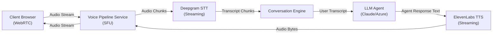

# IaaS (Interviewer As a Service) — Complete Concept Document

**Version:** 2.0 (Complete & Unified)
**Last Updated:** February 2026
**Status:** Authoritative Master Reference
**Audience:** Product Owners, Architecture Team, Engineering Team, Stakeholders

---

## Table of Contents

1. [Executive Summary](#executive-summary)
2. [Target Architecture — Overall](#target-architecture--overall)
3. [Target Architecture — MVP](#target-architecture--mvp)
4. [Technical Concept](#technical-concept)
5. [Roles & Rights Concept](#roles--rights-concept)
6. [Business Concept](#business-concept)
7. [TDD Concept & Testing Strategy](#tdd-concept--testing-strategy)
8. [Story-Level Backlog: MVP (Epics 1-7)](#story-level-backlog-mvp-epics-1-7)
9. [Story-Level Backlog: Extended (Epics 8-15)](#story-level-backlog-extended-epics-8-15)
10. [Post-MVP Scope & Roadmap](#post-mvp-scope--roadmap)
11. [Infrastructure Scaling for 2,500 Users](#infrastructure-scaling-for-2500-users)
12. [Updated Database Schema](#updated-database-schema)
13. [Updated API Endpoints](#updated-api-endpoints)
14. [Appendix](#appendix)

---

## Executive Summary

**IaaS** (Interviewer As a Service) is an AI-powered interview platform designed to conduct structured conversations with diverse stakeholders (employees, customers, subject-matter experts) using a multi-agent AI architecture. The platform orchestrates specialized AI agents to handle follow-up logic, sentiment detection, contradiction flagging, real-time topic adaptation, and supports both text and voice interviews with automatic transcription, analysis, and export capabilities.

### Key Characteristics

- **Target Scale (MVP):** 100 concurrent users → 2,500 concurrent users (Phase 2)
- **EU Data Residency:** Azure West Europe (Frankfurt/Amsterdam datacenters)
- **Time-to-Market (MVP):** 6 months from approval
- **Core Technology:** FastAPI (backend), Next.js (frontend), PostgreSQL + Redis, Kubernetes (AKS)
- **LLM:** Claude API (primary), Azure OpenAI (fallback)
- **Voice:** Deepgram STT, ElevenLabs TTS

### Market Opportunity

IaaS addresses four distinct customer segments:

1. **Enterprise Transformation Teams** — Replace expensive, slow manual stakeholder interviews (€50/interview vs. €250-500 human-conducted)
2. **Software Development Organizations** — Transform vague feedback into structured requirements (user stories, acceptance criteria)
3. **HR & People Teams** — Move beyond shallow pulse surveys to deep conversational insights at scale
4. **Consulting Firms & Integrators** — Scale interview capacity without scaling headcount (1 FTE manages 5x volume)

### Document Purpose

This unified document serves as the **single source of truth** for the IaaS platform concept, including:
- Complete architectural design (MVP and future state)
- Detailed API specifications and database schema
- Comprehensive user story backlog (Epics 1-15, 155 story points total)
- Business model and go-to-market strategy
- Risk analysis and mitigation strategies
- Testing and quality assurance framework
- Compliance and security requirements

---

# TARGET ARCHITECTURE — OVERALL

## 1.1 Architecture Overview

The full IaaS architecture is a **distributed, event-driven microservices platform** built on Kubernetes with clear separation of concerns across the client, API layer, business logic services, infrastructure, and external integrations.

### System-Wide Architecture Diagram

```mermaid
graph TB
    subgraph "Client Layer"
        SPA["React/Next.js SPA<br/>(Browser)"]
    end

    subgraph "Edge & Security"
        WAF["Application Gateway<br/>(WAF, SSL/TLS)"]
        CDN["Azure Front Door<br/>(CDN, DDoS)"]
    end

    subgraph "API Layer"
        BFF["API Gateway / BFF<br/>(Rate Limit, Compose, Route)"]
    end

    subgraph "Kubernetes Cluster - AKS"
        subgraph "Core Services"
            IS["Interview Service<br/>(CRUD, Templates)"]
            AOS["Agent Orchestration<br/>(Multi-agent, RAG, Prompts)"]
            CE["Conversation Engine<br/>(Real-time Chat, Logic)"]
            VPS["Voice Pipeline<br/>(STT, TTS, WebRTC)"]
            AE["Analysis Engine<br/>(Thematic, Sentiment, Summary)"]
            NS["Notification Service<br/>(Email, Webhooks)"]
            ES["Export Service<br/>(PDF, PPTX, XLSX)"]
            UAS["User & Auth Service<br/>(SSO, RBAC, Audit)"]
        end

        subgraph "Data & Cache"
            PG["PostgreSQL 16<br/>+ pgvector"]
            RC["Redis 7<br/>(Session, Cache, Pub/Sub)"]
        end

        subgraph "Message Bus"
            MB["RabbitMQ / Redis Streams<br/>(Event Bus, Job Queue)"]
        end
    end

    subgraph "External Storage"
        ABS["Azure Blob Storage<br/>(Audio, Documents, Exports)"]
    end

    subgraph "Security & Secrets"
        KV["Azure Key Vault<br/>(Credentials, API Keys)"]
        AD["Azure AD / Auth0<br/>(Identity, SSO)"]
    end

    subgraph "External LLM & Voice"
        LLMP["LLM Providers<br/>(Claude API, Azure OpenAI)"]
        STT["Deepgram<br/>(Speech-to-Text)"]
        TTS["ElevenLabs<br/>(Text-to-Speech)"]
    end

    subgraph "Search & Analytics"
        ES_DB["Elasticsearch<br/>(Search, Analytics)"]
    end

    subgraph "Integrations"
        EMAIL["SendGrid / SMTP<br/>(Email)"]
        JIRA["Jira<br/>(Export Integration)"]
        ADO["Azure DevOps<br/>(Export Integration)"]
    end

    subgraph "Observability"
        PROM["Prometheus<br/>(Metrics)"]
        GRAF["Grafana<br/>(Dashboards)"]
        SENT["Sentry<br/>(Error Tracking)"]
        LA["Log Analytics<br/>(Logs)"]
    end

    SPA -->|HTTPS| CDN
    CDN -->|HTTPS| WAF
    WAF --> BFF
    BFF --> IS & AOS & CE & VPS & AE & NS & ES & UAS

    IS & AOS & CE & VPS & AE & NS & ES --> PG & RC & MB
    VPS -->|Stream Audio| STT & TTS
    AOS & CE -->|Call| LLMP
    AE -->|Index Results| ES_DB
    NS -->|Send| EMAIL
    ES -->|Integrate| JIRA & ADO
    IS & CE & VPS & AE & ES -->|Store| ABS

    IS & AOS & CE & VPS & AE & NS & ES & UAS -->|Fetch Secrets| KV
    UAS -->|Auth| AD

    IS & AOS & CE & VPS & AE & NS & ES & UAS -->|Emit Metrics| PROM
    PROM --> GRAF
    IS & AOS & CE & VPS & AE & NS & ES & UAS -->|Log Events| LA
    IS & AOS & CE & VPS & AE & NS & ES & UAS -->|Send Exceptions| SENT

    style SPA fill:#e1f5ff
    style BFF fill:#fff3e0
    style IS fill:#f3e5f5
    style AOS fill:#f3e5f5
    style CE fill:#f3e5f5
    style VPS fill:#f3e5f5
    style AE fill:#f3e5f5
    style NS fill:#f3e5f5
    style ES fill:#f3e5f5
    style UAS fill:#f3e5f5
    style PG fill:#e8f5e9
    style RC fill:#e8f5e9
    style MB fill:#fce4ec
    style KV fill:#ffe0b2
    style PROM fill:#f1f8e9
    style GRAF fill:#f1f8e9
```



## 1.2 Architecture Principles

### Foundational Design Tenets

1. **Event-Driven Microservices**
   - Services communicate asynchronously via event bus (RabbitMQ / Redis Streams)
   - Enables loose coupling, independent deployment, and scalability
   - Events include: `interview.created`, `conversation.started`, `message.sent`, `analysis.completed`, `export.requested`

2. **CQRS (Command Query Responsibility Segregation)**
   - Read-heavy analytics queries are served from a dedicated read model
   - Write operations update the authoritative database first, then propagate to read model
   - Improves query performance and allows independent scaling of read replicas

3. **API-First Design**
   - All service boundaries are well-defined REST APIs (OpenAPI 3.0 specification)
   - Frontend communicates exclusively via BFF; BFF composes and routes to services
   - Enables clear contracts, API versioning, and third-party integrations

4. **EU Data Residency & Privacy**
   - All data resides in **Azure West Europe** (Frankfurt/Amsterdam datacenters)
   - Compliance: GDPR, CCPA, ISO 27001
   - Encryption at rest (AES-256) and in transit (TLS 1.3)
   - Data retention policies and GDPR right-to-be-forgotten support

5. **Zero-Trust Security Model**
   - Every request authenticated and authorized, regardless of origin
   - Service-to-service authentication via mTLS + RBAC
   - Network segmentation with Azure NSGs
   - Secret rotation and key vault integration
   - Audit logging for all data access

6. **Infrastructure as Code (IaC) & GitOps**
   - **Terraform** for all Azure infrastructure
   - **ArgoCD** watches Git repository; auto-deploys on commit
   - Immutable infrastructure; new deployments replace old ones

7. **Scalability & Resilience**
   - Horizontal pod autoscaling (HPA) based on CPU/memory
   - Database connection pooling (PgBouncer)
   - Circuit breakers and retry logic for external API calls
   - Cache-aside pattern for frequently accessed data
   - Multi-replica PostgreSQL for HA

## 1.3 Service Decomposition

### Core Service Responsibilities & API Surface

#### 1. Interview Service
- **Responsibility:** Manage interview project lifecycle, question templates, branching logic, interview instances
- **Owned Data:** `organizations`, `projects`, `interview_definitions`, `questions`, `question_branches`, `templates`
- **Key APIs:**
  - `POST /api/interviews/projects` — Create interview project
  - `GET /api/interviews/projects/{id}` — Fetch project details
  - `POST /api/interviews/instances` — Start new interview instance
- **Dependencies:** PostgreSQL, Auth Service, Notification Service
- **Events Emitted:** `interview.created`, `interview.started`, `interview.completed`

#### 2. Agent Orchestration Service
- **Responsibility:** Manage multi-agent team, prompt versioning, RAG knowledge base, agent turn-taking orchestration
- **Owned Data:** `agents`, `agent_prompts`, `agent_versions`, `knowledge_base`, `embeddings` (pgvector)
- **Key APIs:**
  - `POST /api/agents` — Register or update an AI agent definition
  - `GET /api/agents/{id}/config` — Fetch agent configuration
  - `POST /api/orchestration/select-agent` — Select best agent for next turn
  - `POST /api/orchestration/generate-response` — Call LLM with agent prompt + context
- **Dependencies:** PostgreSQL, pgvector, LLM APIs, Elasticsearch (optional)
- **Events Emitted:** `agent.response.generated`, `knowledge.updated`

#### 3. Conversation Engine
- **Responsibility:** Real-time chat management, adaptive follow-up logic, sentiment detection, contradiction flagging
- **Owned Data:** `conversations`, `messages`, `sentiment_scores`, `uncertainty_flags`, `contradictions_detected`
- **Key APIs:**
  - `GET /api/conversations/{interview_id}` — Fetch conversation history
  - `POST /api/conversations/{interview_id}/messages` — Submit user message
  - `POST /api/conversations/{interview_id}/next-turn` — Request agent's next turn
- **Real-Time Communication:** WebSocket (Socket.io) for live message delivery
- **Dependencies:** PostgreSQL, Redis, Agent Orchestration Service, LLM APIs
- **Events Emitted:** `message.sent`, `turn.completed`, `contradiction.detected`

#### 4. Voice Pipeline Service
- **Responsibility:** STT (speech-to-text), TTS (text-to-speech), WebRTC signaling, audio recording
- **Owned Data:** `audio_recordings`, `transcripts`, `voice_sessions`, `audio_metadata`
- **Key APIs:**
  - `POST /api/voice/sessions/{interview_id}` — Initiate voice session
  - `POST /api/voice/transcribe` — Trigger STT on audio
  - `POST /api/voice/synthesize` — Generate audio from text
- **Integrations:**
  - **Deepgram Nova-2** for low-latency, multilingual STT
  - **ElevenLabs** for natural TTS
- **Dependencies:** PostgreSQL, Azure Blob Storage, Deepgram API, ElevenLabs API
- **Events Emitted:** `audio.recorded`, `transcript.generated`, `synthesis.completed`

#### 5. Analysis Engine
- **Responsibility:** Post-interview thematic analysis, sentiment tracking, contradiction matrix, quote extraction
- **Owned Data:** `analysis_results`, `themes`, `quotes`, `sentiment_history`, `contradictions`, `summaries`
- **Key APIs:**
  - `POST /api/analysis/trigger` — Start analysis job
  - `GET /api/analysis/results/{interview_id}` — Fetch analysis report
  - `GET /api/analysis/themes` — Extract identified themes
- **Algorithms:**
  - Thematic coding: Leverages Claude API to categorize content
  - Sentiment: Uses transformer model or Claude classification
  - Contradiction detection: Semantic similarity analysis
  - Quote extraction: Importance ranking
- **Dependencies:** PostgreSQL, Elasticsearch, LLM APIs, NLP libraries
- **Events Emitted:** `analysis.completed`, `theme.identified`, `summary.generated`

#### 6. Notification Service
- **Responsibility:** Email invitations, reminders, Slack/Teams webhooks, in-app notifications
- **Owned Data:** `notifications`, `notification_preferences`, `email_templates`, `webhook_subscriptions`
- **Key APIs:**
  - `POST /api/notifications/email/invite` — Send invitation email
  - `POST /api/notifications/webhook` — Register webhook
- **Integrations:**
  - **SendGrid** or **SMTP** for email delivery
  - **Slack API** for team notifications
- **Dependencies:** PostgreSQL, SendGrid / SMTP
- **Events Consumed:** `interview.created`, `interview.completed`, `analysis.completed`

#### 7. Export Service
- **Responsibility:** Generate reports (PDF, PPTX, XLSX), integrate with Jira and Azure DevOps
- **Owned Data:** `export_jobs`, `export_templates`, `generated_reports`
- **Key APIs:**
  - `POST /api/exports` — Request export
  - `POST /api/exports/{id}/jira` — Create Jira issue with report
- **Report Templates:** Executive summary, full transcripts, theme analysis, sentiment charts
- **Dependencies:** PostgreSQL, Azure Blob Storage, Analysis Engine, python-pptx, openpyxl
- **Events Consumed:** `analysis.completed`, `export.requested`

#### 8. User & Auth Service
- **Responsibility:** Single Sign-On (SAML, OIDC), RBAC, user management, audit logging
- **Owned Data:** `users`, `organizations`, `roles`, `permissions`, `audit_logs`, `session_tokens`
- **Key APIs:**
  - `POST /api/auth/login` — Initiate SSO flow
  - `GET /api/auth/verify` — Validate and decode JWT token
  - `PUT /api/users/{id}/roles` — Assign role to user
- **RBAC Roles:** `system_admin`, `org_admin`, `designer`, `analyst`, `viewer`, `interviewee`
- **Integrations:**
  - **Auth0** (SAML, OIDC, MFA)
  - **Azure AD B2C** (alternative for enterprise)
- **Dependencies:** PostgreSQL, Auth0, Azure Key Vault
- **Events Emitted:** `user.created`, `user.authenticated`, `auth.failed`

#### 9. API Gateway / BFF (Backend for Frontend)
- **Responsibility:** Request routing, rate limiting, API composition, WebSocket upgrade
- **Key Features:**
  - Rate Limiting: Per-user, per-IP limits
  - Request Composition: Combine multiple service calls
  - Authentication: Verify JWT on all requests
  - Response Caching: Cache frequently accessed data
  - WebSocket Upgrade: Route WebSocket requests to Conversation Engine
  - API Versioning: Support `v1`, `v2` routes
- **Dependencies:** All core services, Auth Service, Redis

## 1.4 Data Architecture

### Database Schema Overview (PostgreSQL 16 + pgvector)

**Core Tables:**
- `organizations` — Organization ownership and multi-tenancy
- `users` — User profiles, roles, authentication
- `projects` — Interview projects
- `interview_definitions` — Interview structure and question flows
- `questions` — Individual questions with branching logic
- `interview_templates` — Question templates for reuse
- `interviews` — Interview instances and status
- `conversations` — Conversation state per interview
- `messages` — Individual user and agent messages
- `agents` — AI agent definitions
- `agent_prompts` — System prompts and versions
- `agent_knowledge_docs` — Knowledge base documents for RAG
- `knowledge_base_embeddings` — pgvector embeddings for semantic search

**Analysis Tables:**
- `analysis_results` — Completed analysis reports
- `themes` — Identified themes from thematic coding
- `theme_quotes` — Quotes tagged to themes
- `sentiment_results` — Sentiment analysis by dimension
- `contradictions` — Detected contradictions across interviews

**Voice & Media:**
- `voice_sessions` — Voice interview sessions
- `audio_recordings` — Audio files stored in Blob Storage
- `transcripts` — Speech-to-text transcripts with timestamps

**Distribution & Participation:**
- `distribution_links` — Shareable interview links (one-time or reusable)
- `invitations` — Email invitation tracking
- `participants` — Participant list management
- `participant_invitations` — Invitation tracking per participant
- `participant_engagement` — Engagement metrics per participant

**Export & Reporting:**
- `exports` — Export jobs and generated reports

**Compliance & Audit:**
- `audit_logs` — Complete audit trail
- `data_retention_policies` — GDPR data retention rules
- `consents` — Participant consent records

**New Tables (Phase 2):**
- `agent_orchestration_flows` — DAG definitions for multi-agent flows
- `orchestration_nodes` — Nodes in the DAG
- `agent_flow_transitions` — Edges and transition conditions
- `interview_orchestration_state` — Runtime state during interviews
- `project_meta` — End-client-facing metadata
- `output_configurations` — Output collection and summarization settings
- `output_formats` — Report format definitions
- `scheduled_reports` — Recurring report generation
- `cost_tracking` — Per-transaction cost records
- `project_cost_summary` — Aggregated costs by project
- `cost_budget_alerts` — Budget threshold alerts
- `monitoring_snapshots` — Periodic aggregated metrics
- `ai_test_results` — AI testing and quality guidance results

### Data Partitioning Strategy

- **Multi-tenancy:** Partition `interviews`, `messages`, `analysis_results` by `org_id`
- **Time-series Data:** Partition `messages`, `audit_logs` by month
- **Read Replicas:** PostgreSQL streaming replication for analytics queries

### Redis Data Structures

- **Sessions:** `session:{session_id}` → JSON (user_id, org_id, roles, exp)
- **Conversation State:** `conversation:{conversation_id}` → current message, agent state
- **Real-time Presence:** `presence:users:{interview_id}` → Set of active user IDs
- **Rate Limits:** `rate-limit:{user_id}` → Sliding window counter
- **Cache:** `cache:question:{question_id}` → Frequently accessed questions (TTL 1 hour)
- **Job Queue:** `job-queue:analysis` → Pending analysis jobs
- **Monitoring Metrics:** `metrics:project:{project_id}` → Real-time metric counters

### Azure Blob Storage Organization

```
interviews/
  ├── {org_id}/
  │   ├── {interview_id}/
  │   │   ├── audio/
  │   │   │   ├── recording_1.wav
  │   │   │   └── recording_2.wav
  │   │   ├── exports/
  │   │   │   ├── report_20240215.pdf
  │   │   │   └── report_20240215.pptx
  │   │   └── documents/
  │   │       └── uploaded_context.pdf
```

## 1.5 Communication Patterns

### Synchronous Communication (REST/gRPC)

- **BFF to Services:** REST APIs (OpenAPI 3.0 spec)
- **Service-to-Service (trusted):** REST with mTLS
- **Timeout & Retry:** 10-second timeout, exponential backoff (1s, 2s, 4s, 8s)

### Asynchronous Communication (Event Bus)

The event bus (RabbitMQ / Redis Streams) decouples services:

**Example Event Topics:**
- `interview.created` → triggered by Interview Service → consumed by Notification Service
- `interview.started` → triggered by Conversation Engine → consumed by Analysis Engine
- `message.sent` → triggered by Conversation Engine → consumed by Analysis Engine
- `analysis.completed` → triggered by Analysis Engine → consumed by Notification, Export Services
- `export.requested` → triggered by Export Service → consumed by job processor

**Guaranteed Delivery:**
- Publish-subscribe with durable queues
- Dead-letter queues for failed events

### Real-Time Communication (WebSocket)

- **Framework:** Socket.io (or native FastAPI WebSocket)
- **Use Cases:**
  - Live message delivery in conversation
  - Real-time sentiment/flag updates in dashboard
  - Agent's "thinking" indicator
  - Presence awareness
- **Connection:** Sticky sessions on BFF
- **Broadcast:** Redis pub/sub for cross-pod message relay

### Voice/Audio (WebRTC)

- **Signaling:** WebSocket
- **Data Channel:** WebRTC data channel for audio stream (opus codec, 48kHz)
- **Recording:** Save audio to Azure Blob Storage (async job)
- **Latency:** < 300ms round-trip target

---

# TARGET ARCHITECTURE — MVP

## 2.1 MVP Architecture Decisions

The **MVP prioritizes rapid market entry** while maintaining a modular codebase that evolves toward the full architecture. The MVP uses a **modular monolith** with clear module boundaries that can be extracted into services later.

### What's Included in MVP

| Component | Included | Rationale |
|-----------|----------|-----------|
| **Interview Service** | ✅ | Core to value; CRUD for projects, questions, templates |
| **Conversation Engine** | ✅ | Essential for interview flow; text + voice support |
| **Agent Orchestration** | ✅ | Single primary agent (Claude) + simple follow-up logic |
| **Voice Pipeline** | ✅ | Deepgram STT + ElevenLabs TTS; WebRTC support |
| **Analysis Engine** | ✅ | Thematic coding, sentiment, key quote extraction |
| **User & Auth** | ✅ | Auth0 SSO, RBAC; audit logging |
| **Notification Service** | ✅ | Email invitations + reminders (SendGrid) |
| **Export Service** | ✅ | PDF reports + XLSX (basic templates) |
| **API Gateway / BFF** | ✅ | FastAPI reverse proxy + request composition |
| **Event Bus (Async)** | ⚠️ Partial | Redis Streams for analysis triggers; defer RabbitMQ |
| **Real-time (WebSocket)** | ✅ | FastAPI WebSocket for live chat + presence |
| **Search (Elasticsearch)** | ❌ Deferred | Use PostgreSQL full-text search; defer ES for post-MVP |
| **Multi-agent Orchestration** | ⚠️ Partial | Single primary agent + rule-based follow-up; defer complex swapping |
| **Monitoring Dashboard** | ❌ Deferred | Basic metrics; full dashboard in Phase 2 |
| **Participant Management** | ❌ Deferred | Basic link generation; full CSV import in Phase 2 |
| **Cost Tracking** | ❌ Deferred | Basic token counting; full cost dashboard in Phase 2 |

### Architecture Pattern: Modular Monolith

The MVP backend is a **single Python FastAPI application** deployed as one container, but internally organized into **distinct modules** that mimic service boundaries:

```
iaas-backend/
├── app/
│   ├── main.py                    # FastAPI app initialization
│   ├── dependencies.py            # Dependency injection
│   ├── config.py                  # Configuration
│   │
│   ├── interviews/                # Interview Service module
│   │   ├── models.py
│   │   ├── schemas.py
│   │   ├── routes.py
│   │   └── crud.py
│   │
│   ├── conversations/             # Conversation Engine module
│   │   ├── models.py
│   │   ├── schemas.py
│   │   ├── routes.py
│   │   ├── logic.py
│   │   ├── websocket_handler.py
│   │   └── crud.py
│   │
│   ├── agents/                    # Agent Orchestration module
│   │   ├── models.py
│   │   ├── schemas.py
│   │   ├── routes.py
│   │   ├── orchestration.py
│   │   ├── llm_client.py
│   │   ├── rag.py
│   │   └── crud.py
│   │
│   ├── voice/                     # Voice Pipeline module
│   │   ├── models.py
│   │   ├── routes.py
│   │   ├── webrtc_handler.py
│   │   ├── deepgram_client.py
│   │   ├── elevenlabs_client.py
│   │   └── crud.py
│   │
│   ├── analysis/                  # Analysis Engine module
│   │   ├── models.py
│   │   ├── routes.py
│   │   ├── thematic_coder.py
│   │   ├── sentiment_analyzer.py
│   │   ├── quote_extractor.py
│   │   └── crud.py
│   │
│   ├── exports/                   # Export Service module
│   │   ├── models.py
│   │   ├── routes.py
│   │   ├── pdf_generator.py
│   │   ├── excel_generator.py
│   │   └── crud.py
│   │
│   ├── notifications/             # Notification Service module
│   │   ├── models.py
│   │   ├── routes.py
│   │   ├── email_sender.py
│   │   └── crud.py
│   │
│   ├── auth/                      # User & Auth Service module
│   │   ├── models.py
│   │   ├── routes.py
│   │   ├── auth0_client.py
│   │   ├── rbac.py
│   │   └── crud.py
│   │
│   ├── shared/                    # Shared utilities
│   │   ├── database.py
│   │   ├── cache.py
│   │   ├── blob_storage.py
│   │   ├── event_bus.py
│   │   ├── logging.py
│   │   └── exceptions.py
│   │
│   └── tasks/                     # Background jobs
│       ├── analysis_jobs.py
│       ├── export_jobs.py
│       └── notification_jobs.py
│
├── migrations/                    # Alembic database migrations
├── tests/
├── docker/                        # Dockerfile, Docker Compose
├── k8s/                           # Kubernetes manifests
├── terraform/                     # Terraform IaC
├── requirements.txt
└── README.md
```

### Backend Technology Choices (MVP)

| Layer | Technology | Justification |
|-------|-----------|---------------|
| **Framework** | FastAPI 0.104+ | Async-first, built-in WebSocket, auto OpenAPI docs |
| **Async Runtime** | asyncio + uvicorn | Native to Python; production-ready |
| **ORM** | SQLAlchemy 2.0 | Async support, pgvector support, mature |
| **Database** | PostgreSQL 16 + pgvector | ACID compliance, JSON/JSONB, pgvector for embeddings |
| **Cache/Queue** | Redis 7 | Session management, pub/sub, job queue |
| **LLM Primary** | Claude API (Anthropic) | Superior reasoning, long context (200K tokens) |
| **LLM Fallback** | Azure OpenAI | EU data residency, enterprise SLA |
| **STT** | Deepgram Nova-2 | Low latency (100ms), multilingual, high accuracy |
| **TTS** | ElevenLabs | Natural voice quality, emotion control |
| **Background Jobs** | Celery + Redis broker | Distributed task queue |
| **PDF Generation** | reportlab + Pillow | Lightweight, low latency |
| **Excel Generation** | openpyxl | Lightweight, pure Python |
| **Auth** | Auth0 (primary), Azure AD B2C (alt) | SSO, SAML, OIDC, no credential management |
| **Monitoring** | Prometheus + Grafana | Standard in Kubernetes |
| **Error Tracking** | Sentry | Real-time error alerts |
| **Logging** | Python logging + JSON (ELK or Azure Log Analytics) | Structured logs |
| **Testing** | pytest + pytest-asyncio | Standard Python testing |
| **Code Quality** | black, flake8, mypy | Linting + type checking |

### Frontend Stack

| Component | Technology | Version | Justification |
|-----------|-----------|---------|---------------|
| **Framework** | Next.js | 14+ | React + SSR/SSG, built-in API routes, image optimization |
| **Language** | TypeScript | 5.2+ | Type safety, IDE autocomplete |
| **Styling** | Tailwind CSS | 3.3+ | Utility-first, small bundle, dark mode |
| **UI Components** | shadcn/ui | latest | Headless, accessible, Radix UI primitives |
| **State Management** | React Context + TanStack Query | - | Lightweight, TanStack for server-state caching |
| **Real-time** | Socket.io (client) | 4.5+ | Auto-reconnection, fallbacks |
| **WebRTC** | Simple Peer / PeerJS | - | Audio streaming library |
| **Forms** | React Hook Form | 7.0+ | Minimal re-renders |
| **Charts** | Recharts | 2.8+ | Responsive, sentiment timelines |
| **Icons** | Lucide React | latest | Modern, accessible |
| **Testing** | Vitest + Testing Library | - | Fast, ESM-native |

## 2.2 MVP Infrastructure Diagram

```mermaid
graph TB
    subgraph "Azure West Europe Region"
        subgraph "Virtual Network"
            subgraph "AKS Cluster"
                NG["Node Group<br/>3x Standard_D4s_v5<br/>(4 vCores, 16GB each)"]

                subgraph "App Pods"
                    AP1["FastAPI Pod<br/>(iaas-backend:latest)"]
                    AP2["FastAPI Pod"]
                    AP3["FastAPI Pod"]
                end

                subgraph "Worker Pods"
                    CP1["Celery Worker<br/>(analysis, exports)"]
                    CP2["Celery Worker"]
                end

                subgraph "System"
                    INR["Ingress Controller<br/>(nginx)"]
                    DNS["CoreDNS"]
                    ETCD["etcd<br/>(cluster store)"]
                end
            end

            subgraph "Managed Services"
                PGDB["Azure Database<br/>for PostgreSQL<br/>(4 vCores, 16GB)<br/>+ pgvector"]
                REDIS["Azure Cache<br/>for Redis<br/>(C1: 1GB)"]
                ABS["Azure Blob Storage<br/>(hot tier)<br/>audio, exports"]
            end
        end

        subgraph "Security & Routing"
            WAF["Application Gateway<br/>(WAF, SSL/TLS 1.3)"]
            FDOOR["Azure Front Door<br/>(CDN, DDoS)"]
            KV["Azure Key Vault<br/>(secrets, certs)"]
        end

        subgraph "Observability"
            LA["Log Analytics<br/>Workspace"]
            PROM["Prometheus<br/>(Pod metrics)"]
            GRAF["Grafana<br/>(Dashboards)"]
            AI["Application Insights<br/>(APM, exceptions)"]
        end
    end

    subgraph "Internet"
        USERS["Users<br/>(Web, Mobile)"]
        EXT["External APIs<br/>(Auth0, Claude, Deepgram)"]
    end

    USERS -->|HTTPS| FDOOR
    FDOOR -->|HTTPS| WAF
    WAF -->|HTTP| INR
    INR -->|Route| AP1 & AP2 & AP3

    AP1 & AP2 & AP3 -->|Port 5432| PGDB
    AP1 & AP2 & AP3 -->|Port 6379| REDIS
    AP1 & AP2 & AP3 -->|HTTPS| ABS
    AP1 & AP2 & AP3 -->|HTTPS| EXT

    CP1 & CP2 -->|Port 5432| PGDB
    CP1 & CP2 -->|Port 6379| REDIS

    AP1 & AP2 & AP3 & CP1 & CP2 -->|Fetch Secrets| KV

    AP1 & AP2 & AP3 & CP1 & CP2 -->|Emit Metrics| PROM
    PROM -->|Scrape| GRAF

    AP1 & AP2 & AP3 & CP1 & CP2 -->|Logs| LA
    AP1 & AP2 & AP3 -->|Exceptions| AI

    NG -->|Runs| AP1 & AP2 & AP3 & CP1 & CP2 & INR & DNS & ETCD

    style WAF fill:#fff3e0
    style FDOOR fill:#fff3e0
    style PGDB fill:#e8f5e9
    style REDIS fill:#e8f5e9
    style ABS fill:#fce4ec
    style KV fill:#ffe0b2
    style AP1 fill:#f3e5f5
    style AP2 fill:#f3e5f5
    style AP3 fill:#f3e5f5
    style CP1 fill:#f3e5f5
    style CP2 fill:#f3e5f5
    style LA fill:#f1f8e9
    style PROM fill:#f1f8e9
    style GRAF fill:#f1f8e9
    style AI fill:#f1f8e9
```



## 2.3 Scaling for 100 Concurrent Users (MVP)

### Request & Connection Load Estimation

**Assumptions:**
- 100 concurrent users actively using the platform
- Average request rate per user: 1 request / 3 seconds
- Average conversation lasts 45 minutes
- Voice users: ~30% of total (30 concurrent voice sessions)

**Calculations:**

| Metric | Calculation | Value |
|--------|-----------|-------|
| **API Request Rate (RPS)** | 100 users × (1 req / 3 sec) | ~33 RPS |
| **WebSocket Connections** | 100 users × 1 active connection | 100 active WS |
| **Voice Sessions (concurrent)** | 100 × 30% | 30 WebRTC streams |
| **Message Queue Jobs/sec** | (Analysis jobs: 1 per interview @ 45 min) | ~0.4 jobs/sec |
| **Database Connections** | 3 FastAPI pods × 20 conns per pool | 60 total connections |
| **Database Query Rate** | ~3-5 queries per API call | ~100-150 queries/sec |

### Infrastructure Sizing

#### Kubernetes Compute (AKS)

```yaml
Node Type: Standard_D4s_v5
Specs: 4 vCores, 16GB RAM, 128GB SSD
Pod Density: ~20 pods per node
Planned Nodes: 3 (for 100 concurrent users + headroom)

Deployment Resource Requests:
  FastAPI Pod:
    CPU: 500m (0.5 vCore)
    Memory: 512Mi
    Replicas: 3 (initial), scale to 8 under load

  Celery Worker Pod:
    CPU: 1000m (1 vCore)
    Memory: 2Gi
    Replicas: 2, auto-scale to 5

Horizontal Pod Autoscaler (HPA) Rules:
  FastAPI:
    Target CPU: 70%
    Min Replicas: 3
    Max Replicas: 8
    Scale-up: CPU > 70% for 2 minutes

  Celery:
    Target: Job queue length > 10
    Min Replicas: 1
    Max Replicas: 5
```

#### Database (PostgreSQL Flexible Server)

```yaml
Tier: General Purpose
Compute: 4 vCores, 16GB RAM
Storage: 250GB SSD
IOPS: 3000 (provisioned)
Backup: 35-day retention, geo-redundant
High Availability: Standby replica

Connection Pooling (PgBouncer):
  Max Connections: 100
  Pool Size per App: ~20 connections
  Pool Mode: transaction

Query Performance:
  Expected QPS: 100-150 queries/sec
  Average Latency: 5-20ms

Indexing:
  - B-tree on org_id, user_id, created_at
  - GIN index on JSONB columns
  - pgvector HNSW index on embeddings
```

#### Redis (Cache & Queue)

```yaml
SKU: Standard C1 (1GB capacity)
Eviction Policy: allkeys-lru
Persistence: Not enabled (MVP)
Clustering: Not needed
Max Clients: 10,000

Data Breakdown:
  - Sessions: ~1 MB
  - Conversation state: ~200 KB
  - Presence: ~10 KB
  - Cache: ~50 MB
  - Job queue: ~10 MB
  Total: ~60-70 MB average (well under 1GB)
```

#### Voice Pipeline Capacity

```yaml
Deepgram:
  API Tier: Standard (Pro tier for <100ms latency)
  Concurrent Streams: 50 (default)
  Estimated: 30 concurrent streams (30% of 100 users)
  Headroom: 20/50 streams unused

ElevenLabs:
  API Tier: Professional
  Concurrent Requests: 30
  Character Output: ~200 chars per response × 33 RPS = 6,600 chars/sec
  ElevenLabs Limit: 10,000 chars/min = 166 chars/sec
  → Requires queuing; acceptable (responses can wait 500ms)

Cost Estimate:
  - Deepgram: $0.0050/min × 30 concurrent × 45 min = $6.75 per voice interview
  - ElevenLabs: ~$0.30/month baseline
```

### Cost Analysis (MVP @ 100 Concurrent Users)

**Monthly Operating Costs Estimate** (EUR, Azure West Europe):

| Component | Tier | Monthly Cost | Notes |
|-----------|------|--------------|-------|
| **AKS** | 3 × Standard_D4s_v5 nodes | €450 | ~€150/node |
| **PostgreSQL** | 4 vCores, 16GB, 250GB | €200 | ~€0.0014/hr + storage |
| **Azure Cache for Redis** | Standard C1, 1GB | €20 | ~€0.0288/hr |
| **Blob Storage** | Hot tier, 100GB | €2 | ~€0.02/GB |
| **Application Gateway** | WAF + Standard tier | €15 | Estimate for bandwidth |
| **Azure Front Door** | Premium | €15 | Global CDN, DDoS |
| **Log Analytics** | Pay-as-you-go, 10GB/month | €10 | ~€0.50/GB |
| **Application Insights** | Pay-as-you-go | €5 | Exceptions, traces |
| **Key Vault** | Standard, operations | €1 | Minimal usage |
| **Auth0** | Developer tier (free) → Pro | €0-$13/mo | Assume free during MVP |
| **Claude API** | Pay-per-token | Variable | ~€5-20/interview |
| **Deepgram** | Pro tier | €15-50/month | Depends on voice adoption |
| **ElevenLabs** | Pro tier | €10-20/month | Depends on TTS usage |
| **SendGrid** | Email volume | €15-30/month | 100 invites/week + reminders |
| **DNS** | Azure DNS | Minimal | < €1 |
| | **Total (Infrastructure)** | ~€730-800/month | Excludes LLM/voice |
| | **Total (All Services)** | ~€800-1,000/month | Includes LLM + voice estimates |

**Cost Drivers:**
- **Compute (AKS):** 45-55% of spend
- **Database & Cache:** 25-30%
- **External APIs (Claude, Deepgram, ElevenLabs):** 15-25% (highly variable)
- **CDN & Networking:** 5-10%

---

# TECHNICAL CONCEPT

## 3.1 API Design

### 3.1.1 Core API Standards

- **Protocol**: RESTful API following OpenAPI 3.0 specification
- **Versioning**: URL-based versioning (`/api/v1`, `/api/v2`, etc.)
- **Response Format**: All responses must follow standard envelope:

```json
{
  "success": boolean,
  "data": object|array|null,
  "error": {
    "code": string,
    "message": string,
    "details": object|null
  },
  "meta": {
    "timestamp": "ISO8601",
    "request_id": "uuid",
    "version": "string"
  }
}
```

- **Pagination**: Cursor-based pagination
  - Query params: `?limit=50&cursor=abc123def456`
  - Response includes: `meta.next_cursor`, `meta.has_more`, `meta.total_count`
- **Rate Limiting**:
  - Per-user: 100 requests/minute
  - Per-organization: 1000 requests/minute
  - Per-IP (unauthenticated): 20 requests/minute
  - Returns: `X-RateLimit-Limit`, `X-RateLimit-Remaining`, `X-RateLimit-Reset` headers

### 3.1.2 Complete API Endpoint Catalog

#### Authentication & User Management
```
POST   /auth/login                    — Username/password authentication
POST   /auth/sso/initiate             — SSO flow initiation (OIDC redirect)
POST   /auth/sso/callback             — SSO callback handler
POST   /auth/refresh                  — Refresh JWT token
POST   /auth/logout                   — Invalidate session
GET    /users                         — List users in organization (Admin only)
GET    /users/:id                     — Get user profile
PUT    /users/:id                     — Update user profile
POST   /users/invite                  — Send invitation to new user
DELETE /users/:id                     — Remove user from organization
PUT    /users/:id/role                — Change user role
POST   /users/me/password             — Change own password
```

#### Organizations
```
GET    /orgs                          — List organizations (System Admin)
GET    /orgs/current                  — Get current org (authenticated user)
POST   /orgs                          — Create new organization
PUT    /orgs/:id/settings             — Update org name, description, settings
GET    /orgs/:id/members              — List organization members
PUT    /orgs/:id/sso                  — Configure SSO settings
GET    /orgs/:id/sso                  — Get SSO configuration
DELETE /orgs/:id                      — Delete organization (System Admin)
GET    /orgs/:id/usage                — Get org usage metrics
POST   /orgs/:id/billing/upgrade      — Upgrade org to enterprise plan
```

#### Interview Projects
```
GET    /projects                      — List projects in org
POST   /projects                      — Create new interview project
GET    /projects/:id                  — Get project details
PUT    /projects/:id                  — Update project metadata
DELETE /projects/:id                  — Delete project (cascade deletes conversations)
POST   /projects/:id/publish          — Publish project for interviews
POST   /projects/:id/unpublish        — Unpublish project
POST   /projects/:id/clone            — Duplicate project with all questions/agents
POST   /projects/:id/archive          — Archive completed project
GET    /projects/:id/statistics       — Get participation and completion stats
PUT    /projects/:id/settings         — Update project settings
```

#### Questions & Interview Guides
```
GET    /projects/:id/questions        — List all questions for project
POST   /projects/:id/questions        — Create new question
GET    /projects/:id/questions/:q_id  — Get question details
PUT    /projects/:id/questions/:q_id  — Update question text, type, settings
DELETE /projects/:id/questions/:q_id  — Remove question
POST   /projects/:id/questions/:q_id/reorder — Change question order
PUT    /projects/:id/questions/:q_id/branching — Define branching rules
GET    /templates                     — List question templates (system & org)
POST   /templates                     — Create custom template
GET    /templates/:id                 — Get template questions
```

#### Agents & Prompts
```
GET    /projects/:id/agents           — List agents for project
POST   /projects/:id/agents           — Create new agent
GET    /projects/:id/agents/:a_id     — Get agent configuration
PUT    /projects/:id/agents/:a_id     — Update agent
DELETE /projects/:id/agents/:a_id     — Delete agent
POST   /projects/:id/agents/:a_id/prompt — Update system prompt
GET    /projects/:id/agents/:a_id/versions — List prompt versions
POST   /projects/:id/agents/:a_id/versions/:v_id/rollback — Revert to previous prompt
POST   /projects/:id/agents/:a_id/knowledge — Upload knowledge base document
GET    /projects/:id/agents/:a_id/knowledge — List uploaded documents
DELETE /projects/:id/agents/:a_id/knowledge/:doc_id — Delete knowledge document
```

#### Conversations (WebSocket + REST)
```
WS     /ws/conversations/:token       — WebSocket connection for live chat
POST   /conversations                 — Create new conversation session
GET    /conversations/:id             — Get conversation metadata
GET    /conversations/:id/messages    — List messages in conversation
PUT    /conversations/:id/pause       — Pause ongoing conversation
PUT    /conversations/:id/resume      — Resume paused conversation
POST   /conversations/:id/end         — Terminate conversation
GET    /conversations/:id/export      — Export conversation as text/JSON
```

#### Voice Sessions
```
POST   /conversations/:id/voice/start — Initialize WebRTC voice session
POST   /conversations/:id/voice/stop  — End voice session
GET    /conversations/:id/voice/recording — Get voice recording (audio file URL)
GET    /conversations/:id/voice/transcript — Get transcript of voice session
POST   /conversations/:id/voice/toggle-transcription — Enable/disable real-time captions
```

#### Analysis Engine
```
POST   /projects/:id/analysis/run     — Trigger analysis on all conversations
GET    /projects/:id/analysis/:run_id — Get analysis job status
GET    /projects/:id/analysis/:run_id/themes — List themes discovered
GET    /projects/:id/analysis/:run_id/themes/:theme_id — Get theme details
GET    /projects/:id/analysis/:run_id/sentiment — Get sentiment breakdown
GET    /projects/:id/analysis/:run_id/contradictions — List contradictory statements
GET    /projects/:id/analysis/:run_id/summary — Get executive summary
POST   /projects/:id/analysis/:run_id/chat — Chat with analysis data
```

#### Export & Reports
```
POST   /projects/:id/export/report    — Generate formatted report
POST   /projects/:id/export/raw-data  — Export raw conversations
GET    /projects/:id/export/summary   — Generate executive summary
GET    /exports/:export_id            — Check export job status
GET    /exports/:export_id/download   — Download export file
```

#### Distribution & Invitations
```
POST   /projects/:id/links            — Generate interview link
GET    /projects/:id/links            — List all distribution links
PUT    /projects/:id/links/:link_id   — Update link (expiry, password)
DELETE /projects/:id/links/:link_id   — Deactivate link
POST   /projects/:id/invitations      — Send email invitations
GET    /projects/:id/invitations      — List sent invitations with status
PUT    /projects/:id/invitations/:inv_id/resend — Resend invitation
GET    /projects/:id/participation    — Get participation tracking data
```

#### Monitoring & Metrics (Phase 2)
```
GET    /projects/:id/monitoring/metrics — Get current real-time metrics
GET    /projects/:id/monitoring/metrics/historical — Get historical metrics
GET    /projects/:id/monitoring/dropoff-analysis — Detailed drop-off analysis
GET    /projects/:id/monitoring/export — Export monitoring data
WS     /ws/projects/:id/monitoring    — Subscribe to real-time monitoring updates
```

#### Cost Dashboard (Phase 2)
```
GET    /projects/:id/costs/summary    — Get cost summary for project
GET    /projects/:id/costs/breakdown  — Get detailed cost breakdown
PUT    /projects/:id/costs/budget     — Set budget limit and alerts
GET    /projects/:id/costs/forecast   — Get cost forecast
```

#### Participant Management (Phase 2)
```
POST   /projects/:id/participants/import — Bulk import participants from CSV
GET    /projects/:id/participants/import/:import_id — Check import status
POST   /projects/:id/participants/add — Add a single participant
GET    /projects/:id/participants     — List all participants
POST   /projects/:id/participants/:participant_id/invite — Send invitation
POST   /projects/:id/participants/invite-bulk — Bulk send invitations
POST   /projects/:id/participants/:participant_id/remind — Send reminder
GET    /projects/:id/participants/:participant_id/engagement — Get engagement metrics
```

#### Administration & Compliance
```
GET    /admin/audit-log               — View audit log (System Admin)
GET    /orgs/:id/audit-log            — View org audit log (Org Admin)
POST   /orgs/:id/data-retention       — Set data retention policies
PUT    /orgs/:id/data-retention       — Update retention rules
POST   /conversations/:id/anonymize   — Replace PII with tokens
DELETE /conversations/:id             — Delete conversation (permanent)
GET    /admin/system-health           — System metrics: latency, errors, users
GET    /admin/database-stats          — Database health: connections, storage, lag
```

#### Agent Orchestration Flow (Phase 2)
```
POST   /projects/:id/orchestration-flows — Create new orchestration flow
GET    /projects/:id/orchestration-flows — List all flows for project
GET    /projects/:id/orchestration-flows/:flow_id — Get detailed flow definition
PUT    /projects/:id/orchestration-flows/:flow_id — Update flow definition
POST   /projects/:id/orchestration-flows/:flow_id/activate — Activate flow
```

#### AI Testing (Phase 2)
```
POST   /projects/:id/tests            — Run a test on project configuration
GET    /projects/:id/tests/:test_id   — Get test results
GET    /projects/:id/tests            — List all tests for project
```

#### Project Meta (Phase 2)
```
POST   /projects/:id/meta             — Create/update project metadata
GET    /projects/:id/meta             — Retrieve project metadata
GET    /interviews/:interview_id/meta — Get metadata for interviewee landing page
```

#### Output Configuration (Phase 2)
```
POST   /projects/:id/output-config    — Define output settings
POST   /projects/:id/output-formats   — Define output format
POST   /projects/:id/scheduled-reports — Set up recurring reports
POST   /projects/:id/reports/generate — Manually trigger report generation
```

#### Project Lifecycle (Phase 2)
```
POST   /projects/:id/state-transitions — Transition project state
POST   /projects/:id/close            — Close/end a project
POST   /projects/:id/reopen           — Re-open completed project
POST   /projects/:id/version          — Create new version of project
```

## 3.2 Database Schema (Detailed)

### 3.2.1 PostgreSQL DDL

**ORGANIZATIONS & USERS:**

```sql
CREATE TABLE organizations (
  id UUID PRIMARY KEY DEFAULT gen_random_uuid(),
  name VARCHAR(255) NOT NULL,
  slug VARCHAR(100) NOT NULL UNIQUE,
  settings_json JSONB NOT NULL DEFAULT '{}',
  sso_enabled BOOLEAN DEFAULT FALSE,
  sso_provider VARCHAR(50),
  sso_config JSONB,
  sso_client_id VARCHAR(255),
  sso_client_secret VARCHAR(255),
  eu_data_residency BOOLEAN DEFAULT FALSE,
  gdpr_dpa_signed BOOLEAN DEFAULT FALSE,
  subscription_plan VARCHAR(50) DEFAULT 'free',
  max_concurrent_interviews INT DEFAULT 5,
  storage_quota_gb INT DEFAULT 10,
  api_rate_limit_per_min INT DEFAULT 1000,
  created_at TIMESTAMP DEFAULT CURRENT_TIMESTAMP,
  updated_at TIMESTAMP DEFAULT CURRENT_TIMESTAMP,
  created_by UUID,
  deleted_at TIMESTAMP
);

CREATE TABLE users (
  id UUID PRIMARY KEY DEFAULT gen_random_uuid(),
  org_id UUID NOT NULL REFERENCES organizations(id) ON DELETE CASCADE,
  email VARCHAR(255) NOT NULL,
  name VARCHAR(255),
  password_hash VARCHAR(255),
  role VARCHAR(50) NOT NULL CHECK (role IN ('system_admin', 'org_admin', 'designer', 'analyst', 'viewer')),
  sso_provider VARCHAR(50),
  sso_subject_id VARCHAR(500),
  mfa_enabled BOOLEAN DEFAULT FALSE,
  mfa_secret VARCHAR(32),
  last_login TIMESTAMP,
  last_login_ip INET,
  status VARCHAR(20) DEFAULT 'active' CHECK (status IN ('active', 'invited', 'inactive', 'suspended')),
  created_at TIMESTAMP DEFAULT CURRENT_TIMESTAMP,
  updated_at TIMESTAMP DEFAULT CURRENT_TIMESTAMP,
  deleted_at TIMESTAMP,
  UNIQUE(org_id, email),
  UNIQUE(sso_provider, sso_subject_id)
);
```

**INTERVIEW PROJECTS & QUESTIONS:**

```sql
CREATE TABLE interview_projects (
  id UUID PRIMARY KEY DEFAULT gen_random_uuid(),
  org_id UUID NOT NULL REFERENCES organizations(id) ON DELETE CASCADE,
  created_by UUID NOT NULL REFERENCES users(id),
  title VARCHAR(500) NOT NULL,
  description TEXT,
  research_objectives TEXT,
  status VARCHAR(50) NOT NULL DEFAULT 'draft' CHECK (status IN ('draft', 'active', 'paused', 'completed', 'archived')),
  settings_json JSONB NOT NULL DEFAULT '{"max_duration_minutes": 60, "require_consent": true}',
  modality_type VARCHAR(50) DEFAULT 'text' CHECK (modality_type IN ('text', 'voice', 'hybrid')),
  target_interviews INT,
  interviews_started INT DEFAULT 0,
  interviews_completed INT DEFAULT 0,
  created_at TIMESTAMP DEFAULT CURRENT_TIMESTAMP,
  updated_at TIMESTAMP DEFAULT CURRENT_TIMESTAMP,
  published_at TIMESTAMP,
  archived_at TIMESTAMP,
  deleted_at TIMESTAMP,
  state VARCHAR(50) DEFAULT 'draft' CHECK (state IN ('draft', 'testing', 'active', 'paused', 'completed', 'archived')),
  state_changed_at TIMESTAMP,
  closed_at TIMESTAMP,
  close_reason VARCHAR(255),
  graceful_close BOOLEAN,
  close_message TEXT,
  parent_project_id UUID REFERENCES interview_projects(id) ON DELETE SET NULL
);

CREATE TABLE interview_questions (
  id UUID PRIMARY KEY DEFAULT gen_random_uuid(),
  project_id UUID NOT NULL REFERENCES interview_projects(id) ON DELETE CASCADE,
  parent_id UUID REFERENCES interview_questions(id) ON DELETE CASCADE,
  order_index INT NOT NULL,
  question_text TEXT NOT NULL,
  question_type VARCHAR(50) NOT NULL CHECK (question_type IN ('open', 'multiple_choice', 'scale', 'ranking', 'branching_gate')),
  probing_depth INT DEFAULT 1 CHECK (probing_depth BETWEEN 0 AND 5),
  branching_rules JSONB,
  allow_skip BOOLEAN DEFAULT TRUE,
  estimated_duration_seconds INT,
  settings_json JSONB,
  created_at TIMESTAMP DEFAULT CURRENT_TIMESTAMP,
  updated_at TIMESTAMP DEFAULT CURRENT_TIMESTAMP,
  deleted_at TIMESTAMP,
  UNIQUE(project_id, order_index)
);

CREATE TABLE interview_templates (
  id UUID PRIMARY KEY DEFAULT gen_random_uuid(),
  org_id UUID REFERENCES organizations(id) ON DELETE SET NULL,
  name VARCHAR(255) NOT NULL,
  description TEXT,
  category VARCHAR(100),
  questions_json JSONB NOT NULL,
  is_system BOOLEAN DEFAULT FALSE,
  usage_count INT DEFAULT 0,
  created_by UUID REFERENCES users(id),
  created_at TIMESTAMP DEFAULT CURRENT_TIMESTAMP,
  updated_at TIMESTAMP DEFAULT CURRENT_TIMESTAMP
);
```

**AGENTS & PROMPTS:**

```sql
CREATE TABLE agents (
  id UUID PRIMARY KEY DEFAULT gen_random_uuid(),
  project_id UUID NOT NULL REFERENCES interview_projects(id) ON DELETE CASCADE,
  name VARCHAR(255) NOT NULL,
  description TEXT,
  system_prompt TEXT NOT NULL,
  persona VARCHAR(500),
  domain_knowledge_config JSONB,
  questioning_style VARCHAR(100) CHECK (questioning_style IN ('empathetic', 'analytical', 'directive', 'exploratory')),
  archetype VARCHAR(100),
  model_provider VARCHAR(50) DEFAULT 'anthropic' CHECK (model_provider IN ('anthropic', 'azure_openai')),
  model_name VARCHAR(100) DEFAULT 'claude-opus-4',
  temperature FLOAT DEFAULT 0.7 CHECK (temperature BETWEEN 0 AND 1),
  max_tokens INT DEFAULT 1000,
  version INT DEFAULT 1,
  is_active BOOLEAN DEFAULT TRUE,
  created_at TIMESTAMP DEFAULT CURRENT_TIMESTAMP,
  updated_at TIMESTAMP DEFAULT CURRENT_TIMESTAMP,
  created_by UUID REFERENCES users(id)
);

CREATE TABLE agent_versions (
  id UUID PRIMARY KEY DEFAULT gen_random_uuid(),
  agent_id UUID NOT NULL REFERENCES agents(id) ON DELETE CASCADE,
  version INT NOT NULL,
  system_prompt TEXT NOT NULL,
  persona VARCHAR(500),
  change_description TEXT,
  created_at TIMESTAMP DEFAULT CURRENT_TIMESTAMP,
  created_by UUID REFERENCES users(id),
  UNIQUE(agent_id, version)
);

CREATE TABLE agent_knowledge_docs (
  id UUID PRIMARY KEY DEFAULT gen_random_uuid(),
  agent_id UUID NOT NULL REFERENCES agents(id) ON DELETE CASCADE,
  filename VARCHAR(500) NOT NULL,
  storage_path VARCHAR(1000) NOT NULL,
  file_type VARCHAR(50) CHECK (file_type IN ('pdf', 'txt', 'docx', 'md')),
  file_size_bytes BIGINT,
  embedding_status VARCHAR(50) DEFAULT 'pending' CHECK (embedding_status IN ('pending', 'processing', 'complete', 'failed')),
  chunk_count INT DEFAULT 0,
  uploaded_at TIMESTAMP DEFAULT CURRENT_TIMESTAMP,
  indexed_at TIMESTAMP,
  created_by UUID REFERENCES users(id)
);
```

**CONVERSATIONS & MESSAGES:**

```sql
CREATE TABLE conversations (
  id UUID PRIMARY KEY DEFAULT gen_random_uuid(),
  project_id UUID NOT NULL REFERENCES interview_projects(id) ON DELETE CASCADE,
  agent_id UUID NOT NULL REFERENCES agents(id),
  distribution_link_id UUID REFERENCES distribution_links(id),
  participant_id UUID REFERENCES users(id),
  participant_email VARCHAR(255),
  participant_name VARCHAR(255),
  participant_organization VARCHAR(255),
  status VARCHAR(50) NOT NULL DEFAULT 'invited' CHECK (status IN ('invited', 'in_progress', 'paused', 'completed', 'abandoned')),
  modality VARCHAR(50) DEFAULT 'text' CHECK (modality IN ('text', 'voice', 'hybrid')),
  session_token VARCHAR(255) NOT NULL UNIQUE,
  session_started_at TIMESTAMP,
  session_completed_at TIMESTAMP,
  paused_at TIMESTAMP,
  duration_seconds INT,
  total_messages INT DEFAULT 0,
  consent_given BOOLEAN DEFAULT FALSE,
  consent_timestamp TIMESTAMP,
  privacy_acknowledged BOOLEAN DEFAULT FALSE,
  metadata_json JSONB DEFAULT '{}',
  created_at TIMESTAMP DEFAULT CURRENT_TIMESTAMP,
  updated_at TIMESTAMP DEFAULT CURRENT_TIMESTAMP,
  deleted_at TIMESTAMP
);

CREATE TABLE messages (
  id UUID PRIMARY KEY DEFAULT gen_random_uuid(),
  conversation_id UUID NOT NULL REFERENCES conversations(id) ON DELETE CASCADE,
  sender_type VARCHAR(50) NOT NULL CHECK (sender_type IN ('agent', 'participant', 'system')),
  agent_id UUID REFERENCES agents(id),
  content TEXT NOT NULL,
  message_type VARCHAR(50) DEFAULT 'text' CHECK (message_type IN ('text', 'voice_transcript', 'system', 'action')),
  sentiment_score FLOAT CHECK (sentiment_score BETWEEN -1 AND 1),
  sentiment_label VARCHAR(20),
  tokens_used INT,
  sequence_number INT,
  is_synthesized BOOLEAN DEFAULT FALSE,
  created_at TIMESTAMP DEFAULT CURRENT_TIMESTAMP
);
```

**VOICE SESSIONS:**

```sql
CREATE TABLE voice_sessions (
  id UUID PRIMARY KEY DEFAULT gen_random_uuid(),
  conversation_id UUID NOT NULL REFERENCES conversations(id) ON DELETE CASCADE,
  recording_storage_path VARCHAR(1000),
  recording_duration_seconds INT,
  transcript_json JSONB,
  transcript_raw TEXT,
  transcript_status VARCHAR(50) DEFAULT 'pending' CHECK (transcript_status IN ('pending', 'processing', 'complete', 'failed')),
  audio_codec VARCHAR(50),
  sample_rate_hz INT,
  started_at TIMESTAMP DEFAULT CURRENT_TIMESTAMP,
  ended_at TIMESTAMP,
  transcription_confidence FLOAT
);
```

**ANALYSIS ENGINE:**

```sql
CREATE TABLE analysis_runs (
  id UUID PRIMARY KEY DEFAULT gen_random_uuid(),
  project_id UUID NOT NULL REFERENCES interview_projects(id) ON DELETE CASCADE,
  status VARCHAR(50) NOT NULL DEFAULT 'pending' CHECK (status IN ('pending', 'processing', 'complete', 'failed')),
  config_json JSONB NOT NULL,
  conversation_count INT,
  started_at TIMESTAMP DEFAULT CURRENT_TIMESTAMP,
  completed_at TIMESTAMP,
  duration_seconds INT,
  error_message TEXT,
  triggered_by UUID REFERENCES users(id)
);

CREATE TABLE themes (
  id UUID PRIMARY KEY DEFAULT gen_random_uuid(),
  analysis_run_id UUID NOT NULL REFERENCES analysis_runs(id) ON DELETE CASCADE,
  theme_name VARCHAR(500) NOT NULL,
  theme_description TEXT,
  theme_category VARCHAR(100),
  quote_count INT DEFAULT 0,
  avg_sentiment_score FLOAT,
  relevance_score FLOAT CHECK (relevance_score BETWEEN 0 AND 1),
  supporting_conversations INT,
  created_at TIMESTAMP DEFAULT CURRENT_TIMESTAMP
);

CREATE TABLE theme_quotes (
  id UUID PRIMARY KEY DEFAULT gen_random_uuid(),
  theme_id UUID NOT NULL REFERENCES themes(id) ON DELETE CASCADE,
  message_id UUID NOT NULL REFERENCES messages(id),
  quote_text TEXT NOT NULL,
  sentiment_score FLOAT,
  relevance_score FLOAT CHECK (relevance_score BETWEEN 0 AND 1),
  tagged_at TIMESTAMP DEFAULT CURRENT_TIMESTAMP
);

CREATE TABLE sentiment_results (
  id UUID PRIMARY KEY DEFAULT gen_random_uuid(),
  analysis_run_id UUID NOT NULL REFERENCES analysis_runs(id) ON DELETE CASCADE,
  dimension VARCHAR(100),
  segment VARCHAR(100),
  score FLOAT CHECK (score BETWEEN -1 AND 1),
  sample_size INT,
  created_at TIMESTAMP DEFAULT CURRENT_TIMESTAMP
);

CREATE TABLE contradictions (
  id UUID PRIMARY KEY DEFAULT gen_random_uuid(),
  analysis_run_id UUID NOT NULL REFERENCES analysis_runs(id) ON DELETE CASCADE,
  topic VARCHAR(500) NOT NULL,
  position_a TEXT NOT NULL,
  position_b TEXT NOT NULL,
  conversation_a_id UUID REFERENCES conversations(id),
  conversation_b_id UUID REFERENCES conversations(id),
  severity VARCHAR(20) CHECK (severity IN ('low', 'medium', 'high')),
  context_a TEXT,
  context_b TEXT,
  created_at TIMESTAMP DEFAULT CURRENT_TIMESTAMP
);
```

**DISTRIBUTION & PARTICIPATION:**

```sql
CREATE TABLE distribution_links (
  id UUID PRIMARY KEY DEFAULT gen_random_uuid(),
  project_id UUID NOT NULL REFERENCES interview_projects(id) ON DELETE CASCADE,
  token VARCHAR(255) NOT NULL UNIQUE,
  participant_email VARCHAR(255),
  participant_email_hash VARCHAR(255),
  password_hash VARCHAR(255),
  is_generic BOOLEAN DEFAULT FALSE,
  max_uses INT,
  use_count INT DEFAULT 0,
  created_at TIMESTAMP DEFAULT CURRENT_TIMESTAMP,
  expires_at TIMESTAMP,
  created_by UUID NOT NULL REFERENCES users(id),
  deleted_at TIMESTAMP
);

CREATE TABLE invitations (
  id UUID PRIMARY KEY DEFAULT gen_random_uuid(),
  project_id UUID NOT NULL REFERENCES interview_projects(id) ON DELETE CASCADE,
  link_id UUID NOT NULL REFERENCES distribution_links(id) ON DELETE CASCADE,
  recipient_email VARCHAR(255) NOT NULL,
  recipient_name VARCHAR(255),
  status VARCHAR(50) NOT NULL DEFAULT 'sent' CHECK (status IN ('sent', 'opened', 'started', 'completed', 'bounced', 'opted_out')),
  sent_at TIMESTAMP DEFAULT CURRENT_TIMESTAMP,
  opened_at TIMESTAMP,
  started_at TIMESTAMP,
  completed_at TIMESTAMP,
  email_provider VARCHAR(100),
  bounce_reason TEXT,
  created_by UUID REFERENCES users(id)
);

CREATE TABLE participants (
  id UUID PRIMARY KEY DEFAULT gen_random_uuid(),
  project_id UUID NOT NULL REFERENCES interview_projects(id) ON DELETE CASCADE,
  email VARCHAR(255) NOT NULL,
  name VARCHAR(255),
  department VARCHAR(255),
  role VARCHAR(255),
  seniority_level VARCHAR(50),
  custom_fields JSONB,
  invitation_status VARCHAR(50) DEFAULT 'not_invited' CHECK (invitation_status IN ('not_invited', 'invited', 'opened', 'started', 'completed', 'dropped')),
  created_at TIMESTAMP DEFAULT CURRENT_TIMESTAMP,
  updated_at TIMESTAMP DEFAULT CURRENT_TIMESTAMP,
  UNIQUE(project_id, email)
);

CREATE TABLE participant_invitations (
  id UUID PRIMARY KEY DEFAULT gen_random_uuid(),
  participant_id UUID NOT NULL REFERENCES participants(id) ON DELETE CASCADE,
  project_id UUID NOT NULL REFERENCES interview_projects(id) ON DELETE CASCADE,
  unique_token VARCHAR(255) UNIQUE,
  invitation_email_sent_at TIMESTAMP,
  email_opened_at TIMESTAMP,
  interview_started_at TIMESTAMP,
  interview_completed_at TIMESTAMP,
  completion_status VARCHAR(50) DEFAULT 'not_started' CHECK (completion_status IN ('not_started', 'in_progress', 'completed', 'abandoned')),
  times_reminded INT DEFAULT 0,
  last_reminder_sent_at TIMESTAMP,
  created_at TIMESTAMP DEFAULT CURRENT_TIMESTAMP,
  FOREIGN KEY (participant_id) REFERENCES participants(id) ON DELETE CASCADE,
  FOREIGN KEY (project_id) REFERENCES interview_projects(id) ON DELETE CASCADE
);

CREATE TABLE participant_engagement (
  id UUID PRIMARY KEY DEFAULT gen_random_uuid(),
  participant_id UUID NOT NULL REFERENCES participants(id) ON DELETE CASCADE,
  interview_id UUID NOT NULL REFERENCES conversations(id) ON DELETE CASCADE,
  interview_duration_seconds INT,
  questions_answered INT,
  avg_response_length_chars INT,
  sentiment_distribution JSONB,
  dropout_question_index INT,
  created_at TIMESTAMP DEFAULT CURRENT_TIMESTAMP,
  FOREIGN KEY (participant_id) REFERENCES participants(id) ON DELETE CASCADE,
  FOREIGN KEY (interview_id) REFERENCES conversations(id) ON DELETE CASCADE
);
```

**COMPLIANCE & AUDIT:**

```sql
CREATE TABLE audit_logs (
  id UUID PRIMARY KEY DEFAULT gen_random_uuid(),
  org_id UUID NOT NULL REFERENCES organizations(id) ON DELETE CASCADE,
  user_id UUID REFERENCES users(id),
  action VARCHAR(255) NOT NULL,
  resource_type VARCHAR(100),
  resource_id UUID,
  resource_name VARCHAR(500),
  details_json JSONB,
  ip_address INET,
  user_agent VARCHAR(1000),
  status VARCHAR(50) DEFAULT 'success' CHECK (status IN ('success', 'failure', 'unauthorized')),
  created_at TIMESTAMP DEFAULT CURRENT_TIMESTAMP
);

CREATE TABLE data_retention_policies (
  id UUID PRIMARY KEY DEFAULT gen_random_uuid(),
  org_id UUID NOT NULL REFERENCES organizations(id) ON DELETE CASCADE,
  project_id UUID REFERENCES interview_projects(id) ON DELETE CASCADE,
  retention_days INT NOT NULL,
  auto_anonymize BOOLEAN DEFAULT FALSE,
  auto_delete BOOLEAN DEFAULT FALSE,
  anonymize_after_days INT,
  applies_to_scope VARCHAR(50) CHECK (applies_to_scope IN ('org', 'project')),
  created_at TIMESTAMP DEFAULT CURRENT_TIMESTAMP,
  updated_at TIMESTAMP DEFAULT CURRENT_TIMESTAMP,
  created_by UUID REFERENCES users(id)
);

CREATE TABLE consents (
  id UUID PRIMARY KEY DEFAULT gen_random_uuid(),
  conversation_id UUID NOT NULL REFERENCES conversations(id) ON DELETE CASCADE,
  consent_type VARCHAR(100),
  consent_version VARCHAR(50),
  user_accepted BOOLEAN,
  ip_address INET,
  user_agent VARCHAR(1000),
  timestamp TIMESTAMP DEFAULT CURRENT_TIMESTAMP
);
```

**COST & USAGE TRACKING:**

```sql
CREATE TABLE usage_metrics (
  id UUID PRIMARY KEY DEFAULT gen_random_uuid(),
  org_id UUID NOT NULL REFERENCES organizations(id),
  period_date DATE NOT NULL,
  conversation_count INT DEFAULT 0,
  total_messages INT DEFAULT 0,
  total_tokens_used INT DEFAULT 0,
  api_calls_count INT DEFAULT 0,
  storage_used_mb BIGINT DEFAULT 0,
  voice_minutes_used INT DEFAULT 0,
  estimated_cost_usd DECIMAL(10, 2) DEFAULT 0,
  created_at TIMESTAMP DEFAULT CURRENT_TIMESTAMP,
  UNIQUE(org_id, period_date)
);

CREATE TABLE cost_tracking (
  id UUID PRIMARY KEY DEFAULT gen_random_uuid(),
  project_id UUID NOT NULL REFERENCES interview_projects(id) ON DELETE CASCADE,
  cost_type VARCHAR(50) CHECK (cost_type IN ('llm', 'voice_stt', 'voice_tts', 'storage', 'infrastructure')),
  cost_amount DECIMAL(10, 4),
  cost_currency VARCHAR(3) DEFAULT 'EUR',
  unit_quantity INT,
  unit_type VARCHAR(50),
  associated_resource_id UUID,
  incurred_timestamp TIMESTAMP,
  created_at TIMESTAMP DEFAULT CURRENT_TIMESTAMP,
  INDEX (project_id, incurred_timestamp)
);

CREATE TABLE project_cost_summary (
  project_id UUID PRIMARY KEY REFERENCES interview_projects(id) ON DELETE CASCADE,
  total_cost_eur DECIMAL(10, 2),
  llm_cost_eur DECIMAL(10, 2),
  voice_cost_eur DECIMAL(10, 2),
  storage_cost_eur DECIMAL(10, 2),
  infrastructure_cost_eur DECIMAL(10, 2),
  interview_count INT,
  cost_per_interview DECIMAL(10, 4),
  budget_limit_eur DECIMAL(10, 2),
  last_updated TIMESTAMP
);

CREATE TABLE cost_budget_alerts (
  id UUID PRIMARY KEY DEFAULT gen_random_uuid(),
  project_id UUID NOT NULL REFERENCES interview_projects(id) ON DELETE CASCADE,
  threshold_amount DECIMAL(10, 2),
  alert_type VARCHAR(50) CHECK (alert_type IN ('soft', 'hard')),
  is_active BOOLEAN DEFAULT TRUE,
  triggered_at TIMESTAMP,
  alert_message TEXT
);
```

**MONITORING:**

```sql
CREATE TABLE monitoring_snapshots (
  id UUID PRIMARY KEY DEFAULT gen_random_uuid(),
  project_id UUID NOT NULL REFERENCES interview_projects(id) ON DELETE CASCADE,
  snapshot_timestamp TIMESTAMP,
  active_interviews_count INT,
  completed_interviews_count INT,
  avg_duration_seconds INT,
  completion_rate DECIMAL(5, 4),
  sentiment_positive_pct DECIMAL(5, 2),
  error_count INT,
  metrics_json JSONB,
  created_at TIMESTAMP DEFAULT CURRENT_TIMESTAMP,
  INDEX (project_id, snapshot_timestamp)
);
```

**AGENT ORCHESTRATION (Phase 2):**

```sql
CREATE TABLE agent_orchestration_flows (
  id UUID PRIMARY KEY DEFAULT gen_random_uuid(),
  project_id UUID NOT NULL REFERENCES interview_projects(id) ON DELETE CASCADE,
  name VARCHAR(255) NOT NULL,
  description TEXT,
  version INT DEFAULT 1,
  start_node_id UUID NOT NULL,
  end_node_id UUID NOT NULL,
  flow_json JSONB,
  is_active BOOLEAN DEFAULT TRUE,
  created_by UUID NOT NULL REFERENCES users(id),
  created_at TIMESTAMP DEFAULT CURRENT_TIMESTAMP,
  updated_at TIMESTAMP DEFAULT CURRENT_TIMESTAMP,
  UNIQUE(project_id, version)
);

CREATE TABLE orchestration_nodes (
  id UUID PRIMARY KEY DEFAULT gen_random_uuid(),
  flow_id UUID NOT NULL REFERENCES agent_orchestration_flows(id) ON DELETE CASCADE,
  node_type VARCHAR(50) CHECK (node_type IN ('agent', 'decision', 'start', 'end')),
  agent_id UUID REFERENCES agents(id) ON DELETE SET NULL,
  name VARCHAR(255),
  description TEXT,
  config_json JSONB,
  position_x INT,
  position_y INT,
  created_at TIMESTAMP DEFAULT CURRENT_TIMESTAMP
);

CREATE TABLE agent_flow_transitions (
  id UUID PRIMARY KEY DEFAULT gen_random_uuid(),
  flow_id UUID NOT NULL REFERENCES agent_orchestration_flows(id) ON DELETE CASCADE,
  source_node_id UUID NOT NULL REFERENCES orchestration_nodes(id) ON DELETE CASCADE,
  target_node_id UUID NOT NULL REFERENCES orchestration_nodes(id) ON DELETE CASCADE,
  condition_type VARCHAR(50) CHECK (condition_type IN ('none', 'sentiment_threshold', 'question_count', 'topic_coverage', 'keyword_trigger', 'elapsed_time', 'custom_logic')),
  condition_params JSONB,
  weight DECIMAL(5, 4) DEFAULT 1.0,
  handoff_message TEXT,
  fallback BOOLEAN DEFAULT FALSE,
  created_at TIMESTAMP DEFAULT CURRENT_TIMESTAMP
);

CREATE TABLE interview_orchestration_state (
  id UUID PRIMARY KEY DEFAULT gen_random_uuid(),
  interview_id UUID NOT NULL UNIQUE REFERENCES conversations(id) ON DELETE CASCADE,
  flow_id UUID NOT NULL REFERENCES agent_orchestration_flows(id),
  current_node_id UUID NOT NULL REFERENCES orchestration_nodes(id),
  current_agent_id UUID REFERENCES agents(id),
  state_history JSONB,
  context_snapshot JSONB,
  last_transition_timestamp TIMESTAMP,
  created_at TIMESTAMP DEFAULT CURRENT_TIMESTAMP,
  updated_at TIMESTAMP DEFAULT CURRENT_TIMESTAMP
);
```

**PROJECT METADATA & OUTPUT (Phase 2):**

```sql
CREATE TABLE project_meta (
  id UUID PRIMARY KEY DEFAULT gen_random_uuid(),
  project_id UUID NOT NULL UNIQUE REFERENCES interview_projects(id) ON DELETE CASCADE,
  title VARCHAR(255),
  description TEXT,
  purpose_statement TEXT,
  estimated_duration_minutes INT,
  org_logo_url VARCHAR(2048),
  org_name VARCHAR(255),
  org_color_primary VARCHAR(7),
  org_color_secondary VARCHAR(7),
  privacy_notice_text TEXT,
  consent_checkboxes JSONB,
  contact_email VARCHAR(255),
  contact_phone VARCHAR(20),
  thank_you_message TEXT,
  welcome_video_url VARCHAR(2048),
  welcome_image_url VARCHAR(2048),
  available_languages JSON,
  font_sizes_enabled BOOLEAN DEFAULT TRUE,
  high_contrast_enabled BOOLEAN DEFAULT TRUE,
  created_at TIMESTAMP DEFAULT CURRENT_TIMESTAMP,
  updated_at TIMESTAMP DEFAULT CURRENT_TIMESTAMP
);

CREATE TABLE output_configurations (
  id UUID PRIMARY KEY DEFAULT gen_random_uuid(),
  project_id UUID NOT NULL UNIQUE REFERENCES interview_projects(id) ON DELETE CASCADE,
  anonymization_level VARCHAR(50) DEFAULT 'none' CHECK (anonymization_level IN ('none', 'partial', 'full')),
  data_grouping VARCHAR(50),
  custom_grouping_field VARCHAR(255),
  analysis_mode VARCHAR(50) DEFAULT 'batch' CHECK (analysis_mode IN ('realtime', 'batch')),
  analysis_trigger VARCHAR(50),
  summary_depth VARCHAR(50) DEFAULT 'standard' CHECK (summary_depth IN ('brief', 'standard', 'comprehensive')),
  include_themes BOOLEAN DEFAULT TRUE,
  include_sentiment BOOLEAN DEFAULT TRUE,
  include_contradictions BOOLEAN DEFAULT TRUE,
  include_quotes BOOLEAN DEFAULT TRUE,
  include_recommendations BOOLEAN DEFAULT TRUE,
  summary_language VARCHAR(2),
  custom_sections JSONB,
  created_at TIMESTAMP DEFAULT CURRENT_TIMESTAMP,
  updated_at TIMESTAMP DEFAULT CURRENT_TIMESTAMP
);

CREATE TABLE output_formats (
  id UUID PRIMARY KEY DEFAULT gen_random_uuid(),
  project_id UUID NOT NULL REFERENCES interview_projects(id) ON DELETE CASCADE,
  format_type VARCHAR(50) NOT NULL CHECK (format_type IN ('pdf', 'pptx', 'xlsx', 'json', 'custom')),
  name VARCHAR(255),
  custom_template_url VARCHAR(2048),
  field_mappings JSONB,
  delivery_method VARCHAR(50) DEFAULT 'download' CHECK (delivery_method IN ('download', 'email', 'webhook')),
  email_recipients JSON,
  webhook_url VARCHAR(2048),
  webhook_events JSON,
  created_at TIMESTAMP DEFAULT CURRENT_TIMESTAMP
);

CREATE TABLE scheduled_reports (
  id UUID PRIMARY KEY DEFAULT gen_random_uuid(),
  project_id UUID NOT NULL REFERENCES interview_projects(id) ON DELETE CASCADE,
  format_id UUID NOT NULL REFERENCES output_formats(id) ON DELETE CASCADE,
  schedule VARCHAR(20) CHECK (schedule IN ('daily', 'weekly', 'monthly')),
  next_run_timestamp TIMESTAMP,
  email_recipients JSON,
  is_active BOOLEAN DEFAULT TRUE,
  created_at TIMESTAMP DEFAULT CURRENT_TIMESTAMP
);

CREATE TABLE ai_test_results (
  id UUID PRIMARY KEY DEFAULT gen_random_uuid(),
  project_id UUID NOT NULL REFERENCES interview_projects(id) ON DELETE CASCADE,
  test_timestamp TIMESTAMP DEFAULT CURRENT_TIMESTAMP,
  overall_quality_score INT,
  estimated_duration_minutes INT,
  risk_level VARCHAR(20) CHECK (risk_level IN ('critical', 'high', 'medium', 'low')),
  agent_scores JSONB,
  flow_analysis JSONB,
  recommendations JSONB,
  critical_issues JSONB,
  warnings JSONB,
  test_transcript JSONB,
  created_at TIMESTAMP DEFAULT CURRENT_TIMESTAMP
);

CREATE TABLE project_version_history (
  id UUID PRIMARY KEY DEFAULT gen_random_uuid(),
  project_id UUID NOT NULL REFERENCES interview_projects(id) ON DELETE CASCADE,
  version_number INT,
  snapshot_config JSONB,
  changed_by UUID NOT NULL REFERENCES users(id),
  change_description TEXT,
  created_at TIMESTAMP DEFAULT CURRENT_TIMESTAMP,
  UNIQUE(project_id, version_number)
);
```

**INDEXES FOR PERFORMANCE:**

```sql
CREATE INDEX idx_organizations_slug ON organizations(slug);
CREATE INDEX idx_users_org_id ON users(org_id);
CREATE INDEX idx_users_email ON users(email);
CREATE INDEX idx_users_sso ON users(sso_provider, sso_subject_id);
CREATE INDEX idx_interview_projects_org_id ON interview_projects(org_id);
CREATE INDEX idx_interview_projects_status ON interview_projects(status);
CREATE INDEX idx_interview_projects_created_by ON interview_projects(created_by);
CREATE INDEX idx_interview_questions_project_id ON interview_questions(project_id);
CREATE INDEX idx_interview_questions_order ON interview_questions(project_id, order_index);
CREATE INDEX idx_agents_project_id ON agents(project_id);
CREATE INDEX idx_conversations_project_id ON conversations(project_id);
CREATE INDEX idx_conversations_participant_email ON conversations(participant_email);
CREATE INDEX idx_conversations_session_token ON conversations(session_token);
CREATE INDEX idx_conversations_status ON conversations(status);
CREATE INDEX idx_messages_conversation_id ON messages(conversation_id);
CREATE INDEX idx_messages_created_at ON messages(created_at);
CREATE INDEX idx_messages_sender_type ON messages(sender_type);
CREATE INDEX idx_voice_sessions_conversation_id ON voice_sessions(conversation_id);
CREATE INDEX idx_analysis_runs_project_id ON analysis_runs(project_id);
CREATE INDEX idx_themes_analysis_run_id ON themes(analysis_run_id);
CREATE INDEX idx_theme_quotes_theme_id ON theme_quotes(theme_id);
CREATE INDEX idx_distribution_links_token ON distribution_links(token);
CREATE INDEX idx_distribution_links_project_id ON distribution_links(project_id);
CREATE INDEX idx_invitations_project_id ON invitations(project_id);
CREATE INDEX idx_invitations_recipient_email ON invitations(recipient_email);
CREATE INDEX idx_audit_logs_org_id ON audit_logs(org_id);
CREATE INDEX idx_audit_logs_user_id ON audit_logs(user_id);
CREATE INDEX idx_audit_logs_created_at ON audit_logs(created_at);
CREATE INDEX idx_usage_metrics_org_id ON usage_metrics(org_id);
CREATE INDEX idx_usage_metrics_period_date ON usage_metrics(period_date);
```

---

## 3.3 Real-Time Communication Architecture

### 3.3.1 WebSocket Text Chat

**Connection Lifecycle:**

```
Client → /ws/conversations/:token → Server
↓
[Authenticate token, load conversation state]
↓
{ "type": "connection_established", "conversation_id": "...", "agent_id": "..." }
↓
[Participant sends message]
↓
{ "type": "message", "content": "...", "timestamp": "ISO8601" }
↓
[Server stores, agent processes, returns response]
↓
{ "type": "message", "sender": "agent", "content": "...", "timestamp": "...", "message_id": "..." }
↓
[Heartbeat every 30 seconds]
↓
{ "type": "heartbeat", "timestamp": "ISO8601" }
↓
[Reconnection on disconnect]
↓
[Token re-validated, unacknowledged messages replayed from sequence_number]
```

**WebSocket Message Format:**

```json
{
  "type": "message|heartbeat|typing|connection_established|error",
  "conversation_id": "uuid",
  "message_id": "uuid",
  "sender_type": "agent|participant|system",
  "sender_id": "uuid",
  "content": "string",
  "sequence_number": "integer",
  "timestamp": "ISO8601",
  "metadata": {
    "sentiment_score": "float|null",
    "tokens_used": "integer|null"
  }
}
```

**Heartbeat & Keep-Alive:**
- Server sends heartbeat every 30 seconds
- Client should respond with ACK within 10 seconds
- If no ACK, server closes connection after 40 seconds
- Client auto-reconnects with exponential backoff (1s, 2s, 4s, 8s, max 60s)

**Message Delivery Guarantees:**
- At-least-once delivery: each message has unique `message_id` + `sequence_number`
- Client-side deduplication: ignore messages with duplicate `sequence_number`
- Server stores unacknowledged messages for 24 hours
- On reconnect: server sends all unacked messages with `redelivery: true` flag

### 3.3.2 WebRTC Voice Configuration

**STUN/TURN Servers:**
- STUN: `stun.l.google.com:19302` (connectivity check)
- TURN: Customer-provided or Azure Relay for EU residency
- TURN credentials: time-limited, rotated hourly

**Audio Codec:**
- Primary: Opus 48kHz stereo (20ms frame size)
- Fallback: G711 μ-law
- Bitrate: 16-48 kbps (adaptive)

**Latency Budget:**

| Component | Target Latency | Notes |
|-----------|-----------------|-------|
| WebRTC audio transmission | 100ms | One-way |
| Deepgram STT processing | 500ms | Streaming, per 500ms audio chunks |
| LLM inference | 800ms | Claude response generation |
| ElevenLabs TTS | 600ms | 20 seconds of audio synthesis |
| WebRTC audio playback | 200ms | One-way |
| **Total E2E** | **~2.2 seconds** | User speaks → hears agent response |

**Optimization Tactics:**
- Stream audio chunks (250ms) to STT as soon as available
- Begin TTS generation while LLM is still producing text (buffered chunks)
- Cache common agent responses (opening, closing statements)
- Use regional CDN for TTS audio delivery

---

## 3.4 LLM Integration Layer

### 3.4.1 Multi-Provider Abstraction

**Supported Providers:**
- Primary: Anthropic Claude (Opus 4, Sonnet 4)
- Secondary: Azure OpenAI (GPT-4 Turbo, GPT-4o)
- Fallback chain: Try primary for 30s → timeout → switch to secondary

**Provider Selection Logic:**

```python
def select_provider(org_id: UUID, project_id: UUID, agent_id: UUID) -> str:
    agent = get_agent(agent_id)
    if agent.model_provider == 'anthropic':
        if anthropic_available():
            return 'anthropic'
        elif azure_available():
            return 'azure_openai'
    else:
        if azure_available():
            return 'azure_openai'
        elif anthropic_available():
            return 'anthropic'
    raise ProviderUnavailableError("No LLM provider available")
```

### 3.4.2 Prompt Management

**System Prompt Template Structure:**

```
# ROLE & PERSONA
You are a [persona]. Your name is [agent_name].
Your goal is to conduct a structured interview on [research_objective].

# QUESTIONING STYLE
Use a [questioning_style] approach:
- Empathetic: Show understanding, validate emotions, build rapport
- Analytical: Ask probing follow-ups, identify patterns, challenge assumptions
- Directive: Ask specific questions, minimize tangents, maximize information density
- Exploratory: Discover unknowns, let participant lead, follow interesting threads

# DOMAIN KNOWLEDGE
Context: [domain_knowledge]

# INSTRUCTIONS
1. Start with opening question: [first_question_text]
2. Based on participant response, follow branching rule: [branching_logic]
3. After each response, evaluate:
   - Does participant answer clearly? If no, probe: "Can you elaborate on...?"
   - Is answer on-topic? If no, redirect gently: "That's interesting, but let me ask..."
   - Have we covered all aspects? If not, ask follow-up from knowledge base
4. Probing depth: Use 0-5 scale where 5 = maximum detail
5. End interview with: "Thank you for your time. Is there anything else you'd like to share?"

# SAFETY GUIDELINES
- Do NOT process PII (SSN, credit card, medical records)
- Maintain confidentiality
- Respect user boundaries
```

**Conversation Context Management:**
- Window size: 20 most recent messages + system prompt
- Token budget: 4000 tokens max per response
- Sliding window: drop oldest messages when approaching token limit
- Summary injection: After 50 messages, inject summary of key themes

### 3.4.3 Cost Tracking

**Per-Conversation Cost Model:**

```python
cost_per_call = {
    "anthropic": {
        "claude-opus-4": {
            "input": 0.015 / 1_000_000,    # $0.015 per 1M input tokens
            "output": 0.045 / 1_000_000     # $0.045 per 1M output tokens
        }
    },
    "azure_openai": {
        "gpt-4-turbo": {
            "input": 0.01 / 1_000_000,
            "output": 0.03 / 1_000_000
        }
    }
}

total_cost = (input_tokens * rate[provider][model]["input"]) + \
             (output_tokens * rate[provider][model]["output"])
```

Track in `usage_metrics` table:
- `total_tokens_used` per day/org
- `estimated_cost_usd` per day/org
- Alert org admin if daily cost exceeds 110% of previous month average

---

## 3.5 Voice Pipeline Architecture

### 3.5.1 End-to-End Voice Flow



### 3.5.2 Voice Session Lifecycle

1. **Session Initiation**
   - Participant clicks "Start Voice Interview"
   - Browser requests microphone/speaker permissions
   - Client establishes WebRTC connection to Voice Pipeline Service (SFU)
   - Server generates `voice_session_id` and stores in `voice_sessions` table

2. **Audio Streaming**
   - Browser streams audio via WebRTC (Opus codec, 48kHz)
   - SFU buffers audio in 100ms chunks
   - Each chunk sent to Deepgram STT (streaming mode)

3. **Real-Time Transcription**
   - Deepgram returns partial transcripts (interim results)
   - When confidence threshold met, partial becomes confirmed
   - Transcript stored in `messages` table with `message_type = 'voice_transcript'`

4. **LLM Processing**
   - Conversation Engine receives confirmed transcript
   - Builds context window (last 20 messages + system prompt)
   - Sends to LLM (Claude or Azure OpenAI)
   - LLM returns agent response text

5. **Voice Synthesis**
   - Response text sent to ElevenLabs TTS API
   - TTS returns audio stream
   - SFU buffers audio and streams back via WebRTC

6. **Session Termination**
   - Participant clicks "End Interview"
   - Final transcript and voice recording saved
   - Session status updated to `completed`
   - Analysis engine triggered asynchronously

### 3.5.3 Emotion & Tone Analysis

Real-time voice prosody analysis informs the follow-up engine:

```json
{
  "voice_session_id": "vs_abc123",
  "transcript_segment": "Actually, I think the current system works pretty well...",
  "prosody_analysis": {
    "hesitation_score": 0.72,
    "confidence_level": 0.45,
    "frustration_level": 0.18,
    "enthusiasm_level": 0.52,
    "pause_duration_ms": [450, 280],
    "speech_rate_words_per_minute": 125,
    "pitch_variation": 0.38,
    "voice_energy_level": 0.65
  },
  "detected_signals": [
    "HIGH_HESITATION - trigger clarifying follow-up",
    "LOW_CONFIDENCE - offer reassurance or rephrasing",
    "NORMAL_FRUSTRATION - acknowledge and move forward"
  ]
}
```

These signals feed into the follow-up engine's decision tree.

---

## 4. Roles & Rights Concept

### 4.1 Role Hierarchy

IaaS implements 6 core roles with hierarchical permissions:

| Role | Description | Permissions |
|------|-------------|-------------|
| **Organization Admin** | Full platform control | Create users, manage SSO, configure compliance settings, view all projects, manage billing |
| **Project Owner** | Interview project lead | Create/edit interviews, manage participants, access results, export data, invite collaborators |
| **Interview Designer** | Question & agent configuration | Create/edit interview guides, configure agents, test interviews, design templates |
| **Analyst** | Results interpretation | View results, analyze themes, create reports, export findings, chat with data |
| **Viewer** | Read-only access | View completed interviews, read reports, share findings (no data modification) |
| **Interviewee** | Participant | Complete assigned interviews, view personal feedback (if enabled) |

### 4.2 Access Control Model

**Project-Scoped RBAC:**
- Users assigned to projects with specific roles
- Permissions cascade: Admin > Project Owner > Designer/Analyst > Viewer
- Cross-project visibility restricted by default

**Department Scoping (Optional):**
- Organizations can restrict interviews to specific departments
- Users see only interviews in their assigned department(s)

**Data Anonymization Levels:**
- Level 1: Full PII visible (for internal use only)
- Level 2: Pseudonymized (participant IDs only)
- Level 3: Fully anonymized (names, IDs, departments removed)

### 4.3 Consent & Data Rights

**Pre-Interview Consent Flow:**
1. Participant reads informed consent (configurable per project)
2. Explicit checkbox: "I consent to recording and data processing"
3. Optional: "I allow my feedback to be used in organizational reports"
4. Optional: "I allow this data to be retained for 90 days (auto-delete thereafter)"

**Right to Deletion:**
- Any participant can request deletion of their interview data
- Admin can bulk-delete interviews by project or date range
- Audit log records all deletion requests and completions

---

## 5. Business Concept

### 5.1 Pricing Model (Planned)

**Tier 1: Starter** (€500/month)
- Up to 50 interview projects
- 1,000 interview responses/month
- 3 users (Admin + 2 collaborators)
- Text chat only
- Basic reporting

**Tier 2: Professional** (€2,000/month)
- Up to 200 interview projects
- 10,000 interview responses/month
- 15 users
- Text + voice interviews
- Advanced analytics (thematic analysis, sentiment, contradiction matrix)
- API access (read-only)

**Tier 3: Enterprise** (Custom pricing)
- Unlimited projects
- 50,000+ interviews/month
- Unlimited users
- Multi-agent interviews
- Full API access (read + write)
- Custom integrations (Jira, CRM, HR systems)
- Dedicated infrastructure option
- White-label capability

### 5.2 Go-to-Market Strategy

**Phase 1 (Months 1-3 post-launch): Land-and-Expand**
- Target 5-10 German-speaking enterprises
- Use cases: AI readiness assessment, requirements gathering
- Vertical: Mid-market manufacturing, financial services, HR tech

**Phase 2 (Months 4-9): Category Education**
- Webinar series on AI interview best practices
- Publish industry research on enterprise AI interviews
- Build partnerships with consulting firms as resellers

**Phase 3 (Months 10+): Scale**
- Expand to English-speaking markets (UK, US)
- Multi-agent and requirements engineering as premium features
- Marketplace for pre-built agent templates

### 5.3 Competitive Positioning

| Aspect | Outset.ai | Tellet.ai | IaaS |
|--------|-----------|-----------|------|
| Primary Use | Consumer research | Market research | **Enterprise-internal** |
| Multi-Agent | No | No | **Yes** |
| Dev Tool Integration | No | No | **Yes (Jira/ADO)** |
| German Focus | Generic | Generic | **Optimized** |
| Requirements Output | No | No | **Yes** |
| Pricing | Enterprise custom | Enterprise custom | Transparent tiers |

---

## 6. TDD Concept & Testing Strategy

### 6.1 Test-Driven Development Approach

IaaS follows strict TDD principles across all services:

**Backend API Testing:**
```
For each endpoint:
1. Write failing test (spec)
2. Implement minimum logic to pass
3. Refactor for clarity
4. Run full test suite
5. Document test coverage
```

**Priority Test Coverage:**
- Conversation engine (98% coverage) — core IP, must be bulletproof
- Follow-up logic (98% coverage) — critical for quality
- Authentication & RBAC (99% coverage) — enterprise security
- Voice pipeline (90% coverage) — complex, real-time
- Database queries (85% coverage) — essential for integrity

### 6.2 Testing Stack

**Unit Testing:**
- Framework: pytest (Python), Jest (Node.js)
- Mocking: unittest.mock (Python), jest.mock (JavaScript)
- Coverage: pytest-cov, nyc (Node.js)
- Target: 90%+ coverage

**Integration Testing:**
- PostgreSQL test database (ephemeral per test run)
- Redis test instance
- Mock LLM responses (deterministic)
- Test: Database queries, transaction handling, state management

**End-to-End Testing:**
- Playwright/Cypress for UI automation
- Staging environment (mirrors production)
- Test scenarios: Interview flow, voice pipeline, export, SSO
- Run on every pull request

**Performance Testing:**
- Load testing: k6 (1,000+ concurrent users)
- Voice latency: SFU stress tests (100+ concurrent voice sessions)
- Database query performance: pgBench
- Target: p99 latency < 200ms for API, < 500ms for voice

### 6.3 AI Testing & Quality Guidance

**LLM Output Quality Testing:**

Since interview quality is subjective, use a multi-layered approach:

1. **Deterministic Validation:**
   - Response length: 50-500 tokens (prevent empty or excessive)
   - Presence of follow-up question: Required for probing depth > 0
   - Sentiment detection: Classify as positive, negative, neutral
   - No PII in response: Validate against regex patterns

2. **Semantic Validation:**
   - Response addresses the question: Embed question + response, check cosine similarity > 0.75
   - Follow-up is relevant: Cross-check with previous context
   - No contradictions: Compare with prior responses in session

3. **Human Review Sampling:**
   - Randomly sample 5% of interviews for human review
   - Reviewers rate: clarity (1-5), relevance (1-5), depth (1-5)
   - Aggregate scores feed into agent quality metrics dashboard

4. **Agent Performance Analytics:**
   - Track per-agent metrics: average response length, follow-up frequency, participant satisfaction
   - A/B testing for prompt variants
   - Identify high-performing agents and prompts

### 6.4 Compliance Testing

- GDPR/DSGVO: Data retention policies enforced by automated jobs
- PII handling: Audit log tracks all data access
- Consent: Verify consent captured before interview start
- Right to deletion: Automated tests verify data purged completely

---


## 8. Story-Level Backlog: MVP (Epics 1-7)

### Global Definition of Done

Every story must satisfy **ALL** the following criteria before marking as complete:

- ✅ All acceptance criteria verified
- ✅ **TDD:** Tests written FIRST, ≥90% line coverage for business logic, ≥80% overall
- ✅ Integration tests pass
- ✅ Code reviewed and approved (1 reviewer minimum)
- ✅ No lint errors (ruff for Python, ESLint for TypeScript)
- ✅ No type errors (mypy for Python, tsc for TypeScript)
- ✅ API documentation updated (OpenAPI 3.0 spec)
- ✅ UI responsive on desktop (≥1024px) and tablet (≥768px)
- ✅ All UI strings externalized in i18n files (DE + EN)
- ✅ Error states handled with user-friendly messages
- ✅ Loading/skeleton states for async operations
- ✅ WCAG 2.1 AA accessibility compliance
- ✅ No security vulnerabilities (Snyk scan clean)
- ✅ Audit log entry created for state-changing operations

---
# EPIC 1: Infrastructure & Auth
**Sprint:** 1 | **Weeks:** 1-2 | **Total Points:** 31

---

## #### US-1.01: Monorepo Setup & CI/CD Pipeline

**Story:** As a developer, I want a structured monorepo with automated CI/CD, so that code quality is enforced from day one.

**Points:** 5
**Sprint:** 1
**Dependencies:** None

**Acceptance Criteria:**

1. **Given** a push to any branch, **when** CI triggers, **then** lint (ruff + ESLint), type-check (mypy + tsc), and unit tests execute and complete in < 5 minutes
2. **Given** a merge to `main`, **when** CI passes, **then** Docker images are built and pushed to Azure Container Registry with `main-<sha>` tag
3. **Given** the repository root, **when** inspected, **then** it contains directories: `/backend` (FastAPI), `/frontend` (Next.js 14), `/shared` (shared types), `/tests`, `/infrastructure` (Terraform), plus `docker-compose.yml`, `Makefile`, `.github/workflows/ci.yml`
4. **Given** `docker-compose up`, **when** executed locally, **then** backend (port 8000), frontend (port 3000), PostgreSQL (5432), and Redis (6379) all start and health-check green within 60 seconds
5. **Given** the Makefile, **when** `make test` runs, **then** all unit tests execute with pytest and Jest in parallel

**Test Specification:**

| Test File | Test Function | Asserts |
|-----------|--------------|---------|
| `tests/ci/test_workflows.py` | `test_ci_lint_stage_completes_under_5min()` | ruff and ESLint finish without errors in < 5 min |
| `tests/ci/test_workflows.py` | `test_ci_type_check_stage_passes()` | mypy and tsc find no errors |
| `tests/ci/test_workflows.py` | `test_ci_test_stage_runs_in_parallel()` | pytest and Jest run concurrently |
| `tests/ci/test_workflows.py` | `test_main_branch_builds_docker_images()` | ACR has images tagged with `main-<sha>` after merge |
| `tests/integration/test_docker_compose.py` | `test_docker_compose_all_services_start()` | All 4 services health-check pass within 60 sec |
| `tests/integration/test_docker_compose.py` | `test_backend_port_8000_responds()` | GET /health returns 200 OK |
| `tests/integration/test_docker_compose.py` | `test_frontend_port_3000_responds()` | Frontend page loads without 500 errors |
| `tests/integration/test_docker_compose.py` | `test_postgres_5432_accepts_connections()` | psql can connect and query |
| `tests/integration/test_docker_compose.py` | `test_redis_6379_accepts_connections()` | redis-cli PING returns PONG |

**Implementation Notes:**

Use GitHub Actions with matrix builds (Python 3.11 + Node.js 20). Monorepo organized with Turborepo for parallel builds. Docker Compose uses named volumes for PostgreSQL persistence and Redis for caching/session store. Makefile targets: `make test`, `make lint`, `make type-check`, `make build`, `make up`, `make down`.

---

## #### US-1.02: PostgreSQL Database Schema & Migrations

**Story:** As a developer, I want all MVP database tables created via versioned Alembic migrations, so that the schema is reproducible and version-controlled.

**Points:** 5
**Sprint:** 1
**Dependencies:** US-1.01

**Acceptance Criteria:**

1. **Given** a fresh PostgreSQL database, **when** `alembic upgrade head` runs, **then** all 17+ tables are created: `organizations`, `users`, `interview_projects`, `interview_questions`, `agents`, `agent_versions`, `conversations`, `messages`, `voice_sessions`, `analysis_runs`, `themes`, `theme_quotes`, `distribution_links`, `invitations`, `audit_logs`, `participants`, `cost_tracking_events`
2. **Given** each table, **when** inspected, **then** all columns have correct types, NOT NULL constraints, CHECK constraints, and DEFAULT values matching the DDL specification
3. **Given** foreign key columns, **when** referencing parent rows, **then** ON DELETE behavior is correctly defined (CASCADE for child data, SET NULL for optional refs)
4. **Given** `alembic downgrade -1` after upgrade, **then** the last migration is cleanly reversed without data loss errors
5. **Given** the `messages` table, **when** inspected, **then** `content` is TEXT, `sentiment_score` is FLOAT with CHECK between -1 and 1, `sequence_number` is INT
6. **Given** pgvector extension, **when** `SELECT * FROM pg_extension WHERE extname='vector'` runs, **then** it returns one row

**Test Specification:**

| Test File | Test Function | Asserts |
|-----------|--------------|---------|
| `tests/unit/migrations/test_migrations.py` | `test_migration_creates_all_17_tables()` | All table names exist in pg_tables |
| `tests/unit/migrations/test_migrations.py` | `test_messages_table_schema()` | content=TEXT, sentiment_score=FLOAT CHECK(-1,1), sequence_number=INT |
| `tests/unit/migrations/test_migrations.py` | `test_foreign_key_on_delete_cascade()` | Deleting org cascades to users, projects |
| `tests/unit/migrations/test_migrations.py` | `test_foreign_key_on_delete_set_null()` | Deleting agent sets agent_id=NULL in conversations |
| `tests/integration/test_migrations.py` | `test_alembic_upgrade_head_succeeds()` | No errors, all tables present |
| `tests/integration/test_migrations.py` | `test_alembic_downgrade_reverses_cleanly()` | Drop is clean, no dangling constraints |
| `tests/integration/test_migrations.py` | `test_pgvector_extension_installed()` | Verify extension via pg_extension |
| `tests/integration/test_migrations.py` | `test_indexes_exist_on_key_columns()` | Indexes on org_id, project_id, created_at, status exist |

**Implementation Notes:**

Use Alembic `--autogenerate` for initial migration, then manual review. Indexes created explicitly on frequently queried columns (org_id, project_id, status, created_at, question_id). pgvector extension enabled in the initial migration for future semantic search. Constraints use CHECK for sentiment_score range, NOT NULL for required fields.

---

## #### US-1.03: User Registration & JWT Authentication

**Story:** As a user, I want to register with email/password and receive a JWT token, so that I can authenticate with the API.

**Points:** 8
**Sprint:** 1
**Dependencies:** US-1.02

**Acceptance Criteria:**

1. **Given** a valid email and password (≥8 chars, 1 uppercase, 1 number), **when** `POST /api/v1/auth/register` with `{email, password, name}`, **then** response is 201 with `{access_token, refresh_token, user: {id, email, name, role}}` and user is persisted with bcrypt-hashed password
2. **Given** a registered user with valid credentials, **when** `POST /api/v1/auth/login` with `{email, password}`, **then** response is 200 with `{access_token (15min expiry), refresh_token (7d expiry)}`
3. **Given** an expired access_token but valid refresh_token, **when** `POST /api/v1/auth/refresh` with `{refresh_token}`, **then** response is 200 with new access_token
4. **Given** invalid credentials (wrong password), **when** `POST /api/v1/auth/login`, **then** response is 401 with `{error: "Invalid credentials"}` — no information leakage about whether email exists
5. **Given** a valid JWT in `Authorization: Bearer <token>` header, **when** any protected endpoint is called, **then** the middleware extracts user_id, org_id, role from the token and attaches to request context
6. **Given** no JWT or an expired/malformed JWT, **when** any protected endpoint is called, **then** response is 401 with `{error: "Authentication required"}`
7. **Given** a duplicate email, **when** `POST /api/v1/auth/register`, **then** response is 409 with `{error: "Email already registered"}`

**Test Specification:**

| Test File | Test Function | Asserts |
|-----------|--------------|---------|
| `tests/unit/auth/test_auth_endpoints.py` | `test_register_valid_credentials()` | 201 response, access_token present, user persisted |
| `tests/unit/auth/test_auth_endpoints.py` | `test_register_hashes_password_with_bcrypt()` | DB password != plain text, bcrypt verify works |
| `tests/unit/auth/test_auth_endpoints.py` | `test_register_duplicate_email_409()` | 409 response on second register with same email |
| `tests/unit/auth/test_auth_endpoints.py` | `test_register_invalid_password_400()` | 400 on < 8 chars, no uppercase, no number |
| `tests/unit/auth/test_auth_endpoints.py` | `test_login_valid_credentials_200()` | 200, access_token + refresh_token returned |
| `tests/unit/auth/test_auth_endpoints.py` | `test_login_wrong_password_401()` | 401, no email-exists hint in response |
| `tests/unit/auth/test_auth_endpoints.py` | `test_jwt_contains_correct_claims()` | Decode token: sub=user_id, org_id, role, exp set |
| `tests/unit/auth/test_auth_endpoints.py` | `test_refresh_token_flow()` | Expired access + valid refresh → new access_token |
| `tests/unit/auth/test_auth_endpoints.py` | `test_expired_token_rejected_401()` | 401 when token exp < now() |
| `tests/unit/auth/test_auth_endpoints.py` | `test_malformed_token_rejected_401()` | 401 on invalid/tampered token |
| `tests/integration/auth/test_auth_middleware.py` | `test_middleware_extracts_claims_from_header()` | request.state.user_id, org_id, role populated |
| `tests/integration/auth/test_auth_middleware.py` | `test_protected_endpoint_401_without_token()` | Any protected endpoint rejects missing header |

**Implementation Notes:**

Use python-jose for JWT, bcrypt for password hashing. Access tokens contain: `sub` (user_id), `org_id`, `role`, `exp` (current_time + 15min). Refresh tokens stored in DB `refresh_tokens` table with optional revocation. Password validation: regex for ≥8 chars, ≥1 uppercase, ≥1 number. Use constant-time comparison to prevent timing attacks.

---

## #### US-1.04: Organization & User Management

**Story:** As an Org Admin, I want to invite users with specific roles to my organization, so that I can control who accesses the platform.

**Points:** 8
**Sprint:** 1
**Dependencies:** US-1.03

**Acceptance Criteria:**

1. **Given** an authenticated Org Admin, **when** `POST /api/v1/users/invite` with `{email, role, name}`, **then** a user record is created with status `invited` and an invitation email is queued
2. **Given** an invitation token (from email link), **when** `POST /api/v1/auth/accept-invite` with `{token, password}`, **then** user status changes to `active`, password is set, and response includes JWT
3. **Given** an authenticated Org Admin, **when** `GET /api/v1/users?page=1&limit=20`, **then** response is paginated list of org users with fields: id, name, email, role, status, last_login, created_at
4. **Given** an authenticated Org Admin, **when** `PUT /api/v1/users/{id}/role` with `{role: "analyst"}`, **then** user's role is updated and an audit log entry is created
5. **Given** an authenticated Org Admin, **when** `DELETE /api/v1/users/{id}`, **then** user's status is set to `inactive` (soft delete), not physically removed, and all active sessions are invalidated
6. **Given** a non-admin user (Designer, Analyst, Viewer), **when** calling any user management endpoint, **then** response is 403 Forbidden
7. **Given** an invitation token older than 72 hours, **when** used, **then** response is 410 Gone with `{error: "Invitation expired"}`

**Test Specification:**

| Test File | Test Function | Asserts |
|-----------|--------------|---------|
| `tests/unit/users/test_user_endpoints.py` | `test_invite_user_creates_record()` | User created with status=invited, org_id set |
| `tests/unit/users/test_user_endpoints.py` | `test_invite_queues_email_to_service()` | Email queue receives invitation with unique token |
| `tests/unit/users/test_user_endpoints.py` | `test_accept_invitation_sets_password()` | POST accept-invite sets password, status→active |
| `tests/unit/users/test_user_endpoints.py` | `test_accept_invitation_returns_jwt()` | JWT returned, contains user_id + org_id |
| `tests/unit/users/test_user_endpoints.py` | `test_list_users_paginated()` | GET /users?page=1&limit=20 returns 20 max, total count |
| `tests/unit/users/test_user_endpoints.py` | `test_change_user_role_creates_audit_log()` | Role updated, audit_logs entry created with before/after |
| `tests/unit/users/test_user_endpoints.py` | `test_soft_delete_user_sets_deleted_at()` | DELETE sets deleted_at, user not physically removed |
| `tests/unit/users/test_user_endpoints.py` | `test_soft_delete_invalidates_sessions()` | All refresh_tokens for user revoked |
| `tests/unit/users/test_user_endpoints.py` | `test_non_admin_403_on_user_endpoints()` | Designer/Analyst/Viewer get 403 on invite/delete/role |
| `tests/unit/users/test_user_endpoints.py` | `test_expired_invitation_410()` | Token > 72 hours old returns 410 |
| `tests/integration/users/test_user_permissions.py` | `test_org_isolation_in_user_list()` | Org A admin only sees Org A users |

**Implementation Notes:**

Invitation tokens are UUIDs stored in `invitations` table with `created_at` and `expires_at`. Email queue via Redis + background worker. Soft delete sets `deleted_at` timestamp; all queries filter `WHERE deleted_at IS NULL` implicitly. Role enum: system_admin, org_admin, designer, analyst, viewer, interviewee. Org Admin is the only user who can manage users within their org.

---

## #### US-1.05: Application Shell & Navigation

**Story:** As an authenticated user, I want a responsive app shell with sidebar navigation, so that I can move between platform sections.

**Points:** 5
**Sprint:** 1
**Dependencies:** US-1.03

**Acceptance Criteria:**

1. **Given** an authenticated user, **when** the app loads, **then** the sidebar shows: Dashboard (📊), Projects (📋), Templates (📑), Team (👥, admin only), Settings (⚙️)
2. **Given** a user with role `designer`, **when** viewing the sidebar, **then** "Team" menu item is NOT shown
3. **Given** any navigation item, **when** clicked, **then** the URL updates (client-side routing) and the correct page component renders within 200ms
4. **Given** a viewport width < 768px, **when** the app loads, **then** the sidebar is collapsed and a hamburger menu icon is shown
5. **Given** the top bar, **when** rendered, **then** it shows: organization name, user avatar (initials), user name, "Preview as Interviewee" button
6. **Given** an unauthenticated request to any route except `/login`, **when** the route guard fires, **then** the user is redirected to `/login`

**Test Specification:**

| Test File | Test Function | Asserts |
|-----------|--------------|---------|
| `tests/frontend/app/test_shell.test.tsx` | `test_renders_sidebar_with_all_items()` | Dashboard, Projects, Templates, Team, Settings appear |
| `tests/frontend/app/test_shell.test.tsx` | `test_hides_team_for_designer_role()` | Designer role → Team not in sidebar |
| `tests/frontend/app/test_shell.test.tsx` | `test_hides_team_for_analyst_role()` | Analyst role → Team not in sidebar |
| `tests/frontend/app/test_shell.test.tsx` | `test_route_change_updates_url()` | Click Projects → URL changes to /projects |
| `tests/frontend/app/test_shell.test.tsx` | `test_route_renders_component_in_200ms()` | Component visible within 200ms after nav |
| `tests/frontend/app/test_shell.test.tsx` | `test_mobile_hamburger_shows_on_small_viewport()` | Viewport < 768px → hamburger visible, sidebar collapsed |
| `tests/frontend/app/test_shell.test.tsx` | `test_top_bar_shows_org_name_and_user()` | Org name, user initials, user name display |
| `tests/frontend/app/test_shell.test.tsx` | `test_preview_as_interviewee_button_present()` | Button renders and is clickable |
| `tests/frontend/app/test_guards.test.tsx` | `test_unauthenticated_redirect_to_login()` | No token → redirect to /login |
| `tests/frontend/app/test_guards.test.tsx` | `test_login_page_accessible_without_token()` | /login loads without auth |

**Implementation Notes:**

Next.js 14 App Router with layout component wrapping authenticated routes. Use Zustand for lightweight client state (currentUser, org). Tailwind CSS for responsive design. Route guards implemented at the app layout level. Mobile sidebar toggle via useState hook. Avatar initials computed from user name.

---

# EPIC 2: Interview Project & Question Designer
**Sprint:** 2 | **Weeks:** 3-4 | **Total Points:** 60

---

## #### US-2.01: Interview Project CRUD

**Story:** As a Project Owner, I want to create and manage interview projects, so that I can organize my research.

**Points:** 8
**Sprint:** 2
**Dependencies:** US-1.04, US-1.05

**Acceptance Criteria:**

1. **Given** an authenticated Designer/Admin, **when** `POST /api/v1/projects` with `{title, description, research_objectives, target_audience, language, modality}`, **then** project is created with status `draft` and response is 201 with full project object
2. **Given** the projects list page, **when** loaded, **then** it shows all projects the user has access to with columns: title, status badge, interview count, completion %, cost, created date, last modified — sorted by last modified DESC
3. **Given** a project, **when** `PUT /api/v1/projects/{id}` with updated fields, **then** only provided fields are updated, `updated_at` is set, and an audit log entry is created
4. **Given** a project with status `draft`, **when** `DELETE /api/v1/projects/{id}`, **then** project is soft-deleted (deleted_at set) and response is 204
5. **Given** a project with status `active`, **when** `DELETE /api/v1/projects/{id}`, **then** response is 409 with `{error: "Active projects cannot be deleted. Pause or complete first."}`
6. **Given** a project, **when** `POST /api/v1/projects/{id}/clone`, **then** a new project is created with title "[Original] — Copy", all questions and agent configs duplicated, status set to `draft`
7. **Given** the project list with search input, **when** the user types "AI" (debounced 300ms), **then** only projects with "AI" in the title are shown

**Test Specification:**

| Test File | Test Function | Asserts |
|-----------|--------------|---------|
| `tests/unit/projects/test_project_endpoints.py` | `test_create_project_returns_201()` | Project created, status=draft, has id |
| `tests/unit/projects/test_project_endpoints.py` | `test_create_project_sets_defaults()` | language defaults to EN, modality=text if not specified |
| `tests/unit/projects/test_project_endpoints.py` | `test_list_projects_sorted_by_modified()` | Projects ordered DESC by updated_at |
| `tests/unit/projects/test_project_endpoints.py` | `test_update_project_partial()` | PATCH updates only provided fields |
| `tests/unit/projects/test_project_endpoints.py` | `test_update_creates_audit_log()` | Audit entry created with before/after JSON |
| `tests/unit/projects/test_project_endpoints.py` | `test_delete_draft_project_204()` | DELETE draft project returns 204, soft-deleted |
| `tests/unit/projects/test_project_endpoints.py` | `test_prevent_delete_active_409()` | DELETE active project returns 409 |
| `tests/unit/projects/test_project_endpoints.py` | `test_clone_project_deep_copy()` | Questions + agents duplicated, new title "[Original] — Copy" |
| `tests/frontend/projects/test_project_list.test.tsx` | `test_search_projects_debounced_300ms()` | Debounce ensures no spam queries |
| `tests/frontend/projects/test_project_list.test.tsx` | `test_search_filters_by_title()` | Type "AI" → only AI-related projects shown |
| `tests/integration/projects/test_project_isolation.py` | `test_user_only_sees_own_org_projects()` | Org isolation enforced |

**Implementation Notes:**

Use SQLAlchemy with async session for all DB queries. Soft delete via `deleted_at IS NULL` filter in all queries. Clone operation uses deep copy with SQLAlchemy's `mapper.copy()` for nested objects. Status enum: draft, active, paused, completed. Modality enum: text, voice, hybrid. Language enum: en, de.

---

## #### US-2.02: Question Guide Editor

**Story:** As a Designer, I want to add, edit, reorder, and configure interview questions, so that the AI knows what to ask.

**Points:** 13
**Sprint:** 2
**Dependencies:** US-2.01

**Acceptance Criteria:**

1. **Given** a project's question editor, **when** loaded, **then** all questions are displayed as vertically stacked cards with: drag handle (⋮⋮), question number (Q1, Q2...), question text, type badge, probing depth indicator
2. **Given** the editor, **when** "Add Question" is clicked, **then** a new card appears at the bottom with fields: question text (textarea, required, max 1000 chars), type dropdown (open-ended | rating | multiple-choice | ranking), probing depth slider (1-10, default 3), help text (optional textarea, max 500 chars)
3. **Given** a question of type `rating`, **when** selected, **then** additional fields appear: min value (default 1), max value (default 10), min label ("Not at all"), max label ("Extremely")
4. **Given** a question of type `multiple-choice`, **when** selected, **then** an "Options" section appears where the user can add/remove options (min 2, max 10), each with text + optional "Add follow-up branch" toggle
5. **Given** two questions, **when** question B is dragged above question A, **then** `PATCH /api/v1/projects/{id}/questions/reorder` is called with `{question_id, new_index}` and all `order_index` values are recalculated
6. **Given** a question, **when** the delete icon is clicked, **then** a 5-second toast "Question deleted" with "Undo" appears; after 5s the question is permanently removed via `DELETE /api/v1/projects/{id}/questions/{q_id}`
7. **Given** all changes, **when** "Save" is clicked, **then** all questions are persisted via batch `PUT /api/v1/projects/{id}/questions` and a success toast is shown
8. **Given** validation, **when** question text is empty and save is attempted, **then** an inline error "Question text is required" appears on the empty question card

**Test Specification:**

| Test File | Test Function | Asserts |
|-----------|--------------|---------|
| `tests/frontend/questions/test_question_editor.test.tsx` | `test_render_questions_in_order()` | Cards display Q1, Q2, Q3... in correct order |
| `tests/frontend/questions/test_question_editor.test.tsx` | `test_add_question_open_ended()` | New card with text input, type=open-ended |
| `tests/frontend/questions/test_question_editor.test.tsx` | `test_add_question_rating_shows_scale_fields()` | Type=rating → min/max fields appear |
| `tests/frontend/questions/test_question_editor.test.tsx` | `test_add_question_mc_shows_options()` | Type=multiple-choice → Options section with add/remove |
| `tests/frontend/questions/test_question_editor.test.tsx` | `test_drag_reorder_updates_cards()` | Dragging B above A reorders cards visually |
| `tests/frontend/questions/test_question_editor.test.tsx` | `test_delete_with_undo_toast()` | Toast appears for 5 sec, Undo button works |
| `tests/frontend/questions/test_question_editor.test.tsx` | `test_save_persists_all_questions()` | Save sends PATCH, response 200, questions saved |
| `tests/frontend/questions/test_question_editor.test.tsx` | `test_validation_empty_text_inline_error()` | Empty text → red error box |
| `tests/unit/questions/test_question_endpoints.py` | `test_create_question()` | POST /questions creates record |
| `tests/unit/questions/test_question_endpoints.py` | `test_update_question()` | PATCH /questions/{id} updates fields |
| `tests/unit/questions/test_question_endpoints.py` | `test_reorder_questions()` | PATCH /reorder recalculates order_index |
| `tests/unit/questions/test_question_endpoints.py` | `test_delete_question()` | DELETE soft-deletes |
| `tests/unit/questions/test_question_endpoints.py` | `test_question_type_validation()` | Invalid type rejected |
| `tests/unit/questions/test_question_endpoints.py` | `test_probing_depth_range_validation()` | Depth must be [1,10] |

**Implementation Notes:**

Use @dnd-kit/sortable for drag-and-drop. Debounce save with 1s timeout to avoid excessive API calls. Backend validates: probing_depth in [1,10], question_type in enum, question_text max 1000 chars, option count 2-10 for MC. Rating min/max default 1-10.

---

## #### US-2.03: Branching Logic Builder

**Story:** As a Designer, I want to define conditional branching between questions, so that interviews adapt to participant responses.

**Points:** 13
**Sprint:** 2
**Dependencies:** US-2.02

**Acceptance Criteria:**

1. **Given** a question card, **when** "Add Branch" is clicked, **then** a branching rule panel expands below the question
2. **Given** the branching rule panel, **when** configured, **then** the user can set: condition type (dropdown: "answer contains text" | "selected option equals" | "rating ≥ value" | "rating ≤ value"), condition value (text input or number), target question (dropdown of all other questions by title)
3. **Given** a question with multiple branching rules, **when** "Add another rule" is clicked, **then** a new condition row appears with AND/OR toggle between conditions
4. **Given** all branching rules for a question, **when** saved, **then** they are stored as JSONB in the `branching_rules` column with schema: `{rules: [{condition_type, condition_value, logic_operator, target_question_id}], default_next_question_id}`
5. **Given** the question editor with a "Visual Flow" toggle, **when** toggled ON, **then** a read-only flow visualization shows questions as nodes and branches as directed arrows with condition labels
6. **Given** a branching rule where question A targets question B and B targets A (circular), **when** validation runs, **then** an error appears: "Circular branch detected between Q{A} and Q{B}. Add an exit condition."
7. **Given** no branching rules match during an interview, **then** the system falls through to the next question by `order_index`

**Test Specification:**

| Test File | Test Function | Asserts |
|-----------|--------------|---------|
| `tests/frontend/branching/test_branching_builder.test.tsx` | `test_add_branching_rule_panel_expands()` | Panel visible after clicking "Add Branch" |
| `tests/frontend/branching/test_branching_builder.test.tsx` | `test_condition_types_dropdown()` | All 4 types selectable |
| `tests/frontend/branching/test_branching_builder.test.tsx` | `test_and_or_logic_toggle()` | AND/OR toggle appears between conditions |
| `tests/frontend/branching/test_branching_builder.test.tsx` | `test_flow_visualization_renders()` | Visual Flow toggle shows DAG |
| `tests/frontend/branching/test_branching_builder.test.tsx` | `test_circular_branch_detected()` | Validation catches A→B→A, shows error |
| `tests/unit/branching/test_branching_endpoints.py` | `test_branching_saved_as_jsonb()` | PATCH /questions/{id}/branching stores correct schema |
| `tests/unit/branching/test_branching_logic.py` | `test_evaluate_text_contains()` | "contains love" matches "I love this" |
| `tests/unit/branching/test_branching_logic.py` | `test_evaluate_rating_gte()` | "≥ 7" matches rating 7, 8, 9, 10 |
| `tests/unit/branching/test_branching_logic.py` | `test_evaluate_rating_lte()` | "≤ 3" matches rating 1, 2, 3 |
| `tests/unit/branching/test_branching_logic.py` | `test_evaluate_option_equals()` | "Option A" matches selected option |
| `tests/unit/branching/test_branching_logic.py` | `test_evaluate_combined_and()` | Both conditions true → target fired |
| `tests/unit/branching/test_branching_logic.py` | `test_evaluate_combined_or()` | One condition true → target fired |
| `tests/unit/branching/test_branching_logic.py` | `test_detect_circular_reference()` | DFS finds all cycles |

**Implementation Notes:**

Branching rules stored as JSONB for flexibility. Circular detection via DFS on the question DAG. Visual flow uses simple CSS-based node-edge layout (not a full graph library in MVP). Schema: `{"rules": [{"condition_type": "...", "condition_value": "...", "logic_operator": "AND", "target_question_id": 5}], "default_next_question_id": 6}`.

---

## #### US-2.04: AI Interview Guide Generation

**Story:** As a Designer, I want to input research objectives and have AI generate a question guide, so that I can create interviews quickly.

**Points:** 8
**Sprint:** 2
**Dependencies:** US-2.02

**Acceptance Criteria:**

1. **Given** a project with research objectives filled, **when** "Generate with AI" is clicked, **then** a modal opens showing the objectives as context and a "Generate" button
2. **Given** the modal, **when** "Generate" is clicked, **then** `POST /api/v1/projects/{id}/questions/generate` is called, a loading spinner shows, and within 15 seconds, 8-12 questions appear
3. **Given** the generated questions, **then** each has: question text, appropriate type (mix of open-ended, rating, multiple-choice), probing depth (2-5), and an "AI Generated" badge
4. **Given** the generated questions, **when** displayed in the editor, **then** all fields are editable (user can modify before saving)
5. **Given** the user is unsatisfied, **when** "Regenerate" is clicked, **then** the previous set is discarded and a new generation runs
6. **Given** an LLM error (timeout, rate limit), **then** a user-friendly message "Generation failed. Please try again." is shown with a retry button
7. **Given** the generation prompt, **then** it includes: research objectives, target audience, language (DE/EN), modality, and instruction to generate diverse question types

**Test Specification:**

| Test File | Test Function | Asserts |
|-----------|--------------|---------|
| `tests/frontend/ai_gen/test_ai_generation.test.tsx` | `test_generate_button_opens_modal()` | Modal appears with objectives visible |
| `tests/frontend/ai_gen/test_ai_generation.test.tsx` | `test_generate_returns_8_to_12_questions()` | Questions array length in [8, 12] |
| `tests/frontend/ai_gen/test_ai_generation.test.tsx` | `test_generated_questions_have_valid_types()` | Types are open-ended, rating, or multiple-choice |
| `tests/frontend/ai_gen/test_ai_generation.test.tsx` | `test_generated_questions_are_editable()` | All fields can be changed |
| `tests/frontend/ai_gen/test_ai_generation.test.tsx` | `test_regenerate_replaces_previous()` | New call discards old set |
| `tests/frontend/ai_gen/test_ai_generation.test.tsx` | `test_generation_handles_llm_error()` | Error message shown, retry button available |
| `tests/unit/ai_gen/test_generation_endpoints.py` | `test_generate_questions_endpoint()` | POST /generate returns 8-12 questions |
| `tests/unit/ai_gen/test_generation_prompt.py` | `test_prompt_includes_objectives()` | Objectives in prompt |
| `tests/unit/ai_gen/test_generation_prompt.py` | `test_prompt_includes_target_audience()` | Audience in prompt |
| `tests/unit/ai_gen/test_generation_prompt.py` | `test_prompt_includes_language_de_en()` | Language selection affects prompt |
| `tests/unit/ai_gen/test_generation_prompt.py` | `test_prompt_requests_diverse_types()` | Type variety instruction in prompt |
| `tests/unit/ai_gen/test_generation_retry.py` | `test_retry_logic_exponential_backoff()` | 3 retries with 2s, 4s, 8s delays |

**Implementation Notes:**

Use Claude API with structured output (JSON mode). Prompt engineering template stored in backend config. Retry logic with exponential backoff (3 attempts, delays 2s, 4s, 8s). Generation runs async; frontend polls `/projects/{id}/questions/generate-status` every 1s.

---

## #### US-2.05: Interview Template Library

**Story:** As a Designer, I want to browse and use pre-built interview templates, so that I don't have to start from scratch.

**Points:** 5
**Sprint:** 2
**Dependencies:** US-2.01

**Acceptance Criteria:**

1. **Given** the Templates page, **when** loaded, **then** at least 5 system templates are shown: "AI Readiness Assessment" (8 questions), "Requirements Gathering" (12), "Onboarding Feedback" (10), "Change Management Pulse" (8), "Compliance Audit" (10)
2. **Given** a template card, **when** "Preview" is clicked, **then** a modal shows all questions with types, probing depths, and estimated duration
3. **Given** a template, **when** "Use Template" is clicked, **then** a new project is created with status `draft`, pre-populated with all template questions and the default agent configuration
4. **Given** an existing project, **when** "Save as Template" is clicked from the project settings, **then** a new org-level template is created with the project's questions and agent config
5. **Given** category filter tabs (All, AI Readiness, Requirements, HR, Compliance, Custom), **when** a category is selected, **then** only matching templates are shown
6. **Given** system templates, **then** they cannot be edited or deleted by any user (read-only, marked with "System" badge)

**Test Specification:**

| Test File | Test Function | Asserts |
|-----------|--------------|---------|
| `tests/frontend/templates/test_template_library.test.tsx` | `test_list_system_templates_returns_5()` | 5 templates visible |
| `tests/frontend/templates/test_template_library.test.tsx` | `test_preview_template_shows_questions()` | Modal lists all questions + estimated time |
| `tests/frontend/templates/test_template_library.test.tsx` | `test_use_template_creates_project()` | New project created, questions populated |
| `tests/frontend/templates/test_template_library.test.tsx` | `test_filter_by_category()` | Category filters work correctly |
| `tests/frontend/templates/test_template_library.test.tsx` | `test_system_template_not_editable()` | No edit/delete buttons on system templates |
| `tests/unit/templates/test_template_endpoints.py` | `test_list_templates_returns_5_system()` | GET /templates returns system ones |
| `tests/unit/templates/test_template_endpoints.py` | `test_use_template_creates_project()` | POST /templates/{id}/use → new project |
| `tests/unit/templates/test_template_endpoints.py` | `test_save_project_as_template()` | POST /projects/{id}/save-as-template → new template |
| `tests/unit/templates/test_template_data.py` | `test_system_templates_seeded_in_migration()` | Alembic data migration creates 5 templates |

**Implementation Notes:**

System templates seeded via Alembic data migration. Templates stored in `interview_templates` table with `is_system` boolean. Estimated duration calculated as sum of (probing_depth × avg_question_time_per_probe). Deep copy of questions + agents when "Use Template" clicked.

---

## #### US-2.06: Interview Preview & AI Test Mode

**Story:** As a Designer, I want to test-run my interview with an AI simulated interviewee, so that I can validate the flow before real participants.

**Points:** 13
**Sprint:** 2
**Dependencies:** US-2.02, US-2.03, US-3.01

**Acceptance Criteria:**

1. **Given** a project with questions and at least 1 agent, **when** "Test Interview" is clicked, **then** a split-screen opens: left = interview chat UI (as interviewee sees it), right = debug panel
2. **Given** the debug panel, **when** a test persona is selected (dropdown: cooperative/resistant/verbose/terse), **then** the AI Test Agent adjusts its response style accordingly
3. **Given** the test interview, **when** the AI Test Agent responds, **then** the debug panel shows: current question ID, branching path taken, follow-up count for current question, agent reasoning (LLM thinking), detected sentiment score
4. **Given** the test completes (all questions answered), **then** a "Readiness Report" appears with scores (0-100): Question Clarity, Flow Logic, Probing Effectiveness, Agent Prompt Quality, Estimated Completion Time, Overall Readiness
5. **Given** the Readiness Report, **then** each dimension includes specific suggestions (e.g., "Q3 appears to be a double-barreled question — consider splitting")
6. **Given** a suggestion, **when** "Apply" is clicked, **then** the system auto-applies the fix (e.g., splits the question into two)
7. **Given** the test interview, **then** NO data is stored in production conversation/messages tables; test data uses a separate `test_conversations` prefix and is auto-cleaned after 24 hours
8. **Given** "Reset", **when** clicked, **then** the test interview restarts from question 1

**Test Specification:**

| Test File | Test Function | Asserts |
|-----------|--------------|---------|
| `tests/frontend/test_mode/test_test_interview.test.tsx` | `test_launch_test_interview()` | Split screen renders |
| `tests/frontend/test_mode/test_test_interview.test.tsx` | `test_persona_cooperative_verbose()` | Responses are detailed, positive tone |
| `tests/frontend/test_mode/test_test_interview.test.tsx` | `test_persona_resistant_short()` | Responses are brief, skeptical tone |
| `tests/frontend/test_mode/test_test_interview.test.tsx` | `test_debug_panel_shows_reasoning()` | Debug info displayed |
| `tests/frontend/test_mode/test_test_interview.test.tsx` | `test_readiness_report_scores()` | 6 scores [0,100], overall score calculated |
| `tests/frontend/test_mode/test_test_interview.test.tsx` | `test_apply_suggestion_splits_question()` | Suggestion applies, Q3 becomes Q3+Q4 |
| `tests/frontend/test_mode/test_test_interview.test.tsx` | `test_reset_restarts_interview()` | Reset button → interview from Q1 again |
| `tests/unit/test_mode/test_ai_test_agent.py` | `test_ai_test_agent_generates_responses()` | Agent responds to questions |
| `tests/unit/test_mode/test_readiness.py` | `test_readiness_score_calculation()` | Scores sum correctly, overall = weighted avg |
| `tests/unit/test_mode/test_readiness.py` | `test_detect_double_barreled_question()` | LLM analysis identifies "X and Y" in one Q |
| `tests/unit/test_mode/test_readiness.py` | `test_detect_low_probing_depth()` | Questions with depth < 3 flagged |
| `tests/integration/test_mode/test_data_cleanup.py` | `test_no_production_data_stored()` | test_conversations table used, not conversations |
| `tests/integration/test_mode/test_data_cleanup.py` | `test_test_data_cleanup_after_24h()` | Cronjob deletes test data |

**Implementation Notes:**

AI Test Agent is a platform-level agent (not user-configurable) with a curated system prompt for simulating interviewee personas. RAG knowledge base with interview methodology best practices. Readiness scoring uses LLM analysis of the question set. Test data uses `test_conversations` table prefix; auto-cleanup via nightly cronjob.

---

# EPIC 3: Agent Configuration & Orchestration
**Sprint:** 3 | **Weeks:** 5-6 | **Total Points:** 26

---

## #### US-3.01: Agent CRUD & Prompt Editor

**Story:** As a Designer, I want to create AI agents with custom system prompts and personas, so that agents interview from the right perspective.

**Points:** 8
**Sprint:** 3
**Dependencies:** US-2.01

**Acceptance Criteria:**

1. **Given** a project's Agents tab, **when** loaded, **then** all agents for this project are listed as cards with: name, archetype badge, questioning style, active/inactive toggle
2. **Given** "Create Agent" is clicked, **when** the form opens, **then** it shows: name (required, max 100 chars), system prompt (rich text editor, required, supports variable insertion), persona description (textarea), questioning style dropdown (exploratory/analytical/empathetic/directive), domain knowledge description (textarea)
3. **Given** the system prompt editor, **when** the user types `{{`, **then** an autocomplete dropdown shows: `{{interviewee_name}}`, `{{department}}`, `{{project_name}}`, `{{interview_language}}`, `{{company_name}}`
4. **Given** an agent, **when** `POST /api/v1/projects/{id}/agents` with all fields, **then** agent is created and response is 201 with full agent object including `version: 1`
5. **Given** an existing agent, **when** edited and saved, **then** `version` increments by 1, the previous version is stored in `agent_versions` table, and both versions are accessible via `GET /api/v1/projects/{id}/agents/{a_id}/versions`
6. **Given** the agent card, **when** "Test Prompt" is clicked, **then** a quick-test chat opens where the user can have a 3-message exchange with the agent to sanity-check its behavior

**Test Specification:**

| Test File | Test Function | Asserts |
|-----------|--------------|---------|
| `tests/unit/agents/test_agent_endpoints.py` | `test_create_agent()` | Agent created, version=1, response 201 |
| `tests/unit/agents/test_agent_endpoints.py` | `test_agent_validation_requires_name_prompt()` | Missing name/prompt → 400 |
| `tests/unit/agents/test_agent_endpoints.py` | `test_variable_substitution()` | `{{interviewee_name}}` → actual name at runtime |
| `tests/unit/agents/test_agent_endpoints.py` | `test_agent_versioning_on_edit()` | Version increments, old stored in agent_versions |
| `tests/unit/agents/test_agent_endpoints.py` | `test_list_agent_versions()` | GET /versions returns all versions |
| `tests/frontend/agents/test_agent_editor.test.tsx` | `test_variable_autocomplete()` | Type `{{` → dropdown with vars |
| `tests/frontend/agents/test_agent_editor.test.tsx` | `test_quick_test_chat()` | 3-message exchange works |

**Implementation Notes:**

Agent prompt variables resolved at interview runtime, not at save time. Versions stored in `agent_versions` table with snapshot of system_prompt, persona, questioning_style. Variables interpolated in flow manager before sending to LLM. Questioning style enum: exploratory, analytical, empathetic, directive.

---

## #### US-3.02: Agent Archetype Templates

**Story:** As a Designer, I want to select from pre-built agent archetypes, so that I can quickly set up domain-specific interviewers.

**Points:** 5
**Sprint:** 3
**Dependencies:** US-3.01

**Acceptance Criteria:**

1. **Given** the agent creation form, **when** "Use Archetype" is clicked, **then** a panel shows 6 archetypes: Requirements Analyst, Organizational Assessor, Technical Architect, Compliance Auditor, HR Insights Specialist, Customer Success Manager
2. **Given** each archetype card, **when** previewed, **then** it shows: name, description (2-3 sentences), pre-written system prompt, recommended questioning style, suggested probing depth
3. **Given** an archetype selected and confirmed, **when** the form re-appears, **then** all fields are pre-filled with archetype values and every field remains editable
4. **Given** archetypes, **then** each has German and English prompt variants that auto-select based on the project's language setting
5. **Given** an archetype, **when** its prompt is used, **then** the agent's `archetype` field is set to the archetype name for analytics

**Test Specification:**

| Test File | Test Function | Asserts |
|-----------|--------------|---------|
| `tests/frontend/agents/test_archetype_selector.test.tsx` | `test_list_archetypes_returns_6()` | 6 archetypes visible |
| `tests/frontend/agents/test_archetype_selector.test.tsx` | `test_archetype_has_all_fields()` | Name, description, prompt, style, depth present |
| `tests/frontend/agents/test_archetype_selector.test.tsx` | `test_archetype_prefills_form()` | Select archetype → form fields populated |
| `tests/unit/agents/test_archetypes.py` | `test_archetype_de_en_variants()` | German + English prompts available |
| `tests/unit/agents/test_archetypes.py` | `test_archetype_field_set_on_agent()` | Agent.archetype = "Requirements Analyst" |

**Implementation Notes:**

Archetypes stored as JSON config files in backend (`/backend/config/archetypes.json`), not in DB. Each archetype has `prompt_en`, `prompt_de`, `questioning_style`, `probing_depth_suggestion` fields. Language selection from project settings determines which prompt is used.

---

## #### US-3.03: Multi-Agent Orchestration Configuration

**Story:** As a Designer, I want to assign 2-3 agents to one interview and configure their interaction flow, so that the interviewee gets probed from multiple perspectives.

**Points:** 13
**Sprint:** 3
**Dependencies:** US-3.01

**Acceptance Criteria:**

1. **Given** a project with 2+ agents, **when** the "Orchestration" tab is opened, **then** a visual canvas shows agents as nodes with a Start node and End node
2. **Given** the canvas, **when** dragging from Agent A to Agent B, **then** a transition edge is created with a configuration panel showing: trigger condition (topic_coverage ≥ X% | question_count ≥ N | sentiment_threshold | keyword_match | time_elapsed ≥ N min), priority weight (0.0-1.0), handoff message (optional)
3. **Given** agent weight sliders, **when** adjusted, **then** all weights auto-normalize to sum to 1.0
4. **Given** the orchestration mode selector, **when** choosing between sequential/interleaved/collaborative, **then** the default flow layout adjusts: sequential = A→B→End, interleaved = Start→A↔B→End, collaborative = Start→[A,B]→End
5. **Given** more than 3 agents assigned, **when** saving, **then** validation rejects with "Maximum 3 agents per interview"
6. **Given** the flow, **when** "Validate" is clicked, **then** the system checks: Start node connects to ≥1 agent, End node is reachable from all agents, no orphan nodes, all transitions have conditions
7. **Given** a circular path without exit conditions, **when** validation runs, **then** a warning says "Potential infinite loop between [Agent A] and [Agent B] — add exit conditions"

**Test Specification:**

| Test File | Test Function | Asserts |
|-----------|--------------|---------|
| `tests/frontend/orchestration/test_orchestration_canvas.test.tsx` | `test_create_transition()` | Drag A→B creates edge, config panel opens |
| `tests/frontend/orchestration/test_orchestration_canvas.test.tsx` | `test_transition_conditions_types()` | All 5 condition types selectable |
| `tests/frontend/orchestration/test_orchestration_canvas.test.tsx` | `test_weight_normalization()` | Adjust A=0.6, B=0.4 → sum=1.0 maintained |
| `tests/frontend/orchestration/test_orchestration_canvas.test.tsx` | `test_mode_sequential_layout()` | Sequential mode → A→B→End |
| `tests/frontend/orchestration/test_orchestration_canvas.test.tsx` | `test_mode_interleaved_layout()` | Interleaved mode → A↔B |
| `tests/frontend/orchestration/test_orchestration_canvas.test.tsx` | `test_max_3_agents()` | 4th agent rejected with error |
| `tests/unit/orchestration/test_orchestration_endpoints.py` | `test_validate_flow_reachability()` | Start connects, End reachable, no orphans |
| `tests/unit/orchestration/test_orchestration_logic.py` | `test_evaluate_topic_coverage_condition()` | Coverage ≥ X% fires transition |
| `tests/unit/orchestration/test_orchestration_logic.py` | `test_evaluate_question_count()` | ≥ N questions answered → transition |
| `tests/unit/orchestration/test_orchestration_logic.py` | `test_evaluate_sentiment_threshold()` | Avg sentiment ≥ X → transition |
| `tests/unit/orchestration/test_orchestration_logic.py` | `test_handoff_preserves_context()` | Context passed to next agent |
| `tests/unit/orchestration/test_orchestration_logic.py` | `test_highest_weight_wins()` | Multiple active agents, highest weight selected |
| `tests/unit/orchestration/test_orchestration_logic.py` | `test_detect_circular_without_exit()` | DFS finds loops, warns if no exit |

**Implementation Notes:**

Flow stored as DAG in `agent_orchestration_flows` (nodes) and `agent_flow_transitions` (edges) tables. Validation uses DFS graph traversal. Runtime orchestration engine evaluates transitions after each participant message. Topic coverage calculated from questions answered vs. total questions. Weights sum to 1.0 via normalization on update.

---

# EPIC 4: Text Conversation Engine
**Sprint:** 3-4 | **Weeks:** 5-8 | **Total Points:** 47

---

## #### US-4.01: WebSocket Chat Infrastructure

**Story:** As a developer, I want a WebSocket server for real-time interview chat, so that messages are delivered instantly.

**Points:** 13
**Sprint:** 3
**Dependencies:** US-1.03, US-1.02

**Acceptance Criteria:**

1. **Given** a valid session token, **when** the client connects to `ws://api/v1/conversations/{token}/ws`, **then** the WebSocket connection is established and a `{"type": "connected", "conversation_id": "..."}` event is sent
2. **Given** an active connection, **when** the client sends `{"type": "message", "content": "..."}`, **then** the message is persisted to `messages` table with `sender_type: "participant"` and an `{"type": "message_ack", "message_id": "..."}` event is returned
3. **Given** a persisted participant message, **when** processed by the conversation engine, **then** the agent's response is streamed back as multiple `{"type": "token", "content": "..."}` frames followed by `{"type": "message_complete", "message_id": "..."}`
4. **Given** a WebSocket connection drops, **when** the client reconnects within 5 minutes using the same token, **then** the conversation resumes with the last 50 messages loaded via `{"type": "history", "messages": [...]}`
5. **Given** a reconnection after 5 minutes, **when** attempted, **then** the session is marked `paused` and requires explicit resume
6. **Given** an invalid or expired token, **when** connection is attempted, **then** the WebSocket is rejected with close code 4001 and reason "Invalid session"
7. **Given** the conversation completes (all questions answered), **then** a `{"type": "conversation_completed"}` event is emitted and the connection closes gracefully with code 1000

**Test Specification:**

| Test File | Test Function | Asserts |
|-----------|--------------|---------|
| `tests/integration/websocket/test_websocket_connection.py` | `test_websocket_connect_with_valid_token()` | Connection established, connected event sent |
| `tests/integration/websocket/test_websocket_connection.py` | `test_websocket_reject_invalid_token()` | Close code 4001, "Invalid session" reason |
| `tests/integration/websocket/test_websocket_connection.py` | `test_send_message_persisted()` | Message persisted with sender_type=participant |
| `tests/integration/websocket/test_websocket_connection.py` | `test_message_ack_event_sent()` | Ack event with message_id returned |
| `tests/integration/websocket/test_websocket_connection.py` | `test_agent_response_streamed_as_tokens()` | Multiple token frames, then message_complete |
| `tests/integration/websocket/test_websocket_connection.py` | `test_reconnect_within_timeout()` | Reconnect < 5 min, history loaded |
| `tests/integration/websocket/test_websocket_connection.py` | `test_reconnect_after_timeout_paused()` | Reconnect > 5 min, session marked paused |
| `tests/integration/websocket/test_websocket_connection.py` | `test_conversation_completed_event()` | All Qs answered → completed event, graceful close |

**Implementation Notes:**

Use FastAPI WebSocket with asyncio. Redis PubSub for scaling across multiple backend instances. Token-based auth (not JWT, since WebSocket headers are limited); tokens are stored in `interview_sessions` table with `created_at`, `last_activity_at`, `status` (active/paused/completed). Session timeout: 5 min inactivity → pause.

---

## #### US-4.02: Conversation Flow Manager

**Story:** As the system, I want to manage the interview flow based on the question guide and branching rules, so that all configured questions are covered.

**Points:** 13
**Sprint:** 4
**Dependencies:** US-4.01, US-2.02, US-2.03

**Acceptance Criteria:**

1. **Given** an interview starts (first WebSocket connection), **when** the flow manager initializes, **then** it sends a greeting message from the agent followed by the first question from the guide (order_index = 0)
2. **Given** a participant answered a question, **when** the flow manager evaluates, **then** it checks: (a) has probing depth been exhausted? (b) do any branching rules fire? (c) should adaptive follow-up probe deeper?
3. **Given** probing depth NOT exhausted and the adaptive engine recommends probing, **when** follow-up is generated, **then** the follow-up question is sent and the `probing_count` for the current question increments
4. **Given** probing depth IS exhausted OR saturation detected, **when** the engine evaluates branching rules, **then** the first matching rule's target question becomes next; if no rules match, the next question by order_index is used
5. **Given** all questions have been covered (each asked at least once), **when** the engine evaluates, **then** it sends a thank-you/closing message and marks the conversation as `completed`
6. **Given** each message in the conversation, **then** it is tagged with `question_id` (the question it relates to) for later analysis grouping
7. **Given** a participant response of < 10 characters (e.g., "yes", "no", "ok"), **then** the agent encourages elaboration: "Could you tell me more about that?" before counting it as a follow-up attempt

**Test Specification:**

| Test File | Test Function | Asserts |
|-----------|--------------|---------|
| `tests/unit/flow/test_flow_manager.py` | `test_starts_with_greeting_and_first_question()` | First message is greeting, second is Q1 |
| `tests/unit/flow/test_flow_manager.py` | `test_probing_increments_count()` | Each follow-up increments probing_count |
| `tests/unit/flow/test_flow_manager.py` | `test_probing_depth_exhausted_moves_on()` | Count ≥ depth → move to next Q |
| `tests/unit/flow/test_flow_manager.py` | `test_branching_rule_fires_correctly()` | Rule condition true → target Q next |
| `tests/unit/flow/test_flow_manager.py` | `test_fallthrough_to_next_by_order()` | No rules match → order_index+1 |
| `tests/unit/flow/test_flow_manager.py` | `test_all_questions_covered_completes()` | All Qs asked → completion msg, status=completed |
| `tests/unit/flow/test_flow_manager.py` | `test_tags_messages_with_question_id()` | Each message has question_id field |
| `tests/unit/flow/test_flow_manager.py` | `test_short_response_encourages_elaboration()` | < 10 chars → elaboration prompt sent |

**Implementation Notes:**

State machine per conversation stored in Redis with keys: `conversation:{id}:state` = `{current_question_id, probing_count, questions_covered (set), messages_in_current_flow}`. Flow manager is a pure function: `(state, message) → (next_state, response)`. Branching evaluated via the branching logic from US-2.03.

---

## #### US-4.03: Adaptive Follow-Up Engine

**Story:** As the system, I want to detect uncertainty, sentiment, and contradictions in responses, so that the AI probes intelligently.

**Points:** 13
**Sprint:** 4
**Dependencies:** US-4.02

**Acceptance Criteria:**

1. **Given** a vague response (LLM analysis detects hedging, uncertainty, or generality), **when** processed, **then** the engine generates a clarifying follow-up (e.g., "Could you give me a specific example of that?")
2. **Given** a response with strong negative sentiment (score < -0.5), **when** detected, **then** the engine probes for root cause (e.g., "What specifically caused that frustration?")
3. **Given** a response with strong positive sentiment (score > 0.5), **when** detected, **then** the engine probes for examples (e.g., "That sounds great — can you describe a specific instance?")
4. **Given** a response that semantically contradicts a previous answer in the same conversation, **when** detected, **then** the engine asks for reconciliation (e.g., "Earlier you mentioned X, but now you're saying Y — could you help me understand?")
5. **Given** the probing depth limit for the current question is reached, **when** the limit is hit, **then** the engine moves to the next question regardless of remaining uncertainty
6. **Given** the last 2 responses from the participant have high semantic similarity (cosine > 0.85) to each other, **when** saturation is detected, **then** the engine moves on
7. **Given** each follow-up decision, **then** the reasoning is logged to a `follow_up_reasoning` JSONB field on the message for debug/preview purposes

**Test Specification:**

| Test File | Test Function | Asserts |
|-----------|--------------|---------|
| `tests/unit/adaptive/test_adaptive_probing.py` | `test_detects_vague_response()` | Hedging language detected |
| `tests/unit/adaptive/test_adaptive_probing.py` | `test_generates_clarifying_probe()` | Follow-up requests specificity |
| `tests/unit/adaptive/test_adaptive_probing.py` | `test_negative_sentiment_probes_root_cause()` | Score < -0.5 → root cause probe |
| `tests/unit/adaptive/test_adaptive_probing.py` | `test_positive_sentiment_probes_examples()` | Score > 0.5 → example probe |
| `tests/unit/adaptive/test_adaptive_probing.py` | `test_detects_contradiction_in_conversation()` | Earlier claim vs. new claim detected |
| `tests/unit/adaptive/test_adaptive_probing.py` | `test_respects_probing_depth_limit()` | Count ≥ depth → no more probes |
| `tests/unit/adaptive/test_adaptive_probing.py` | `test_detects_saturation_moves_on()` | Cosine sim ≥ 0.85 → move on |
| `tests/unit/adaptive/test_adaptive_probing.py` | `test_logs_reasoning()` | follow_up_reasoning JSONB populated |

**Implementation Notes:**

Use Claude API for sentiment analysis and vagueness detection in a single prompt (batch the analysis). Semantic similarity via pgvector cosine distance. Contradiction detection compares key named entities and claims across messages via LLM. Saturation uses embeddings from the same LLM call.

---

## #### US-4.04: Interviewee Text Chat UI

**Story:** As an Interviewee, I want a clean, focused chat interface to conduct my interview, so that I can concentrate on answering questions.

**Points:** 8
**Sprint:** 4
**Dependencies:** US-4.01

**Acceptance Criteria:**

1. **Given** a valid interview link, **when** opened in browser, **then** the landing page shows: interview title, description, estimated duration, organization logo/name, "Begin Interview" button, language selector (DE/EN)
2. **Given** "Begin Interview" is clicked, **then** the consent screen appears with: privacy notice text, configurable consent checkboxes (all required ones must be checked), "Continue" button (disabled until all required checked), "Decline & Exit" link
3. **Given** consent accepted, **when** the chat loads, **then** the UI shows: agent name + avatar at top, message area (scrollable), text input + send button at bottom, progress indicator ("Question 2 of 8"), "Pause" button (top right)
4. **Given** the agent sends a message, **when** rendered, **then** it appears left-aligned with agent avatar, typing animation (3 bouncing dots for 1-2 seconds), then the full message
5. **Given** the participant sends a message, **then** it appears right-aligned in blue, the input clears, and a sent indicator (✓) appears
6. **Given** "Pause" is clicked, **then** a pause screen appears with "Interview Paused — return anytime using the same link" and "Resume Interview" / "Exit Interview" buttons
7. **Given** the interview completes, **then** a thank-you screen shows with: checkmark, custom thank-you message, optional "Additional thoughts?" textarea, optional 1-5 star experience rating, "Close" button
8. **Given** the chat UI, **then** it renders correctly on mobile (≥320px width) with touch-friendly input

**Test Specification:**

| Test File | Test Function | Asserts |
|-----------|--------------|---------|
| `tests/frontend/interviewee/test_landing_page.test.tsx` | `test_landing_page_renders()` | Title, description, duration, org logo shown |
| `tests/frontend/interviewee/test_consent.test.tsx` | `test_consent_blocks_until_all_checked()` | Continue disabled until all required checked |
| `tests/frontend/interviewee/test_chat_ui.test.tsx` | `test_chat_messages_display()` | Agent left, participant right |
| `tests/frontend/interviewee/test_chat_ui.test.tsx` | `test_send_message_clears_input()` | Input field clears after send |
| `tests/frontend/interviewee/test_chat_ui.test.tsx` | `test_typing_animation()` | 3 bouncing dots appear |
| `tests/frontend/interviewee/test_chat_ui.test.tsx` | `test_progress_indicator()` | "Question X of Y" shown |
| `tests/frontend/interviewee/test_chat_ui.test.tsx` | `test_pause_and_resume()` | Pause screen appears, resume works |
| `tests/frontend/interviewee/test_completion.test.tsx` | `test_completion_thank_you()` | Checkmark, message, optional fields |
| `tests/frontend/interviewee/test_mobile.test.tsx` | `test_mobile_responsive()` | Renders at 320px, touch-friendly |

**Implementation Notes:**

Standalone Next.js page at `/interview/{token}` — no sidebar, no admin chrome. Minimal bundle for fast load. Consent state stored in localStorage + sent to backend with conversation. WebSocket managed by a custom React hook. Typing animation via CSS keyframes.

---

# EPIC 5: Voice Interview Engine
**Sprint:** 4-5 | **Weeks:** 7-10 | **Total Points:** 29

---

## #### US-5.01: Voice Session Management & Pipeline

**Story:** As a developer, I want a voice pipeline that handles audio streaming end-to-end, so that voice interviews work in real-time.

**Points:** 13
**Sprint:** 4
**Dependencies:** US-4.01, US-4.02

**Acceptance Criteria:**

1. **Given** an interviewee clicks "Start Voice Interview" (or project is voice-only), **when** initiated, **then** a WebRTC connection is established with the backend media server
2. **Given** the WebRTC connection, **when** audio streams from the microphone, **then** audio chunks are forwarded to Deepgram STT in real-time using their streaming API
3. **Given** Deepgram returns transcript chunks, **then** they are assembled into complete utterances using end-of-speech detection (VAD with 1.5s silence threshold)
4. **Given** a complete utterance, **when** assembled, **then** it is sent to the Conversation Flow Manager as a text message (same pipeline as text chat)
5. **Given** the agent generates a text response, **when** ready, **then** it is sent to ElevenLabs TTS API and the synthesized audio is streamed back to the client via WebRTC
6. **Given** the voice session, **then** the full audio (both participant and agent) is recorded and stored in Azure Blob Storage (encrypted at rest, AES-256)
7. **Given** the voice session ends, **then** a complete timestamped transcript is generated: `[{timestamp, speaker, text, sentiment_score}]` and linked to the conversation
8. **Given** voice latency, **then** the total round-trip time from end-of-speech to start-of-agent-audio is < 2 seconds (target: < 1.5s)

**Test Specification:**

| Test File | Test Function | Asserts |
|-----------|--------------|---------|
| `tests/integration/voice/test_voice_pipeline.py` | `test_webrtc_connection_established()` | WebRTC offer/answer exchange succeeds |
| `tests/integration/voice/test_voice_pipeline.py` | `test_audio_forwarded_to_stt()` | Audio chunks sent to Deepgram API |
| `tests/integration/voice/test_voice_pipeline.py` | `test_utterance_assembly_with_vad()` | Silence > 1.5s → utterance complete |
| `tests/integration/voice/test_voice_pipeline.py` | `test_utterance_sent_to_flow_manager()` | Assembled text sent as message |
| `tests/integration/voice/test_voice_pipeline.py` | `test_tts_audio_streamed_back()` | ElevenLabs audio chunks sent to client |
| `tests/integration/voice/test_voice_pipeline.py` | `test_audio_recorded_and_stored()` | WAV file stored in Azure Blob |
| `tests/integration/voice/test_voice_pipeline.py` | `test_transcript_generated_with_timestamps()` | Complete transcript with timestamps created |
| `tests/integration/voice/test_voice_pipeline.py` | `test_round_trip_latency_under_2s()` | End-of-speech to agent audio start < 2s |

**Implementation Notes:**

Use Deepgram streaming API (Nova-2 model for accuracy). ElevenLabs Turbo v2 for low-latency TTS. WebRTC via simple-peer library. Audio recording as WAV stored in Azure Blob with AES-256 encryption. Utterance assembly uses VAD with 1.5s silence threshold. Session setup stores WebRTC offer/answer in Redis for coordination across backend instances.

---

## #### US-5.02: Voice Interview UI & Controls

**Story:** As an Interviewee, I want intuitive voice controls during my interview, so that the conversation feels natural.

**Points:** 8
**Sprint:** 5
**Dependencies:** US-5.01

**Acceptance Criteria:**

1. **Given** the voice interview UI, **when** active, **then** the screen shows: large agent avatar (centered), animated audio waveform, status text ("Agent is listening..." / "Agent is speaking..." / "Your turn..."), microphone button (toggle mute/unmute)
2. **Given** the controls, **then** the UI shows: volume slider, "Switch to Text" button, "Pause" button, real-time captions area at bottom (live transcript)
3. **Given** silence from the participant for > 8 seconds, **then** the agent says a gentle prompt: "Take your time — would you like me to rephrase the question?"
4. **Given** "Switch to Text", **when** clicked, **then** the voice session pauses, the text chat UI loads with full conversation history, and the participant can continue typing
5. **Given** the waveform animation, **then** it responds to actual audio levels (louder = taller bars) using the Web Audio API

**Test Specification:**

| Test File | Test Function | Asserts |
|-----------|--------------|---------|
| `tests/frontend/voice/test_voice_ui.test.tsx` | `test_voice_ui_renders_avatar_and_waveform()` | Avatar, waveform, status text shown |
| `tests/frontend/voice/test_voice_ui.test.tsx` | `test_mute_unmute_toggle()` | Mute button toggles microphone |
| `tests/frontend/voice/test_voice_ui.test.tsx` | `test_switch_to_text_preserves_history()` | Chat history loaded, messages visible |
| `tests/frontend/voice/test_voice_ui.test.tsx` | `test_silence_prompt_after_8s()` | No input > 8s → agent prompt |
| `tests/frontend/voice/test_voice_ui.test.tsx` | `test_waveform_responds_to_audio()` | Visual bars move with audio level |

**Implementation Notes:**

Web Audio API for real-time audio visualization via AnalyserNode. MediaRecorder API as fallback for recording. Captions update via WebSocket events from STT stream. Volume slider controls system audio output (optional). Mute button disables microphone stream without closing WebRTC connection.

---

## #### US-5.03: Multi-Language Voice Support (DE + EN)

**Story:** As a Designer, I want voice interviews to work in German and English with culturally appropriate speech, so that DACH participants feel comfortable.

**Points:** 8
**Sprint:** 5
**Dependencies:** US-5.01

**Acceptance Criteria:**

1. **Given** project language is "German", **when** voice STT processes audio, **then** it uses Deepgram's German model (`de` language code)
2. **Given** project language is "German", **when** TTS generates agent speech, **then** it uses a German ElevenLabs voice profile (formal, professional)
3. **Given** German language, **when** the agent speaks, **then** it uses formal address (Sie) unless the project is configured for Du
4. **Given** English language, **when** voice processes, **then** it uses English models with professional American/British accent
5. **Given** the voice quality, **then** STT transcription word error rate is < 10% for both German and English (tested on 20 sample recordings each)

**Test Specification:**

| Test File | Test Function | Asserts |
|-----------|--------------|---------|
| `tests/unit/voice/test_voice_config.py` | `test_german_stt_model_selected()` | Language=DE → Deepgram model=de |
| `tests/unit/voice/test_voice_config.py` | `test_german_tts_voice_selected()` | Language=DE → German voice ID set |
| `tests/unit/voice/test_voice_config.py` | `test_sie_du_configuration()` | Formal Sie in agent prompt for German |
| `tests/unit/voice/test_voice_config.py` | `test_english_models_selected()` | Language=EN → English models |
| `tests/integration/voice/test_voice_quality.py` | `test_wer_under_10_percent_de()` | German WER < 10% on sample recordings |
| `tests/integration/voice/test_voice_quality.py` | `test_wer_under_10_percent_en()` | English WER < 10% on sample recordings |

**Implementation Notes:**

Language detection from project settings. Deepgram model selection: `nova-2` for English (`en`), `nova-2` for German (`de`). ElevenLabs voice IDs stored in config per language (e.g., `VOICE_ID_DE_FORMAL`, `VOICE_ID_EN_US`). Agent system prompt adapted for Sie/Du based on project config.

---

# EPIC 6: Analysis Engine
**Sprint:** 5-6 | **Weeks:** 9-12 | **Total Points:** 42

---

## #### US-6.01: Automated Thematic Analysis

**Story:** As an Analyst, I want AI to identify themes across all interviews in a project, so that I can see patterns without reading every transcript.

**Points:** 13
**Sprint:** 5
**Dependencies:** US-4.01

**Acceptance Criteria:**

1. **Given** a project with ≥ 3 completed interviews, **when** `POST /api/v1/projects/{id}/analysis/run` is called, **then** an analysis job starts and returns `{run_id, status: "processing"}`
2. **Given** the analysis completes, **when** `GET /api/v1/projects/{id}/analysis/{run_id}/themes` is called, **then** 5-15 themes are returned, each with: name, description (1-2 sentences), frequency count, average sentiment score, supporting quotes (3-5 per theme with verbatim text, conversation_id, participant identifier)
3. **Given** themes, **when** sorted, **then** they are ordered by frequency (most mentioned first)
4. **Given** a theme, **when** the Analyst clicks "Rename", **then** the theme name is updated via `PUT .../themes/{theme_id}`
5. **Given** two themes, **when** the Analyst selects both and clicks "Merge", **then** they are combined: quotes merged, frequency summed, description regenerated
6. **Given** < 3 completed interviews, **when** analysis is triggered, **then** response is 400 with `{error: "Minimum 3 completed interviews required for thematic analysis"}`
7. **Given** analysis is running, **then** `GET /api/v1/projects/{id}/analysis/{run_id}` returns `{status: "processing", progress: "Processing interview 5 of 12"}`

**Test Specification:**

| Test File | Test Function | Asserts |
|-----------|--------------|---------|
| `tests/unit/analysis/test_analysis_endpoints.py` | `test_run_analysis_returns_job()` | POST returns {run_id, status=processing} |
| `tests/unit/analysis/test_analysis_endpoints.py` | `test_analysis_produces_5_to_15_themes()` | Theme count in [5, 15] |
| `tests/unit/analysis/test_analysis_endpoints.py` | `test_themes_sorted_by_frequency()` | Themes ordered DESC by count |
| `tests/unit/analysis/test_analysis_endpoints.py` | `test_themes_have_supporting_quotes()` | 3-5 quotes per theme |
| `tests/unit/analysis/test_analysis_endpoints.py` | `test_rename_theme()` | PUT updates name |
| `tests/unit/analysis/test_analysis_endpoints.py` | `test_merge_themes()` | Two themes combined, quotes merged |
| `tests/unit/analysis/test_analysis_endpoints.py` | `test_minimum_3_interviews_required()` | < 3 interviews → 400 error |
| `tests/unit/analysis/test_analysis_endpoints.py` | `test_progress_tracking()` | Status updates show progress |

**Implementation Notes:**

Analysis uses Claude API with a structured prompt that ingests all conversation messages. Two-pass: (1) extract candidate themes per interview, (2) cluster and consolidate across interviews. Results stored in `themes` and `theme_quotes` tables. Run stored in `analysis_runs` with status (processing/completed/failed) and timestamps.

---

## #### US-6.02: Sentiment Analysis & Heatmap

**Story:** As an Analyst, I want sentiment scores visualized as a heatmap by question and segment, so that I can identify emotional patterns.

**Points:** 8
**Sprint:** 5
**Dependencies:** US-6.01

**Acceptance Criteria:**

1. **Given** completed analysis, **when** the sentiment tab is opened, **then** a heatmap grid is displayed with rows = questions, columns = participant segments (or individual participants), cells colored green (positive) / gray (neutral) / red (negative)
2. **Given** a heatmap cell, **when** clicked, **then** the actual responses behind that score are shown in a slide-out panel
3. **Given** filter dropdowns (department, role, custom segment), **when** a filter is applied, **then** the heatmap recalculates for the filtered subset
4. **Given** a theme, **when** drilled into, **then** average sentiment for that theme is shown with a trend indicator (up/down/stable)
5. **Given** the analysis run, **then** each message has a sentiment_score (float, -1.0 to 1.0) stored in the `messages.sentiment_score` column
6. **Given** aggregation, **then** question-level sentiment = average of all message sentiment scores tagged to that question

**Test Specification:**

| Test File | Test Function | Asserts |
|-----------|--------------|---------|
| `tests/frontend/analysis/test_heatmap.test.tsx` | `test_heatmap_data_structure()` | Grid with rows=questions, cols=segments |
| `tests/frontend/analysis/test_heatmap.test.tsx` | `test_sentiment_per_question_aggregation()` | Q-level sentiment = avg(scores) |
| `tests/frontend/analysis/test_heatmap.test.tsx` | `test_filter_by_department()` | Filter updates heatmap |
| `tests/frontend/analysis/test_heatmap.test.tsx` | `test_click_cell_shows_responses()` | Panel shows verbatim responses |
| `tests/frontend/analysis/test_heatmap.test.tsx` | `test_theme_sentiment_with_trend()` | Theme sentiment + trend icon |
| `tests/unit/analysis/test_sentiment.py` | `test_message_sentiment_persisted()` | Sentiment_score stored in messages table |

**Implementation Notes:**

Sentiment scoring done during analysis run (batch, not real-time) via Claude API on each message. Heatmap rendered as a grid of colored divs with tooltip on hover. Aggregation queries use PostgreSQL GROUP BY with AVG(sentiment_score). Color scale: < -0.5 = red, -0.5 to 0.5 = gray, > 0.5 = green.

---

## #### US-6.03: Interactive Results Dashboard

**Story:** As an Analyst, I want an interactive dashboard to explore analysis results, so that I can derive and present insights.

**Points:** 13
**Sprint:** 6
**Dependencies:** US-6.01, US-6.02

**Acceptance Criteria:**

1. **Given** a project with completed analysis, **when** the Analysis tab is opened, **then** the dashboard shows: theme overview (horizontal bar chart), sentiment heatmap, key metrics (total interviews, avg duration, completion rate, top theme)
2. **Given** the theme bar chart, **when** a theme bar is clicked, **then** a drill-down panel shows: theme description, supporting quotes (verbatim), sentiment score, contributing participants count
3. **Given** the "Key Quotes" section, **then** the top 5 most impactful quotes are shown, ranked by: sentiment intensity × uniqueness
4. **Given** a quote, **when** "Star" (⭐) is clicked, **then** it is bookmarked and included in the next export
5. **Given** filters (department, role, date range, sentiment range), **when** applied, **then** ALL visualizations update reactively
6. **Given** a Viewer role user, **when** accessing the dashboard, **then** they see all visualizations but cannot: run analysis, edit themes, or export raw data (XLSX with transcripts)
7. **Given** the dashboard, **then** all charts render correctly on tablet (≥768px) and desktop (≥1024px) with responsive layouts

**Test Specification:**

| Test File | Test Function | Asserts |
|-----------|--------------|---------|
| `tests/frontend/analysis/test_dashboard.test.tsx` | `test_dashboard_renders_theme_chart()` | Bar chart visible |
| `tests/frontend/analysis/test_dashboard.test.tsx` | `test_dashboard_renders_heatmap()` | Heatmap visible |
| `tests/frontend/analysis/test_dashboard.test.tsx` | `test_dashboard_shows_key_metrics()` | All 4 metrics displayed |
| `tests/frontend/analysis/test_dashboard.test.tsx` | `test_theme_drilldown()` | Click theme → panel shows details |
| `tests/frontend/analysis/test_dashboard.test.tsx` | `test_key_quotes_ranked()` | Top 5 quotes ranked by impact |
| `tests/frontend/analysis/test_dashboard.test.tsx` | `test_bookmark_quote()` | Star button bookmarks, appears in export |
| `tests/frontend/analysis/test_dashboard.test.tsx` | `test_filters_update_all_charts()` | Apply filter → all charts recalculate |
| `tests/frontend/analysis/test_dashboard.test.tsx` | `test_viewer_role_restrictions()` | Viewer sees visualizations, not edit/export buttons |
| `tests/frontend/analysis/test_dashboard.test.tsx` | `test_responsive_tablet_desktop()` | Renders at 768px and 1024px |

**Implementation Notes:**

Charts built with Recharts (React). Data fetched via REST API with filter params. Viewer role check enforced at both API and UI level. Uniqueness of a quote calculated as 1 / (count of that exact quote across interviews).

---

## #### US-6.04: Executive Summary & Report Export

**Story:** As an Analyst, I want one-click executive summaries and multi-format exports, so that I can share findings with stakeholders.

**Points:** 8
**Sprint:** 6
**Dependencies:** US-6.01, US-6.02, US-6.03

**Acceptance Criteria:**

1. **Given** a project with completed analysis, **when** "Generate Executive Summary" is clicked, **then** the LLM creates a structured summary within 30 seconds with: 3-5 key findings, recommendations, sentiment overview, top quotes, methodology note
2. **Given** the summary, **when** generated, **then** it is displayed in a rich text editor where the Analyst can edit before exporting
3. **Given** "Export PDF", **when** clicked, **then** a PDF is generated with: cover page (title, date, org), executive summary, theme analysis with charts, key quotes, methodology appendix
4. **Given** "Export PPTX", **when** clicked, **then** a presentation is generated with: title slide, key findings slide, one slide per theme, recommendations slide
5. **Given** "Export XLSX", **when** clicked, **then** a spreadsheet is generated with sheets: Summary, Themes, Quotes, Sentiment Data, Raw Messages (if user has permission)
6. **Given** a Viewer role, **when** "Export XLSX" with raw data is attempted, **then** the button is hidden / request returns 403
7. **Given** export generation, **then** it completes within 60 seconds for projects with ≤ 500 interviews and the download link is provided

**Test Specification:**

| Test File | Test Function | Asserts |
|-----------|--------------|---------|
| `tests/unit/analysis/test_summary.py` | `test_generate_summary_under_30s()` | Summary generated in < 30 sec |
| `tests/unit/analysis/test_summary.py` | `test_summary_contains_sections()` | 3-5 findings, recommendations, sentiment, quotes |
| `tests/frontend/analysis/test_exports.test.tsx` | `test_summary_editable()` | Rich text editor allows edits |
| `tests/unit/analysis/test_exports.py` | `test_export_pdf_has_cover_and_sections()` | PDF has all sections |
| `tests/unit/analysis/test_exports.py` | `test_export_pptx_has_slides()` | PPTX has title, findings, theme, recommendations |
| `tests/unit/analysis/test_exports.py` | `test_export_xlsx_has_sheets()` | XLSX has 5 sheets |
| `tests/unit/analysis/test_exports.py` | `test_viewer_no_raw_export()` | Viewer request → 403 or hidden button |
| `tests/unit/analysis/test_exports.py` | `test_export_within_60s()` | All formats < 60 sec for 500 interviews |

**Implementation Notes:**

PDF via WeasyPrint. PPTX via python-pptx. XLSX via openpyxl. Files stored in Azure Blob for 24h then auto-deleted. Summary generation uses Claude with structured output JSON schema. Export runs async; client polls status endpoint.

---

# EPIC 7: Enterprise & Compliance
**Sprint:** 6-7 | **Weeks:** 11-14 | **Total Points:** 60

---

## #### US-7.01: SSO Integration (Azure AD / OIDC)

**Story:** As an Org Admin, I want to configure SSO with Azure AD, so that users log in with corporate credentials.

**Points:** 13
**Sprint:** 6
**Dependencies:** US-1.03

**Acceptance Criteria:**

1. **Given** Settings > Authentication, **when** the Admin configures SSO, **then** they can enter: provider type (Azure AD / Okta / Generic OIDC), client ID, client secret, tenant ID or metadata URL
2. **Given** valid SSO config, **when** a user navigates to `/login`, **then** a "Sign in with SSO" button appears alongside email/password
3. **Given** "Sign in with SSO" is clicked, **then** the user is redirected to the IdP, authenticates, and is redirected back to `/auth/callback` with an authorization code
4. **Given** a successful callback, **when** processed, **then** a JWT is issued and the user is logged in; if the user doesn't exist in IaaS, they are auto-provisioned with role `viewer` and the Org Admin is notified
5. **Given** the Admin toggles "Require SSO", **then** email/password login is disabled for all org users (except the Admin themselves as fallback)
6. **Given** SSO configuration errors (invalid client_id, wrong redirect URI), **when** "Test Connection" is clicked, **then** a clear error message is shown (e.g., "OIDC discovery failed — check your tenant ID")

**Test Specification:**

| Test File | Test Function | Asserts |
|-----------|--------------|---------|
| `tests/unit/sso/test_sso_config.py` | `test_configure_sso()` | SSO config saved, encrypted |
| `tests/unit/sso/test_sso_endpoints.py` | `test_sso_login_redirect()` | Redirect to IdP authorization endpoint |
| `tests/unit/sso/test_sso_endpoints.py` | `test_sso_callback_creates_session()` | Code → JWT issued |
| `tests/unit/sso/test_sso_endpoints.py` | `test_auto_provision_new_user_as_viewer()` | New user created with role=viewer |
| `tests/unit/sso/test_sso_endpoints.py` | `test_require_sso_disables_password()` | Email/password disabled for org users |
| `tests/unit/sso/test_sso_endpoints.py` | `test_test_connection_detects_errors()` | Test button catches OIDC errors |

**Implementation Notes:**

Use authlib for OIDC/SAML. Store SSO config encrypted in `organizations.sso_config` JSONB. Auto-provisioning creates user with org_id from domain mapping or explicit user claim in OIDC token. Fallback admin email stored for SSO-required orgs to prevent lockout.

---

## #### US-7.02: RBAC Enforcement

**Story:** As the system, I want to enforce role-based access control on all API endpoints and UI elements, so that users only access what they're permitted.

**Points:** 13
**Sprint:** 7
**Dependencies:** US-1.03, US-1.04

**Acceptance Criteria:**

1. **Given** the RBAC matrix below, **when** ANY API endpoint is called, **then** middleware checks the user's role against the required permission and returns 403 if unauthorized:
   - **System Admin:** all operations
   - **Org Admin:** all operations within their org
   - **Designer:** create/edit/delete own projects, configure agents, manage participants, run analysis, export
   - **Analyst:** view all org projects, run analysis, export (no raw data XLSX), view monitoring
   - **Viewer:** view completed projects, view analysis dashboards (no export of raw data, no configuration changes)
   - **Interviewee:** access ONLY their assigned interview link (no platform access)
2. **Given** a Designer, **when** calling `GET /api/v1/projects`, **then** they only see projects they created or are explicitly assigned to
3. **Given** an Analyst, **when** calling `POST /api/v1/projects`, **then** response is 403 Forbidden
4. **Given** a Viewer, **when** accessing the export page, **then** the "Export XLSX (raw data)" button is not rendered and the API rejects the request
5. **Given** row-level security, **when** Org A's user queries any endpoint, **then** it is impossible to retrieve Org B's data even with direct ID manipulation
6. **Given** the UI, **when** rendered for each role, **then** navigation items and action buttons are shown/hidden based on role permissions
7. **Given** role changes via `PUT /api/v1/users/{id}/role`, **then** the change takes effect on the next API call (no cached permissions beyond JWT expiry)

**Test Specification:**

| Test File | Test Function | Asserts |
|-----------|--------------|---------|
| `tests/unit/rbac/test_rbac_middleware.py` | `test_sysadmin_access_all()` | System Admin gets 200 on all endpoints |
| `tests/unit/rbac/test_rbac_middleware.py` | `test_orgadmin_access_own_org()` | Org Admin sees only their org data |
| `tests/unit/rbac/test_rbac_middleware.py` | `test_designer_sees_own_projects()` | Designer list = own projects |
| `tests/unit/rbac/test_rbac_middleware.py` | `test_analyst_cannot_create_project()` | POST /projects → 403 |
| `tests/unit/rbac/test_rbac_middleware.py` | `test_viewer_no_raw_export()` | Viewer export blocks raw data |
| `tests/unit/rbac/test_rbac_middleware.py` | `test_interviewee_only_interview_link()` | Interviewee cannot access /dashboard |
| `tests/unit/rbac/test_rbac_middleware.py` | `test_cross_org_data_isolation()` | Org A user cannot retrieve Org B project |
| `tests/frontend/rbac/test_rbac_ui.test.tsx` | `test_ui_hides_by_role()` | Role-specific nav items hidden |
| `tests/unit/rbac/test_role_change.py` | `test_role_change_takes_effect()` | Role change → 403 on old-permission endpoints |

**Implementation Notes:**

RBAC middleware uses a permission matrix dict keyed by (role, resource, action). Row-level security enforced by adding `org_id = current_user.org_id` to all queries (implicit via Base class in SQLAlchemy). Frontend uses a `usePermissions()` hook that reads user role from JWT and hides/shows UI elements accordingly.

---

## #### US-7.03: GDPR Compliance Suite

**Story:** As an Org Admin, I want GDPR tools for consent management, data retention, and data subject requests, so that we meet legal obligations.

**Points:** 13
**Sprint:** 7
**Dependencies:** US-1.02, US-7.02

**Acceptance Criteria:**

1. **Given** Settings > Data & Privacy, **when** retention policy is configured, **then** options are: 30 / 60 / 90 / 180 / 365 days, with toggles for auto-anonymize and auto-delete
2. **Given** auto-anonymize is ON and retention period expires, **then** PII (names, emails) in conversations is replaced with tokens (e.g., "Participant-001") and the change is irreversible
3. **Given** auto-delete is ON and retention period expires, **then** conversations, messages, recordings, and analysis data are permanently deleted via a nightly batch job
4. **Given** a data subject request, **when** the Admin searches by email in the GDPR panel, **then** all interviews by that person are listed
5. **Given** "Delete" for a data subject, **when** confirmed, **then** all their conversations, messages, voice recordings, and analysis contributions are cascade-deleted within 72 hours (GDPR Art. 17 compliance)
6. **Given** "Export" for a data subject, **when** clicked, **then** a ZIP file is generated with all their data in JSON format (GDPR Art. 20 — right to portability) and available for download within 24 hours
7. **Given** the consent flow at interview start, **then** consent records include: timestamp, IP address, consent text shown, checkboxes checked — stored in `conversations.consent_timestamp` and `conversations.metadata_json`
8. **Given** anonymization, **when** applied, **then** the original data CANNOT be recovered (one-way hash replacement)

**Test Specification:**

| Test File | Test Function | Asserts |
|-----------|--------------|---------|
| `tests/unit/gdpr/test_retention_policy.py` | `test_configure_retention_policy()` | Policy saved with all options |
| `tests/unit/gdpr/test_anonymization.py` | `test_auto_anonymize_replaces_pii()` | Names → Participant-XXX, irreversible |
| `tests/unit/gdpr/test_deletion.py` | `test_auto_delete_removes_data()` | Nightly job deletes expired records |
| `tests/unit/gdpr/test_data_subject.py` | `test_data_subject_search_by_email()` | Search finds all interviews |
| `tests/unit/gdpr/test_data_subject.py` | `test_data_subject_delete_cascades()` | All related data deleted |
| `tests/unit/gdpr/test_data_subject.py` | `test_data_subject_export_zip()` | ZIP generated with JSON data |
| `tests/unit/gdpr/test_consent.py` | `test_consent_stored_with_timestamp()` | Consent record has timestamp, IP, text, checks |
| `tests/unit/gdpr/test_anonymization.py` | `test_anonymization_irreversible()` | No reverse lookup possible |

**Implementation Notes:**

Nightly cronjob (via APScheduler) checks retention policies. Anonymization uses SHA-256 hash of original value as token. Data subject export uses a background worker that assembles ZIP and stores in Blob for 48h. Cascade delete via foreign key constraints + explicit cleanup for unstructured data (voice recordings).

---

## #### US-7.04: Audit Log

**Story:** As an Org Admin, I want a complete, immutable audit trail, so that I know who did what and when.

**Points:** 8
**Sprint:** 7
**Dependencies:** US-1.02

**Acceptance Criteria:**

1. **Given** any state-changing action (create, update, delete, export, login, logout, role change, SSO config change, data deletion), **when** performed, **then** an audit log entry is created with: timestamp (UTC), user_id, user_email, action, resource_type, resource_id, IP address, details (JSONB with before/after for updates)
2. **Given** the Audit Log page (Admin only), **when** loaded, **then** it shows a chronological, paginated list of all events with search and filters (user, action type, resource type, date range)
3. **Given** the audit log table, **then** entries are INSERT-only — no UPDATE or DELETE operations are permitted on this table (enforced via PostgreSQL row-level security or a trigger)
4. **Given** "Export Audit Log", **when** clicked, **then** a CSV is generated with all entries within the selected date range
5. **Given** the audit log, **then** it captures at minimum: login/logout, project CRUD, interview access, data exports, role changes, SSO changes, data deletion requests, consent events

**Test Specification:**

| Test File | Test Function | Asserts |
|-----------|--------------|---------|
| `tests/unit/audit/test_audit_log.py` | `test_audit_log_created_on_action()` | Every action creates log entry |
| `tests/unit/audit/test_audit_log.py` | `test_audit_log_list_with_filters()` | Filters work: user, action, resource, date |
| `tests/unit/audit/test_audit_log.py` | `test_audit_log_immutable()` | No UPDATE/DELETE on audit_logs table |
| `tests/unit/audit/test_audit_log.py` | `test_audit_log_export_csv()` | CSV generated with all columns |
| `tests/unit/audit/test_audit_log.py` | `test_audit_captures_login()` | Login event logged |
| `tests/unit/audit/test_audit_log.py` | `test_audit_captures_project_crud()` | Create/update/delete project logged |
| `tests/unit/audit/test_audit_log.py` | `test_audit_captures_data_export()` | Export action logged |
| `tests/unit/audit/test_audit_log.py` | `test_audit_captures_deletion()` | Data deletion request logged |

**Implementation Notes:**

Audit log middleware intercepts all state-changing API calls and inserts into `audit_logs` table. Table has no UPDATE/DELETE grants for the application DB user. Index on (org_id, created_at) for fast queries. Details JSONB stores before/after for updates (useful for compliance audits).

---

## #### US-7.05: Participant Management & Invitations

**Story:** As a Designer, I want to manage participants and send personalized invitations, so that I can run structured interview campaigns.

**Points:** 13
**Sprint:** 7
**Dependencies:** US-2.01, US-4.04

**Acceptance Criteria:**

1. **Given** a project's Participants tab, **when** loaded, **then** a table shows: name, email, department, role, status (invited/opened/started/completed/dropped), invited_at, completed_at, with sort/search/filter
2. **Given** "Add Participant", **when** the form opens, **then** fields are: email (required), name, department, role, custom fields (configurable per project)
3. **Given** "Import CSV", **when** a CSV is uploaded with columns (email, name, department, role), **then** the system validates emails (regex + MX check), deduplicates against existing participants, and returns: "X new, Y updated, Z skipped (invalid)"
4. **Given** selected participants, **when** "Send Invitations" is clicked, **then** a modal shows: email template preview (customizable), send time (now/scheduled), language selection; on confirm, personalized emails with unique links are sent via the email service
5. **Given** participation mode settings, **when** configured, **then** options are: one-time (link deactivates after completion), multi-time (with min interval: daily/weekly/monthly), time-windowed (start date + end date)
6. **Given** "one-time" mode and a participant completes, **when** they revisit the link, **then** they see "You have already completed this interview"
7. **Given** automatic reminders are configured (e.g., after 3 days, after 7 days), **then** non-responding participants receive reminder emails up to the configured max (1-5)
8. **Given** a participant's detail view, **when** clicked, **then** it shows: invitation history (sent, opened, clicked), interview sessions (if any), all reminders sent

**Test Specification:**

| Test File | Test Function | Asserts |
|-----------|--------------|---------|
| `tests/unit/participants/test_participants_endpoints.py` | `test_list_participants()` | Table with all columns, sortable |
| `tests/unit/participants/test_participants_endpoints.py` | `test_add_participant()` | POST creates participant |
| `tests/unit/participants/test_participants_endpoints.py` | `test_import_csv_validates()` | Emails validated, invalid rejected |
| `tests/unit/participants/test_participants_endpoints.py` | `test_csv_deduplicates()` | Duplicates merged, counts correct |
| `tests/unit/participants/test_participants_endpoints.py` | `test_send_invitation_queues_email()` | Email queued with unique token |
| `tests/unit/participants/test_participants_endpoints.py` | `test_one_time_blocks_reentry()` | Completed → reentry blocked |
| `tests/unit/participants/test_participants_endpoints.py` | `test_multi_time_respects_interval()` | Daily interval enforced |
| `tests/unit/participants/test_participants_endpoints.py` | `test_time_window_enforcement()` | Outside window → no access |
| `tests/unit/participants/test_participants_endpoints.py` | `test_automatic_reminders()` | Reminders sent at configured intervals |
| `tests/unit/participants/test_participants_endpoints.py` | `test_participant_detail()` | Detail view shows history |

**Implementation Notes:**

Email service via SendGrid API (or SMTP fallback). Invitation tokens are UUIDs stored in `invitations` table with optional expiry. Reminders via a scheduled background task (APScheduler) that checks `invited_at + interval < now()`. CSV import validates via regex + DNS MX lookup. Custom fields stored as JSONB in `participants.metadata`.

---

# SUMMARY TABLE

| Epic | Sprint | Weeks | Stories | Total Points | Key Deliverables |
|------|--------|-------|---------|-------------|-----------------|
| **1: Infrastructure & Auth** | 1 | 1-2 | 5 | **31** | Monorepo + CI/CD, DB schema + migrations, JWT auth, User mgmt, App shell |
| **2: Interview Designer** | 2 | 3-4 | 6 | **60** | Projects CRUD, Question editor, Branching logic, AI gen, Templates, Test mode |
| **3: Agent & Orchestration** | 3 | 5-6 | 3 | **26** | Agent CRUD + versions, Archetypes, Multi-agent orchestration |
| **4: Text Conversation** | 3-4 | 5-8 | 4 | **47** | WebSocket chat, Flow manager, Adaptive follow-up, Interviewee UI |
| **5: Voice Engine** | 4-5 | 7-10 | 3 | **29** | Voice pipeline (STT/TTS), Voice UI controls, Multi-lang support |
| **6: Analysis Engine** | 5-6 | 9-12 | 4 | **42** | Thematic analysis, Sentiment heatmap, Dashboard, Report export |
| **7: Enterprise & Compliance** | 6-7 | 11-14 | 5 | **60** | SSO (Azure AD), RBAC enforcement, GDPR suite, Audit log, Participants |
| **TOTAL** | | | **30** | **295** | Full IaaS platform, MVP → Production-ready |

---

# DEPENDENCY GRAPH (Text-Based)

```
EPIC 1: Infrastructure & Auth (Sprint 1, Weeks 1-2)
├─ US-1.01: Monorepo + CI/CD
│  └─ No dependencies
├─ US-1.02: DB Schema + Migrations
│  └─ Requires: US-1.01 (for local testing)
├─ US-1.03: JWT Auth
│  └─ Requires: US-1.02 (users table)
├─ US-1.04: User Management
│  └─ Requires: US-1.03 (auth tokens for org admin)
└─ US-1.05: App Shell
   └─ Requires: US-1.03 (authenticated routes)

        ↓↓↓

EPIC 2: Interview Designer (Sprint 2, Weeks 3-4)
├─ US-2.01: Project CRUD
│  └─ Requires: US-1.04 (user org context)
├─ US-2.02: Question Editor
│  └─ Requires: US-2.01 (projects exist)
├─ US-2.03: Branching Logic
│  └─ Requires: US-2.02 (questions exist)
├─ US-2.04: AI Gen
│  └─ Requires: US-2.02 (to populate questions)
├─ US-2.05: Templates
│  └─ Requires: US-2.01 (projects as base)
└─ US-2.06: Test Mode
   └─ Requires: US-2.02 (questions) + US-2.03 (branching) + US-3.01 (agents)

        ↓↓↓

EPIC 3: Agent & Orchestration (Sprint 3, Weeks 5-6)
├─ US-3.01: Agent CRUD
│  └─ Requires: US-2.01 (projects)
├─ US-3.02: Archetypes
│  └─ Requires: US-3.01 (agents)
└─ US-3.03: Multi-Agent Orchestration
   └─ Requires: US-3.01 (agents exist)

        ↓↓↓

EPIC 4: Text Conversation (Sprint 3-4, Weeks 5-8)
├─ US-4.01: WebSocket Chat Infrastructure
│  └─ Requires: US-1.03 (token auth), US-1.02 (conversations/messages tables)
├─ US-4.02: Flow Manager
│  └─ Requires: US-4.01 (WebSocket), US-2.02 (questions), US-2.03 (branching)
├─ US-4.03: Adaptive Follow-Up
│  └─ Requires: US-4.02 (flow context)
└─ US-4.04: Chat UI
   └─ Requires: US-4.01 (WebSocket)

        ↓↓↓

EPIC 5: Voice Engine (Sprint 4-5, Weeks 7-10)
├─ US-5.01: Voice Pipeline
│  └─ Requires: US-4.01 (WebSocket), US-4.02 (flow manager)
├─ US-5.02: Voice UI
│  └─ Requires: US-5.01 (pipeline)
└─ US-5.03: Multi-Language Support
   └─ Requires: US-5.01 (pipeline)

        ↓↓↓

EPIC 6: Analysis Engine (Sprint 5-6, Weeks 9-12)
├─ US-6.01: Thematic Analysis
│  └─ Requires: US-4.01 (completed interviews → messages in DB)
├─ US-6.02: Sentiment Heatmap
│  └─ Requires: US-6.01 (analysis results)
├─ US-6.03: Dashboard
│  └─ Requires: US-6.01 (themes) + US-6.02 (sentiment)
└─ US-6.04: Export
   └─ Requires: US-6.01 (analysis) + US-6.02 (sentiment) + US-6.03 (dashboard)

        ↓↓↓

EPIC 7: Enterprise & Compliance (Sprint 6-7, Weeks 11-14)
├─ US-7.01: SSO Integration
│  └─ Requires: US-1.03 (auth layer)
├─ US-7.02: RBAC Enforcement
│  └─ Requires: US-1.03 (JWT roles) + US-1.04 (user roles)
├─ US-7.03: GDPR Suite
│  └─ Requires: US-1.02 (tables for compliance) + US-7.02 (role checks)
├─ US-7.04: Audit Log
│  └─ Requires: US-1.02 (audit_logs table)
└─ US-7.05: Participant Mgmt
   └─ Requires: US-2.01 (projects) + US-4.04 (interview links)

──────────────────────────────────────────────

CRITICAL PATH (minimum viable product):
US-1.01 → US-1.02 → US-1.03 → US-1.04 → US-1.05 →
US-2.01 → US-2.02 → US-4.01 → US-4.02 → US-4.04 →
US-3.01 → US-6.01 → US-6.03

(Approximately 13 stories covering ~150 points for minimum viable product;
remaining stories add voice, advanced features, compliance, enterprise.)
```

---

# NOTES FOR DEVELOPMENT TEAMS

## Story Estimation & Planning

- **Points Breakdown:** Fibonacci (1, 2, 3, 5, 8, 13) mapped to T-shirt sizes:
  - 1-2 pts = Quick wins, < 1 day
  - 3-5 pts = 1-2 days
  - 8-13 pts = 2-3 days (complex stories)

- **Sprint Capacity:** Assuming 2-person team, 2-week sprint = 40 pts ideal capacity
  - Sprint 1 (US-1.01 through US-1.05): 31 pts → fits comfortably
  - Sprint 2 (US-2.01 through US-2.06): 60 pts → split across 2 sprints if needed

## Implementation Order

1. **Week 1-2 (Sprint 1):** Set up infrastructure, DB, auth. Goal: users can log in.
2. **Week 3-4 (Sprint 2):** Designer can build interview projects. Goal: questions editor works.
3. **Week 5-6 (Sprint 3):** Agents + flow manager. Goal: static interview flows execute.
4. **Week 7-8 (Sprint 4):** Voice + text chat. Goal: real interviewees can do interviews.
5. **Week 9-10 (Sprint 5):** Analysis engine. Goal: AI extracts themes from interviews.
6. **Week 11-14 (Sprint 6-7):** Enterprise features, compliance, participant mgmt.

## Key Technical Decisions

- **Backend:** FastAPI + async SQLAlchemy + Alembic
- **Frontend:** Next.js 14 + Zustand + Tailwind + Recharts
- **Database:** PostgreSQL 16 + pgvector + partitioning for scalability
- **Real-Time:** WebSocket via FastAPI + Redis PubSub
- **AI:** Claude API (structured output + streaming)
- **Voice:** Deepgram STT + ElevenLabs TTS + WebRTC
- **Cloud:** Azure (App Service, Blob, Database for PostgreSQL, Container Registry)
- **Testing:** pytest (backend) + Jest + React Testing Library (frontend)
- **Deployment:** GitHub Actions → Docker → Azure Container Instances

## Code Coverage Standards

- **Business Logic:** ≥90% line coverage (critical paths)
- **Overall:** ≥80% (acceptable for UI components)
- **Integration Tests:** Cover end-to-end flows (auth → project → interview → analysis)
- **No Critical Warnings:** Snyk clean, mypy/tsc with strict mode

---

**Document prepared by:** AI Agent
**Status:** Ready for development team intake
**Next Steps:** Backlog refinement session with stakeholders to confirm story details & acceptance criteria

## 9. Story-Level Backlog: Extended (Epics 8-15)

### Global Definition of Done

Every story must satisfy **ALL** the following criteria before marking as complete:

- ✅ All acceptance criteria verified
- ✅ **TDD:** Tests written FIRST, ≥90% line coverage for business logic, ≥80% overall
- ✅ Integration tests pass
- ✅ Code reviewed and approved (1 reviewer minimum)
- ✅ No lint errors (ruff for Python, ESLint for TypeScript)
- ✅ No type errors (mypy for Python, tsc for TypeScript)
- ✅ API documentation updated (OpenAPI 3.0 spec)
- ✅ UI responsive on desktop (≥1024px) and tablet (≥768px)
- ✅ All UI strings externalized in i18n files (DE + EN)
- ✅ Error states handled with user-friendly messages
- ✅ Loading/skeleton states for async operations
- ✅ WCAG 2.1 AA accessibility compliance
- ✅ No security vulnerabilities (Snyk scan clean)
- ✅ Audit log entry created for state-changing operations

---
# EPIC 8: Agent Orchestration Flow Designer
**Sprint:** 3 | **Weeks:** 5-6 | **Total Points:** 34

---

## #### US-8.01: Agent Flow DAG Editor

**Story:** As a Designer, I want a visual editor to define agent interaction flows, so that I can orchestrate how multiple agents collaborate during an interview.

**Points:** 13
**Sprint:** 3
**Dependencies:** US-3.01 (Agent configuration), US-3.03 (Agent prompts)

**Acceptance Criteria:**

1. **Given** a project with 2+ agents configured, **when** I open the "Orchestration" tab, **then** I see a canvas with agents displayed as draggable nodes and a right-side toolbar showing "Add Transition" and "Validate Flow" buttons
2. **Given** the canvas with agent nodes, **when** I drag from Agent A's output port to Agent B's input port, **then** a transition edge is created with a dotted line, and a right-side panel opens with configuration fields for: trigger condition, priority weight (0.0-1.0), and optional handoff message
3. **Given** a transition edge, **when** I configure the trigger condition dropdown, **then** I can select from: `topic_coverage >= X%`, `sentiment_score threshold`, `keyword_match[tag]`, `question_count >= N`, `time_elapsed >= N minutes`, or `no condition (always transition)`
4. **Given** the flow, **when** I click "Add Start Node", **then** a special "Start" node appears and must connect to exactly one agent (the entry point); if multiple agents exist, a selector modal appears
5. **Given** the flow, **when** I add an "End" node, **then** the system validates that all agent leaf nodes have a path to End; validation fails with message "End node unreachable from [Agent names]"
6. **Given** a circular reference in the flow (A→B→C→A with no exit condition), **when** I click "Validate", **then** the system detects the loop and warns "⚠️ Potential infinite loop: A→B→C→A. Add exit conditions or max-iteration limits to prevent infinite loops"
7. **Given** the canvas, **when** I click "Validate Flow", **then** the system checks and reports: all agents reachable from Start (✓ or ✗), End node reachable from all agents (✓ or ✗), no orphan nodes (✓ or ✗), all transitions have at least one condition defined (✓ or ✗)
8. **Given** the canvas, **when** I use scroll wheel, click +/- buttons, click-drag background, or press Ctrl+Z/Ctrl+Y, **then** zoom in/out, pan, and undo/redo work smoothly without losing node positions
9. **Given** the canvas, **when** I right-click on the background and select "Auto-Layout", **then** nodes arrange hierarchically (top-to-bottom) with Start at top and End at bottom, avoiding edge crossings

**Test Specification:**

| Test File | Test Function | Asserts |
|-----------|--------------|---------|
| `tests/unit/services/test_flow_designer.py` | `test_create_dag_with_agents()` | DAG node list includes all agents, start, and end |
| `tests/unit/services/test_flow_designer.py` | `test_create_transition_edge()` | Edge created between two agents with correct source/target |
| `tests/unit/services/test_flow_designer.py` | `test_configure_transition_conditions()` | Condition types parsed and stored correctly |
| `tests/unit/services/test_flow_designer.py` | `test_validate_start_node_single_connection()` | Start node must have exactly one outgoing edge |
| `tests/unit/services/test_flow_designer.py` | `test_validate_end_node_reachable()` | All agents must have path to End node |
| `tests/unit/services/test_flow_designer.py` | `test_detect_circular_reference()` | Cycle A→B→C→A detected and warning generated |
| `tests/unit/services/test_flow_designer.py` | `test_detect_orphan_nodes()` | Nodes with no incoming/outgoing edges identified |
| `tests/unit/services/test_flow_designer.py` | `test_full_validation_workflow()` | All validations run and consolidated report generated |
| `tests/integration/test_flow_canvas.tsx` | `test_drag_create_edge_between_agents()` | Dragging from port A to port B creates edge visually |
| `tests/integration/test_flow_canvas.tsx` | `test_node_positioning_preserved()` | After drag, node position updated in state |
| `tests/integration/test_flow_canvas.tsx` | `test_auto_layout_hierarchical()` | Auto-layout arranges nodes top-to-bottom without crossings |
| `tests/integration/test_flow_canvas.tsx` | `test_validation_errors_displayed()` | Validation warnings shown as red icons on nodes |
| `tests/integration/test_flow_canvas.tsx` | `test_canvas_zoom_and_pan()` | Scroll wheel zoom 0.5x to 2.0x, pan by 100px |
| `tests/integration/test_flow_canvas.tsx` | `test_undo_redo_functionality()` | Ctrl+Z reverts edge creation, Ctrl+Y restores |
| `tests/integration/test_flow_canvas.tsx` | `test_right_panel_transition_config()` | Condition dropdown loads all 6 types, weight slider 0-1 |

**Implementation Notes:**

Use React Flow (or similar DAG library) for canvas and node/edge management. Backend service validates DAG structure using depth-first search (DFS) for cycle detection and topological sorting. Validation runs on-demand (not real-time to avoid performance issues). Store DAG as adjacency list in database: `flow_definitions` table with columns: `id`, `project_id`, `flow_json` (PostgreSQL JSONB), `created_at`, `updated_at`. Right panel uses controlled input components (Formik or React Hook Form) for condition/weight configuration. Undo/redo managed via Redux or Zustand state management with action history stack (limit to 20 actions in memory).

---

## #### US-8.02: Agent Weighting and Priority Configuration

**Story:** As a Designer, I want to assign priority weights to agents and configure topic ownership, so that the orchestration engine knows which agent should lead on which topics.

**Points:** 8
**Sprint:** 3
**Dependencies:** US-8.01 (Flow designer)

**Acceptance Criteria:**

1. **Given** the orchestration tab with agents visible, **when** I click on an agent node, **then** a properties panel opens on the right showing: Weight Slider (0.0-1.0), Topic Ownership Tags (multi-select list with predefined + custom), Max Questions Before Handoff (number input 1-20), and Response Priority dropdown (Primary / Secondary / Observer)
2. **Given** multiple agents with weights, **when** I save the configuration, **then** the system validates that total weight across all agents in the project = 1.0 (sum exactly 1.0); if sum ≠ 1.0, system shows error "Weights sum to X%, must be 100%"
3. **Given** weights that don't sum to 1.0, **when** I click "Normalize Weights", **then** system auto-adjusts all weights proportionally (e.g., if 2 agents have [0.3, 0.5], normalize to [0.375, 0.625]) and updates slider display
4. **Given** topic ownership tags like "technical", "process", "sentiment", **when** the orchestration engine evaluates a participant response, **then** if response contains keywords matching a tag, that agent is prioritized for next turn
5. **Given** "Observer" response priority mode, **then** the observer agent: receives full conversation context (all messages, agent decisions, metadata), only interjects when its topic triggers are activated (conditional based on keywords), does not count against the "Max Questions Before Handoff" rotation
6. **Given** "Primary" response priority, **then** this agent takes priority turns during normal orchestration and has higher weight in conflict resolution
7. **Given** "Secondary" response priority, **then** this agent responds only when Primary agents have exhausted their max questions or when no better match exists
8. **Given** the max-questions configuration (e.g., "3"), **when** an agent has asked 3 consecutive questions, **then** a forced handoff occurs to the next eligible agent (by weight and transition conditions)

**Test Specification:**

| Test File | Test Function | Asserts |
|-----------|--------------|---------|
| `tests/unit/services/test_agent_weighting.py` | `test_weight_normalization_on_save()` | Weights normalized to sum=1.0 |
| `tests/unit/services/test_agent_weighting.py` | `test_weight_sum_validation()` | Weights must sum to 1.0, error on validation |
| `tests/unit/services/test_agent_weighting.py` | `test_topic_ownership_keyword_matching()` | Tags matched against response keywords |
| `tests/unit/services/test_agent_weighting.py` | `test_observer_mode_receives_full_context()` | Observer agent has access to all conversation |
| `tests/unit/services/test_agent_weighting.py` | `test_observer_mode_no_question_count()` | Observer interjections don't increment question counter |
| `tests/unit/services/test_agent_weighting.py` | `test_conflict_resolution_by_weight_deterministic()` | When 2 agents could respond, higher weight wins |
| `tests/unit/services/test_agent_weighting.py` | `test_max_questions_before_handoff_enforced()` | After N questions, forced handoff to next agent |
| `tests/unit/services/test_agent_weighting.py` | `test_custom_topic_tags_creation()` | Custom tags can be added and persisted |
| `tests/integration/test_agent_properties.tsx` | `test_agent_properties_panel_opens()` | Click agent node → panel visible with all controls |
| `tests/integration/test_agent_properties.tsx` | `test_weight_slider_updates_display()` | Drag slider, value updates in real-time |
| `tests/integration/test_agent_properties.tsx` | `test_normalize_weights_button()` | Click Normalize, weights recalculated |
| `tests/integration/test_agent_properties.tsx` | `test_topic_ownership_tag_selection()` | Multi-select tags loads from database |
| `tests/integration/test_agent_properties.tsx` | `test_response_priority_dropdown()` | Dropdown shows Primary/Secondary/Observer, selection persists |
| `tests/integration/test_agent_properties.tsx` | `test_max_questions_input_validation()` | Input accepts 1-20, rejects 0 or >20 |

**Implementation Notes:**

Store agent weights in `agent_orchestration_config` table with columns: `id`, `project_id`, `agent_id`, `weight` (DECIMAL), `topic_tags` (JSONB array), `max_questions` (INT), `priority_mode` (ENUM: primary/secondary/observer). Keyword matching uses PostgreSQL text search or simple substring matching for MVP. Conflict resolution in orchestration engine (see US-8.03) uses deterministic sorting by weight descending. Normalize endpoint: `POST /api/v1/projects/{id}/orchestration/normalize-weights` returns updated config. Observer mode flagged per agent, queried during runtime evaluation without counting questions.

---

## #### US-8.03: Runtime Agent Orchestration Engine

**Story:** As a System, I want to execute the configured agent flow during interviews, so that agents collaborate according to the designer's plan.

**Points:** 13
**Sprint:** 3
**Dependencies:** US-8.01 (Flow designer), US-8.02 (Agent weighting), US-4.02 (LLM response generation)

**Acceptance Criteria:**

1. **Given** an active interview with a multi-agent flow, **when** a participant message arrives via `/api/v1/interviews/{id}/message`, **then** the orchestration engine loads the flow DAG and evaluates all outgoing transition conditions from the current agent's node
2. **Given** a transition condition like `topic_coverage >= 80%`, **when** evaluated against conversation history, **then** it checks if all major topics have been discussed and coverage percentage calculated; if condition met, transition fires
3. **Given** a handoff event, **when** triggered, **then**: (a) new agent receives full conversation history + agent decisions + metadata (serialized), (b) interviewee sees optional handoff message (e.g., "Now let's explore the technical side..."), (c) old agent's state preserved in `agent_states` table for potential revert, (d) handoff logged to `orchestration_events` table with: timestamp, from_agent_id, to_agent_id, trigger_condition_met
4. **Given** multiple transitions could fire simultaneously (both condition A and B true), **when** resolved, **then** the transition with highest priority weight wins deterministically; if weights equal, lexicographic order by agent_id breaks tie
5. **Given** no transition condition fires, **when** current agent is evaluated, **then** the agent continues with next question from its question bank (respecting max-questions limit from US-8.02)
6. **Given** the flow reaches the "End" node, **when** no more transitions exist, **then** interview is marked complete with status `completed`, closing message sent to interviewee, final sentiment analysis triggered asynchronously
7. **Given** all handoffs and agent responses, **when** they occur, **then** events are logged to `orchestration_events` table asynchronously (non-blocking, eventual consistency within 5 seconds) for the monitoring dashboard (US-12.01)
8. **Given** a circular flow (e.g., A→B→A) in the interview, **when** an agent would handoff back to a previously active agent, **then** the system enforces max-iterations (configurable default 5) per agent per session; if limit exceeded, automatic transition to End node with message "We've covered a lot of ground. Let's wrap up."

**Test Specification:**

| Test File | Test Function | Asserts |
|-----------|--------------|---------|
| `tests/unit/services/test_orchestration_runtime.py` | `test_load_flow_dag_from_database()` | DAG loaded, nodes/edges correctly deserialized |
| `tests/unit/services/test_orchestration_runtime.py` | `test_evaluate_transitions_from_current_agent()` | All outgoing edges evaluated for condition truth |
| `tests/unit/services/test_orchestration_runtime.py` | `test_topic_coverage_condition_evaluation()` | Calculates % of topics discussed, compares to threshold |
| `tests/unit/services/test_orchestration_runtime.py` | `test_handoff_with_full_context_propagation()` | Conversation history passed to new agent intact |
| `tests/unit/services/test_orchestration_runtime.py` | `test_handoff_message_displayed_to_interviewee()` | Optional message visible in message list |
| `tests/unit/services/test_orchestration_runtime.py` | `test_handoff_state_preservation()` | Old agent state saved, can be reverted |
| `tests/unit/services/test_orchestration_runtime.py` | `test_highest_weight_transition_wins()` | Weight 0.8 beats 0.6 deterministically |
| `tests/unit/services/test_orchestration_runtime.py` | `test_current_agent_continues_if_no_transition()` | No condition met → same agent asks next question |
| `tests/unit/services/test_orchestration_runtime.py` | `test_flow_reaches_end_node()` | End node reached → interview completed, status updated |
| `tests/unit/services/test_orchestration_runtime.py` | `test_orchestration_logging_async_nonblocking()` | Events logged within 5 sec, doesn't block response |
| `tests/unit/services/test_orchestration_runtime.py` | `test_max_iterations_prevents_infinite_loop()` | Agent asked 5 times → forced handoff to End |
| `tests/unit/services/test_orchestration_runtime.py` | `test_concurrent_transitions_conflict_resolution()` | Two conditions true simultaneously, weight decides |
| `tests/integration/test_orchestration_flow_e2e.py` | `test_complete_multi_agent_interview_flow()` | Start node → Agent 1 → Agent 2 → End, all handoffs logged |
| `tests/integration/test_orchestration_flow_e2e.py` | `test_handoff_preserves_conversation_history()` | Agent 2 can reference Agent 1's questions |
| `tests/integration/test_orchestration_flow_e2e.py` | `test_monitoring_dashboard_receives_handoff_events()` | WebSocket event emitted for dashboard real-time update |

**Implementation Notes:**

Orchestration engine is a service class (`OrchestrationEngine`) instantiated per interview session. On each message arrival, engine: (1) loads current flow state from `interview_sessions` table, (2) calls `evaluate_transitions()` to check all conditions (condition evaluation via service classes e.g., `TopicCoverageEvaluator`), (3) if transition fires, calls `execute_handoff()` which updates `interview_sessions.current_agent_id`, saves agent state, logs event to `orchestration_events`, (4) if no transition, calls current agent's `next_question()`. Async logging via Celery task or similar background queue. Implement max-iteration tracking in `interview_sessions` table with `agent_iteration_count` (JSONB: `{agent_id: count, ...}`). Deterministic tie-breaking via agent_id ensures reproducible orchestration.

---

# EPIC 9: AI-Powered Project Testing, Evaluation & Quality Gate
**Sprint:** 4 | **Weeks:** 7-8 | **Total Points:** 47 (26 original + 21 new)
**Critical Path:** This epic is the quality gate — projects cannot go live without passing evaluation thresholds.

---

## #### US-9.01: AI Test Agent (Simulated Interviewee)

**Story:** As a Designer, I want an AI agent that simulates a real interviewee during testing, so that I can validate my interview before deploying.

**Points:** 13
**Sprint:** 4
**Dependencies:** US-4.02 (LLM response generation), US-4.03 (Question sequencing)

**Acceptance Criteria:**

1. **Given** a project in "draft" or "testing" status, **when** I open the project and click "AI Test Run", **then** a modal appears with a persona selector (Cooperative / Resistant / Verbose / Terse / Confused) and a "Launch Test" button
2. **Given** the test is launched with a selected persona, **when** the AI Test Agent responds, **then** it generates realistic answers based on: (a) project target audience description, (b) interview topics/objectives, (c) selected persona behavior; responses vary based on persona (cooperative: helpful + detailed, resistant: evasive + short, verbose: tangential + long, terse: minimal + curt, confused: questions clarification + uncertain)
3. **Given** the test interview running, **when** I view the screen, **then** I see a split-screen layout: Left side shows chat interface (as interviewee would see it), Right side shows debug panel with: agent reasoning (why this agent selected), flow transitions (which edge fired), sentiment scores (current + trend), follow-up decisions (next question selected or handoff reason)
4. **Given** the test interview completed, **when** I click "View Test Report", **then** a modal displays: Total questions asked (count), Average response time simulated (milliseconds), Branching paths exercised (coverage %), Probing depths reached per question (1-5 scale), Estimated real completion time (minutes)
5. **Given** test data, **when** the test completes, **then** no data is stored in production `interviews` or `messages` tables; instead, test namespace isolation via `is_test_run=true` flag in separate tables (`test_interviews`, `test_messages`) with auto-cleanup after 24 hours via scheduled job
6. **Given** test with persona "resistant", **when** persona evaluator runs, **then** AI Test Agent: gives short answers (1-2 sentences max), may refuse to answer certain questions with "I'd rather not say", tests probing effectiveness with follow-ups
7. **Given** test with persona "verbose", **when** persona evaluator runs, **then** AI Test Agent: gives long answers (3-5+ sentences), includes tangential details, tests saturation detection with multi-part responses
8. **Given** multiple prior test runs, **when** I view test history, **then** I see a list of past test results with: timestamp, persona used, total questions, coverage %, and comparison button to see differences

**Test Specification:**

| Test File | Test Function | Asserts |
|-----------|--------------|---------|
| `tests/unit/services/test_ai_test_agent.py` | `test_launch_test_interview_in_draft_status()` | Project status=draft or testing required for test launch |
| `tests/unit/services/test_ai_test_agent.py` | `test_persona_cooperative_behavior()` | Responses detailed, helpful, positive sentiment |
| `tests/unit/services/test_ai_test_agent.py` | `test_persona_resistant_behavior()` | Responses short, some refusals, negative sentiment |
| `tests/unit/services/test_ai_test_agent.py` | `test_persona_verbose_behavior()` | Responses long, tangential, multiple sentences |
| `tests/unit/services/test_ai_test_agent.py` | `test_persona_terse_behavior()` | Responses minimal, 1-2 words, neutral sentiment |
| `tests/unit/services/test_ai_test_agent.py` | `test_persona_confused_behavior()` | Asks for clarification, expresses uncertainty |
| `tests/unit/services/test_ai_test_agent.py` | `test_debug_panel_data_generation()` | Reasoning, transitions, sentiment scores generated |
| `tests/unit/services/test_ai_test_agent.py` | `test_test_report_generation()` | Report includes all metrics: questions, time, coverage |
| `tests/unit/services/test_ai_test_agent.py` | `test_coverage_calculation()` | Coverage % calculated from branching paths exercised |
| `tests/unit/services/test_ai_test_agent.py` | `test_no_production_data_pollution()` | is_test_run=true prevents data mixing |
| `tests/unit/services/test_ai_test_agent.py` | `test_test_namespace_auto_cleanup()` | Test data deleted after 24 hours by scheduled job |
| `tests/integration/test_ai_test_run.tsx` | `test_launch_test_run_button_visible()` | Button visible on project detail for draft/testing |
| `tests/integration/test_ai_test_run.tsx` | `test_persona_selector_renders()` | All 5 personas displayed as radio options |
| `tests/integration/test_ai_test_run.tsx` | `test_split_screen_layout_renders()` | Chat left, debug panel right, responsive |
| `tests/integration/test_ai_test_run.tsx` | `test_debug_panel_displays_reasoning()` | Reasoning text, transition labels, sentiment badge |
| `tests/integration/test_ai_test_run.tsx` | `test_test_report_modal_displays()` | Modal shows questions count, coverage %, time estimate |
| `tests/integration/test_ai_test_run.tsx` | `test_test_history_list_loads()` | Past test runs listed with timestamp, persona |

**Implementation Notes:**

AI Test Agent implemented as service class that wraps LLM API calls with persona-specific prompts. Persona prompts injected into system message (e.g., "You are a confused participant who asks for clarification frequently"). Test data isolation via `is_test_run` flag in all tables; queries filter this flag. Auto-cleanup job runs nightly via Celery beat task deleting test records older than 24 hours. Report metrics calculated from conversation length, branch coverage (count unique transition edges executed), probing depth (count follow-up questions per initial question). Debug panel data generated during interview as side-effect of orchestration (logged to `orchestration_events` with debug_mode=true). Completion time estimate based on average response time per agent × total question count.

---

## #### US-9.02: AI Quality Guidance & Improvement Suggestions

**Story:** As a Designer, I want the platform to analyze my interview configuration and suggest improvements, so that I get better results.

**Points:** 13
**Sprint:** 4
**Dependencies:** US-2.02 (Question design), US-3.01 (Agent configuration), US-8.01 (Flow designer)

**Acceptance Criteria:**

1. **Given** a project with questions, agents, and flow configured, **when** I click "Get AI Guidance", **then** the button shows "Analyzing..." spinner and a call to `/api/v1/projects/{id}/guidance/analyze` is made asynchronously
2. **Given** the analysis completes (target: < 30 seconds), **when** the response returns, **then** I see a "Readiness Report" modal with scores (0-100) for: Question Clarity, Flow Logic, Probing Effectiveness, Agent Prompt Quality, Estimated Completion Time Accuracy, and Overall Readiness (weighted average of above)
3. **Given** the "Question Clarity" dimension, **when** expanded, **then** it shows: (a) score (0-100), (b) specific suggestions like "Q3 is double-barreled ('What did you do and why?') — recommend splitting into two separate questions", (c) severity badge (Critical/High/Medium/Low)
4. **Given** the "Probing Effectiveness" dimension, **when** expanded, **then** it shows: (a) score based on probing_depth settings, (b) suggestion "Your probing depth on Q7 is set to 1 — for sensitive topics, recommend depth 3-5 to explore nuances", (c) reference to methodology (Braun & Clarke)
5. **Given** the "Agent Prompt Quality" dimension, **when** expanded, **then** it shows: (a) score based on prompt clarity analysis, (b) suggestion "Agent prompt lacks explicit instruction for handling contradictions — add: 'If the participant contradicts themselves, gently point it out'"
6. **Given** "Flow Logic" dimension, **when** expanded, **then** it shows: (a) score (0-100) analyzing flow completeness and transitions, (b) suggestion "No branching logic after Q4's rating scale — if score < 3, recommend routing to deeper exploration branch"
7. **Given** a suggestion with "Apply" button, **when** I click it, **then** the system auto-applies the fix: (a) splits question and updates all references, (b) updates probing_depth field, (c) inserts agent instruction text, etc., and I see "✓ Applied" confirmation
8. **Given** the Readiness Score below 60, **when** I view the report, **then** a warning banner displays "⚠️ Interview may not produce high-quality results — review suggestions before deploying"
9. **Given** applied suggestions, **when** I click "Undo All", **then** all applied suggestions are reverted to their original state; or I can click "Undo" on individual suggestions

**Test Specification:**

| Test File | Test Function | Asserts |
|-----------|--------------|---------|
| `tests/unit/services/test_ai_guidance.py` | `test_analyze_project_configuration()` | Analysis endpoint called, scores returned |
| `tests/unit/services/test_ai_guidance.py` | `test_readiness_score_calculation_weighted()` | Overall score is weighted average of 6 dimensions |
| `tests/unit/services/test_ai_guidance.py` | `test_detect_double_barreled_question()` | Question with 2 conjunctions flagged, suggestion generated |
| `tests/unit/services/test_ai_guidance.py` | `test_detect_leading_question()` | Question with leading language (e.g., "Isn't it true that...") flagged |
| `tests/unit/services/test_ai_guidance.py` | `test_detect_low_probing_depth()` | Probing depth < 2 on sensitive topics flagged |
| `tests/unit/services/test_ai_guidance.py` | `test_detect_missing_branching_logic()` | Rating scale question without follow-up logic flagged |
| `tests/unit/services/test_ai_guidance.py` | `test_apply_suggestion_splits_question()` | Suggestion applied → question split, new question_id created |
| `tests/unit/services/test_ai_guidance.py` | `test_apply_suggestion_updates_probing_depth()` | Suggestion applied → probing_depth field updated |
| `tests/unit/services/test_ai_guidance.py` | `test_apply_suggestion_adds_agent_instruction()` | Suggestion applied → agent prompt appended with instruction |
| `tests/unit/services/test_ai_guidance.py` | `test_knowledge_base_retrieval()` | Knowledge base queries methodology references |
| `tests/unit/services/test_ai_guidance.py` | `test_undo_suggestion()` | Undo reverts to prior state for single suggestion |
| `tests/unit/services/test_ai_guidance.py` | `test_undo_all_suggestions()` | Undo All reverts all applied suggestions |
| `tests/unit/services/test_ai_guidance.py` | `test_analysis_completes_under_30_seconds()` | API response within 30 sec timeout |
| `tests/integration/test_ai_guidance.tsx` | `test_guidance_button_launches_analysis()` | Click button → POST request sent, spinner shown |
| `tests/integration/test_ai_guidance.tsx` | `test_readiness_report_displays_scores()` | Modal shows 6 scores (0-100) and weighted overall |
| `tests/integration/test_ai_guidance.tsx` | `test_dimension_scores_with_suggestions()` | Each dimension expandable, suggestions displayed |
| `tests/integration/test_ai_guidance.tsx` | `test_apply_suggestion_button()` | Click Apply → suggestion persisted, ✓ badge shown |
| `tests/integration/test_ai_guidance.tsx` | `test_warning_banner_below_60()` | Score < 60 → warning banner visible |
| `tests/integration/test_ai_guidance.tsx` | `test_undo_suggestion_button()` | Click Undo → suggestion reverted, state restored |

**Implementation Notes:**

AI Guidance service uses heuristics + LLM integration to analyze project configuration. Heuristics: regex for double-barreled questions (detect conjunctions like "and", "or"), leading question patterns ("Isn't it true", "You must agree"), check probing_depth against topic sensitivity flag. Knowledge base stored in vector database (Pinecone or PostgreSQL pgvector) with methodology references (Braun & Clarke citations). LLM called to generate natural language suggestions; cache results for 1 hour per project to avoid duplicate API calls. Suggestions stored as immutable records in `guidance_suggestions` table with: id, project_id, dimension, suggestion_text, severity, applied_at, before_state (JSONB for revert). Apply endpoint is transactional: backup current state, apply changes, update applied_at. Undo endpoint loads before_state JSONB and reverts all field changes. Analysis runs in background (Celery task) with progress WebSocket updates.

---

## #### US-9.03: Interview Quality Evaluation Engine (Quality Gate)

**Story:** As a Designer, I want the platform to automatically evaluate interview quality after each test run, so that I know whether my interviewer AI is behaving correctly before I ship to real participants.

**Points:** 13
**Sprint:** 4
**Dependencies:** US-9.01 (AI Test Agent), US-9.02 (AI Guidance), US-4.02 (LLM response generation), US-4.03 (Question sequencing)

**Acceptance Criteria:**

1. **Given** a completed AI test run, **when** the test finishes, **then** the system automatically triggers an evaluation pipeline that produces an **Interview Quality Score (IQS)** from 0-100, computed as a weighted composite of the sub-scores below
2. **Given** the evaluation pipeline, **when** it runs, **then** it computes the following sub-scores:
   - **Follow-up Relevance** (weight 0.20): For each follow-up question the agent asked, calculate semantic similarity (cosine distance on BERT embeddings) between the participant's preceding answer and the follow-up. Score = mean relevance across all follow-ups. Threshold: each follow-up must score ≥ 0.6 relevance
   - **Probing Effectiveness** (weight 0.20): Measures (a) follow-up to main-question ratio (target 1.2-1.5), (b) probe diversity using the DICE framework (Descriptive, Idiographic, Clarifying, Explanatory — target ≥ 3 of 4 types used), (c) depth progression (responses should increase in specificity across probes). Formula: `(ratio_score × 0.3) + (diversity_score × 0.4) + (depth_progression × 0.3)`
   - **Question Quality** (weight 0.15): NLP analysis detecting (a) leading questions (emotionally charged adjectives, presuppositions like "Don't you think..."), (b) double-barreled questions (compound propositions joined by "and"/"or"), (c) loaded/suggestive language. Score = % of questions free from all issues
   - **Interviewer Neutrality** (weight 0.15): Measures (a) absence of leading language in agent responses (≥ 90% neutral), (b) consistent response handling (equal validation across positive/negative answers, inconsistency ratio < 0.15), (c) behavior stability (tone and engagement consistent throughout, variance < threshold)
   - **Topic Coverage** (weight 0.15): `(topics_addressed / topics_planned) × depth_multiplier × saturation_bonus`. Depth multiplier > 1.0 if average depth ≥ 2.5. Saturation bonus if consecutive responses add no new themes
   - **Conversation Coherence** (weight 0.10): Semantic similarity between consecutive turns (cosine similarity ≥ 0.65 target), absence of abrupt topic jumps, smooth transition index across the interview
   - **Data Richness** (weight 0.05): Average response length (target 50-150 words), lexical diversity (Type-Token Ratio > 0.50), conceptual density (1-3 novel concepts per response)
3. **Given** the IQS is computed, **when** displayed, **then** the Testing tab shows: (a) overall score as a large gauge (0-100 with color: red < 50, yellow 50-69, green ≥ 70), (b) each sub-score as a horizontal bar chart with score and pass/fail indicator, (c) specific findings per sub-score (e.g., "Follow-up on Q3 scored 0.42 — agent asked about pricing when participant was discussing team structure"), (d) trend chart if multiple test runs exist (line graph of IQS over test runs)
4. **Given** the IQS, **when** a sub-score falls below its threshold, **then** the system generates actionable recommendations: (a) Follow-up Relevance < 0.6: "Agent follow-ups are not contextually relevant. Review agent prompts for Q3 and Q7 — add explicit instruction to reference the participant's last answer before probing deeper", (b) Probing Effectiveness < 0.65: "Agent is not probing deeply enough. Increase probing_depth setting from 1 to 3, and add clarification probes", (c) Question Quality < 0.80: "3 questions detected as leading or double-barreled. Click 'View Issues' to see and fix each one"
5. **Given** the quality gate for project activation (US-15.01), **when** the Designer clicks "Activate", **then** the system checks: (a) IQS ≥ 70, (b) no critical issues unresolved (leading questions, zero-coverage topics), (c) at least 1 test run with each configured persona completed. If any check fails, activation is blocked with a specific error message listing what must be fixed
6. **Given** the evaluation, **when** I click "Re-run Evaluation", **then** the system re-evaluates using latest data (useful after making changes based on recommendations)
7. **Given** the evaluation results, **when** I click "Download Report", **then** a PDF report is generated with all scores, findings, recommendations, and comparison to previous runs
8. **Given** the IQS computation, **then** the entire pipeline runs within 60 seconds for interviews with up to 30 questions, using async Celery tasks with progress updates via WebSocket

**Test Specification:**

| Test File | Test Function | Asserts |
|-----------|--------------|---------|
| `tests/unit/evaluation/test_iqs_pipeline.py` | `test_iqs_composite_score_weighted_correctly()` | IQS = sum of (sub_score × weight) for all 7 dimensions |
| `tests/unit/evaluation/test_iqs_pipeline.py` | `test_followup_relevance_cosine_similarity()` | Follow-up scoring uses BERT embeddings, threshold 0.6 |
| `tests/unit/evaluation/test_iqs_pipeline.py` | `test_followup_relevance_flags_low_scoring()` | Follow-ups below 0.6 flagged with specific question refs |
| `tests/unit/evaluation/test_iqs_pipeline.py` | `test_probing_effectiveness_dice_framework()` | DICE types classified, diversity scored ≥3/4 types |
| `tests/unit/evaluation/test_iqs_pipeline.py` | `test_probing_depth_progression()` | Responses increasing in specificity scored higher |
| `tests/unit/evaluation/test_iqs_pipeline.py` | `test_question_quality_leading_detection()` | "Don't you think..." pattern flagged as leading |
| `tests/unit/evaluation/test_iqs_pipeline.py` | `test_question_quality_double_barreled()` | "What did you do and why?" flagged as double-barreled |
| `tests/unit/evaluation/test_iqs_pipeline.py` | `test_neutrality_inconsistency_ratio()` | Different validation rates for yes/no responses detected |
| `tests/unit/evaluation/test_iqs_pipeline.py` | `test_neutrality_behavior_stability()` | Tone drift across interview flagged if variance > threshold |
| `tests/unit/evaluation/test_iqs_pipeline.py` | `test_topic_coverage_with_depth_multiplier()` | 80% topics covered at depth ≥ 2.5 → multiplier applied |
| `tests/unit/evaluation/test_iqs_pipeline.py` | `test_coherence_abrupt_transition_detection()` | Topic jump with cosine < 0.4 flagged |
| `tests/unit/evaluation/test_iqs_pipeline.py` | `test_data_richness_lexical_diversity()` | TTR calculated, low TTR flagged |
| `tests/unit/evaluation/test_iqs_pipeline.py` | `test_recommendations_generated_for_low_scores()` | Each sub-score below threshold generates specific recommendation |
| `tests/unit/evaluation/test_iqs_pipeline.py` | `test_quality_gate_blocks_activation()` | IQS < 70 → activation API returns 409 with error details |
| `tests/unit/evaluation/test_iqs_pipeline.py` | `test_quality_gate_requires_persona_coverage()` | Activation requires ≥1 test per configured persona |
| `tests/unit/evaluation/test_iqs_pipeline.py` | `test_pipeline_completes_within_60_seconds()` | 30-question interview evaluated in < 60 seconds |
| `tests/unit/evaluation/test_iqs_pipeline.py` | `test_rerun_evaluation_uses_latest_data()` | Re-evaluation after changes reflects new scores |
| `tests/frontend/evaluation/test_iqs_dashboard.tsx` | `test_iqs_gauge_renders_with_color()` | Gauge red < 50, yellow 50-69, green ≥ 70 |
| `tests/frontend/evaluation/test_iqs_dashboard.tsx` | `test_sub_score_bar_chart_renders()` | 7 sub-scores as horizontal bars with pass/fail |
| `tests/frontend/evaluation/test_iqs_dashboard.tsx` | `test_findings_expandable_per_dimension()` | Click sub-score → specific findings shown |
| `tests/frontend/evaluation/test_iqs_dashboard.tsx` | `test_trend_chart_multiple_runs()` | Line chart plotted for 3+ test runs |
| `tests/frontend/evaluation/test_iqs_dashboard.tsx` | `test_recommendations_action_buttons()` | Each recommendation has "Fix" or "View Issues" button |
| `tests/frontend/evaluation/test_iqs_dashboard.tsx` | `test_download_report_button()` | Click generates PDF download |
| `tests/integration/evaluation/test_iqs_e2e.py` | `test_full_evaluation_after_test_run()` | Test run → evaluation triggered → IQS computed → stored |

**Implementation Notes:**

The IQS pipeline is the central quality assurance mechanism. It runs automatically after each AI test run (US-9.01) and its results feed into the quality gate (US-15.01). The pipeline uses a mix of NLP heuristics and LLM-as-judge evaluation. Follow-up relevance: pre-compute BERT embeddings for all messages, compute pairwise cosine similarity (sentence-transformers library). Question quality: regex patterns for leading indicators + BERT classifier trained on survey research datasets for double-barreled detection (~85% accuracy). Neutrality: statistical analysis comparing agent behavior variance across response polarities. Topic coverage: compare extracted topic embeddings against planned question topic tags. Coherence: sliding-window cosine similarity across consecutive turns. All sub-scores stored in `evaluation_results` table (JSONB) linked to test_run_id. PDF report uses WeasyPrint with Jinja2 template. Quality gate check is a service-layer function called by the lifecycle transition endpoint — returns detailed error payload if any check fails.

---

## #### US-9.04: Scientific Evaluation Module (Optional)

**Story:** As a Designer conducting academic or research-grade interviews, I want to optionally enable scientific evaluation methods, so that my interview data meets rigorous methodological standards for publication or formal research.

**Points:** 8
**Sprint:** 4
**Dependencies:** US-9.03 (IQS pipeline), US-6.01 (Analysis engine)

**Acceptance Criteria:**

1. **Given** a project's settings, **when** I open "Evaluation Settings", **then** I see a toggle "Enable Scientific Evaluation" (default: off) with a description: "Adds research-grade evaluation metrics based on established qualitative research methodologies. Recommended for academic research, regulatory studies, and formal evaluations."
2. **Given** scientific evaluation is enabled, **when** I select a methodology, **then** I can choose one or more from:
   - **Thematic Analysis (Braun & Clarke)** — 15-point quality checklist adapted for AI interviews, evaluates coding comprehensiveness, theme coherence, contradictions, analytic depth
   - **COREQ Compliance** — 32-item Consolidated Criteria for Reporting Qualitative Research, adapted for AI-conducted interviews (documents AI model, limitations, human intervention)
   - **Grounded Theory (Glaser & Strauss)** — Evaluates credibility/fit, applicability, conceptual density, explanatory power, modifiability (weighted composite score)
   - **IPA (Interpretative Phenomenological Analysis)** — 4-marker quality assessment: compelling narrative, vigorous experiential account, close analytic reading, convergence/divergence attention
3. **Given** Thematic Analysis is selected, **when** evaluation runs after a test or real interview batch, **then** the system produces:
   - Automated checks (40% of criteria): code coverage completeness, theme internal consistency (cosine similarity within theme > 0.7), theme external distinctiveness (between-theme similarity < 0.4), data examples per theme (≥ 3 quotes)
   - Expert review prompts (60% of criteria): flagged items requiring human analyst review with structured rubric: "Does the analysis go beyond description to interpretation? Rate 1-5"
   - Coding reliability: if multiple coders configured, compute Krippendorff's Alpha on overlapping coded segments (target α ≥ 0.667 for substantial agreement, α ≥ 0.800 for excellent)
4. **Given** COREQ compliance is selected, **when** evaluation runs, **then** the system produces a COREQ checklist with auto-populated items: (a) AI model description (auto-filled: model version, temperature, token limits), (b) interview protocol documentation (auto-linked to question guide), (c) data collection method (auto: text/voice, recording format), (d) items requiring manual input highlighted in yellow (e.g., "Describe researcher reflexivity", "Document relationship with participants")
5. **Given** Grounded Theory is selected, **when** evaluation runs, **then** the system computes:
   - Conceptual density: count distinct concepts extracted via NLP entity extraction, map relationships between concepts (target: rich concept network)
   - Theoretical saturation indicator: plot cumulative new codes per interview, flag when n ≥ 2 consecutive interviews add zero new codes
   - Credibility score: requires expert input (1-5 scale from domain expert rater)
   - Composite GT Quality = `(Credibility × 0.50) + (Applicability × 0.20) + (Density × 0.15) + (Explanatory Power × 0.10) + (Modifiability × 0.05)` — target ≥ 3.5/5.0
6. **Given** IPA is selected, **when** evaluation runs, **then** the system assesses:
   - Quote-to-interpretation ratio (automated: target ≥ 0.4 — at least 40% of analysis anchored in verbatim quotes)
   - Convergence/divergence detection (automated: identify patterns shared across participants AND contradictions/exceptions)
   - Narrative quality and experiential depth (expert review: structured rubric)
7. **Given** scientific evaluation results, **when** I view the "Scientific Evaluation" panel, **then** I see: (a) selected methodology name and version, (b) automated score components with detailed findings, (c) expert review items with status (pending/completed/N/A), (d) overall compliance percentage, (e) exportable report formatted for methodology-specific standards (e.g., COREQ checklist as appendix-ready table)
8. **Given** the project uses scientific evaluation, **when** I export the final analysis report, **then** the report includes a "Methodology & Quality Assurance" appendix with: selected framework, all computed metrics, expert review results, inter-rater reliability scores (if applicable), and a statement of methodological compliance

**Test Specification:**

| Test File | Test Function | Asserts |
|-----------|--------------|---------|
| `tests/unit/evaluation/test_scientific_eval.py` | `test_toggle_scientific_evaluation()` | Enable/disable toggle persists in project settings |
| `tests/unit/evaluation/test_scientific_eval.py` | `test_methodology_selection_multiple()` | Can select Thematic Analysis + COREQ simultaneously |
| `tests/unit/evaluation/test_scientific_eval.py` | `test_thematic_analysis_code_coverage()` | All interview segments coded, gaps flagged |
| `tests/unit/evaluation/test_scientific_eval.py` | `test_thematic_analysis_theme_coherence()` | Within-theme cosine > 0.7, between-theme < 0.4 |
| `tests/unit/evaluation/test_scientific_eval.py` | `test_thematic_analysis_quotes_per_theme()` | Themes with < 3 quotes flagged as under-evidenced |
| `tests/unit/evaluation/test_scientific_eval.py` | `test_krippendorff_alpha_calculation()` | Alpha computed correctly for 2-rater coding sample |
| `tests/unit/evaluation/test_scientific_eval.py` | `test_krippendorff_threshold_warning()` | Alpha < 0.667 shows warning, < 0.4 shows critical alert |
| `tests/unit/evaluation/test_scientific_eval.py` | `test_coreq_auto_populated_items()` | AI model, protocol, data method auto-filled from project |
| `tests/unit/evaluation/test_scientific_eval.py` | `test_coreq_manual_items_highlighted()` | Manual items shown in yellow with structured prompts |
| `tests/unit/evaluation/test_scientific_eval.py` | `test_grounded_theory_conceptual_density()` | NLP extracts concepts, relationship map generated |
| `tests/unit/evaluation/test_scientific_eval.py` | `test_grounded_theory_saturation_indicator()` | Cumulative new codes plotted, plateau detected |
| `tests/unit/evaluation/test_scientific_eval.py` | `test_grounded_theory_composite_score()` | GT_Quality weighted formula computed correctly |
| `tests/unit/evaluation/test_scientific_eval.py` | `test_ipa_quote_interpretation_ratio()` | Ratio calculated, < 0.4 flagged |
| `tests/unit/evaluation/test_scientific_eval.py` | `test_ipa_convergence_divergence()` | Shared patterns and contradictions identified |
| `tests/unit/evaluation/test_scientific_eval.py` | `test_export_methodology_appendix()` | PDF export includes methodology section with all metrics |
| `tests/frontend/evaluation/test_scientific_panel.tsx` | `test_scientific_toggle_renders()` | Toggle visible in project evaluation settings |
| `tests/frontend/evaluation/test_scientific_panel.tsx` | `test_methodology_selector_renders()` | 4 methodology cards with descriptions |
| `tests/frontend/evaluation/test_scientific_panel.tsx` | `test_expert_review_items_status()` | Expert items show pending/completed/N/A badges |
| `tests/frontend/evaluation/test_scientific_panel.tsx` | `test_compliance_percentage_display()` | Percentage gauge with color coding |
| `tests/frontend/evaluation/test_scientific_panel.tsx` | `test_export_report_button()` | Export generates methodology-specific report |

**Implementation Notes:**

Scientific evaluation is an optional module activated per project. When enabled, additional evaluation dimensions run alongside the standard IQS pipeline (US-9.03). Thematic Analysis automated checks use the same embedding infrastructure as the analysis engine (pgvector). Theme coherence computed via centroid-based clustering — within-cluster cosine similarity vs. between-cluster. Krippendorff's Alpha implementation via `krippendorff` Python package (pip install krippendorff). COREQ checklist stored as structured JSON template; auto-population pulls from project metadata, agent configs, and interview settings. Grounded Theory saturation plot: cumulative distinct codes tracked per interview, rendered as line chart (Recharts). IPA quote extraction: regex + NLP to identify direct quotes in analysis text, compute ratio against interpretive statements. Expert review items stored in `scientific_review_items` table with: methodology, item_text, status (pending/completed), reviewer_id, score, comments. Report generation: Jinja2 template per methodology → WeasyPrint PDF. This module targets researchers and consultancies who need publication-quality or audit-ready documentation of their interview methodology.

---

# EPIC 10: Project Meta Information
**Sprint:** 2 | **Weeks:** 3-4 | **Total Points:** 8

---

## #### US-10.01: End-Client Facing Meta Configuration

**Story:** As a Designer, I want to configure all information the interviewee sees before and after the interview, so that the experience is professional and branded.

**Points:** 8
**Sprint:** 2
**Dependencies:** US-2.01 (Project creation)

**Acceptance Criteria:**

1. **Given** a project, **when** I open the "Appearance" tab in project settings, **then** I see a form with fields: Interview Title (text, max 100 chars), Description (textarea, max 500 chars), Organization Name (text, max 100 chars), Logo Upload (file input accepting PNG/SVG, max 2MB, dimensions validated: min 200x60px, max 800x400px), Primary Color (hex color picker with live preview), Secondary Color (optional hex picker), Estimated Duration (dropdown or text like "15-20 minutes"), Purpose Statement (textarea, max 300 chars), Contact Email (email input)
2. **Given** the appearance config saved, **when** I navigate to "Consent" tab, **then** I see: (a) Privacy Notice Editor (WYSIWYG rich text editor with a GDPR-compliant template pre-populated), (b) Consent Checkboxes section (add/remove individual checkboxes, each with: label text, required/optional toggle), (c) Data Retention Period display (dropdown: "90 days", "1 year", "2 years", "indefinitely"), (d) Privacy Policy Link (optional URL input)
3. **Given** the consent config saved, **when** I open "Thank You" tab, **then** I see: (a) Thank-You Message Editor (WYSIWYG editor), (b) Optional Redirect URL (text input, must be valid HTTP/HTTPS URL or blank), (c) Additional Thoughts Field (optional, with prompt text label and max 200 chars), (d) Feedback Rating (optional checkbox "Enable 1-5 star feedback", with label text input)
4. **Given** all meta configured, **when** I click "Preview Landing Page", **then** a new modal/window opens showing a fully rendered, responsive preview of: landing page (title, description, duration, consent checkboxes, start button), thank you page post-completion (message, optional redirect link, optional feedback form), all with branding colors and logo applied
5. **Given** the configuration, **when** I save and the project has multiple languages selected (e.g., German + English), **then** I see side-by-side editor panes for each language; all fields (title, description, message) support both languages independently
6. **Given** the landing page rendered, **when** I view on mobile device (320px width) and desktop (1920px), **then** layout is responsive: mobile shows single-column, touch targets ≥44px, desktop shows optimized spacing

**Test Specification:**

| Test File | Test Function | Asserts |
|-----------|--------------|---------|
| `tests/unit/services/test_project_meta.py` | `test_save_appearance_configuration()` | All fields persisted to `project_meta.appearance` JSONB |
| `tests/unit/services/test_project_meta.py` | `test_save_consent_configuration()` | Privacy text, checkboxes, retention, policy URL saved |
| `tests/unit/services/test_project_meta.py` | `test_save_thank_you_configuration()` | Message, redirect URL, feedback settings saved |
| `tests/unit/services/test_project_meta.py` | `test_logo_upload_validates_size_and_format()` | PNG/SVG only, max 2MB, dimensions checked |
| `tests/unit/services/test_project_meta.py` | `test_logo_upload_rejects_oversized_file()` | File >2MB rejected with 413 error |
| `tests/unit/services/test_project_meta.py` | `test_logo_upload_rejects_invalid_dimensions()` | Image <200x60 or >800x400 rejected |
| `tests/unit/services/test_project_meta.py` | `test_color_picker_hex_validation()` | Valid hex codes saved, invalid rejected |
| `tests/unit/services/test_project_meta.py` | `test_consent_checkboxes_required_validation()` | At least 1 checkbox required, error if none |
| `tests/unit/services/test_project_meta.py` | `test_preview_landing_page_returns_rendered_html()` | Endpoint `/projects/{id}/preview/landing` returns HTML |
| `tests/unit/services/test_project_meta.py` | `test_i18n_german_english_configuration()` | Both language versions stored, retrieved per locale |
| `tests/integration/test_project_appearance.tsx` | `test_appearance_tab_renders_all_fields()` | All 9 fields visible and functional |
| `tests/integration/test_project_appearance.tsx` | `test_logo_upload_preview()` | Upload image → preview shown immediately |
| `tests/integration/test_project_appearance.tsx` | `test_color_picker_updates_preview()` | Change primary color → preview updates live |
| `tests/integration/test_project_appearance.tsx` | `test_consent_tab_renders_wysiwyg_editor()` | Rich text editor loads with toolbar (bold, italic, link) |
| `tests/integration/test_project_appearance.tsx` | `test_thank_you_tab_renders_fields()` | All fields present and editable |
| `tests/integration/test_project_appearance.tsx` | `test_preview_landing_page_modal()` | Click Preview → modal opens with rendered page |
| `tests/integration/test_project_appearance.tsx` | `test_responsive_mobile_layout()` | Preview on 320px shows single-column, touch targets |
| `tests/integration/test_landing_page.tsx` | `test_renders_logo_and_title()` | Logo image and title text visible on landing |
| `tests/integration/test_landing_page.tsx` | `test_renders_description_and_duration()` | Description and estimated duration displayed |
| `tests/integration/test_landing_page.tsx` | `test_renders_consent_checkboxes_as_required()` | Required checkboxes must be checked to start |
| `tests/integration/test_landing_page.tsx` | `test_renders_thank_you_message_post_completion()` | After interview complete, thank you message shown |
| `tests/integration/test_landing_page.tsx` | `test_renders_redirect_link_post_completion()` | Redirect URL button visible if configured |
| `tests/integration/test_landing_page.tsx` | `test_responsive_mobile_design()` | Landing page responsive on 320px, 768px, 1920px |
| `tests/integration/test_landing_page.tsx` | `test_i18n_language_selection()` | Language selector visible, switches all text |

**Implementation Notes:**

Store meta configuration in `project_meta` table with columns: `id`, `project_id`, `appearance` (JSONB), `consent` (JSONB), `thank_you` (JSONB), `created_at`, `updated_at`. Logo uploaded to cloud storage (Azure Blob Storage) with path stored in appearance JSONB. WYSIWYG editor uses library like Draft.js or TipTap for rich text. I18n strings keyed by language code (de, en); frontend switches language via i18next or similar. Landing page component (`LandingPage.tsx`) fetches project_meta and renders it with TailwindCSS or styled-components. Preview endpoint calls the landing page renderer server-side (via headless browser or template engine) and returns rendered HTML. Validation: logo dimensions checked with file-type library, hex color with regex, URL with URL validation library.

---

# EPIC 11: Output Configuration
**Sprint:** 6 | **Weeks:** 11-12 | **Total Points:** 21

---

## #### US-11.01: Collection & Summarization Settings

**Story:** As a Designer, I want to configure how interview data is collected and summarized, so that outputs match stakeholder needs.

**Points:** 8
**Sprint:** 6
**Dependencies:** US-6.01 (Analysis engine)

**Acceptance Criteria:**

1. **Given** a project, **when** I open the "Output Settings" tab, **then** I see three main sections: Collection, Summarization, and Format (each with a title and collapsible content)
2. **Given** the "Collection" section expanded, **when** I view the options, **then** I can set: (a) Anonymization Level (radio buttons: None / Partial / Full), (b) Data Grouping Dimensions (checkboxes: department, role, seniority, custom tags — multi-select), (c) Analysis Trigger (radio: Real-time Continuous / Batch After N Interviews / Manual Only — if batch, number input 1-100)
3. **Given** the "Summarization" section expanded, **when** I view the options, **then** I can set: (a) Summary Depth (radio: Brief 1-page / Standard 3-5 pages / Comprehensive 10+ pages), (b) Include/Exclude toggles for: Themes (checkbox), Sentiment Heatmap (checkbox), Contradictions (checkbox), Key Quotes (checkbox), Recommendations (checkbox), Methodology Note (checkbox), (c) Summary Style (radio: Narrative / Bullet-Points / Executive Summary)
4. **Given** the summarization settings, **when** I save, **then** the summary language field allows independent selection (dropdown: German / English / Other) separate from the interview language (e.g., conduct in German, summarize in English)
5. **Given** the "Format" section expanded, **when** I view the options, **then** I can select multiple default export formats via checkboxes: PDF, PPTX, XLSX, JSON (at least one required)
6. **Given** all settings saved, **when** analysis runs via the analysis engine (US-6.01), **then** the output is generated adhering to these configurations: anonymization applied, grouping dimensions aggregated, summary language respected, format(s) generated, depth respected (brief summary = 1-page word budget)

**Test Specification:**

| Test File | Test Function | Asserts |
|-----------|--------------|---------|
| `tests/unit/services/test_output_config.py` | `test_save_collection_settings()` | Anonymization, grouping, trigger saved to `output_settings` |
| `tests/unit/services/test_output_config.py` | `test_anonymization_levels_enum()` | Enum values: none (0), partial (1), full (2) |
| `tests/unit/services/test_output_config.py` | `test_data_grouping_dimensions_validation()` | Dimensions stored as JSONB array, custom tags created |
| `tests/unit/services/test_output_config.py` | `test_save_summarization_settings()` | Depth, toggles, style saved |
| `tests/unit/services/test_output_config.py` | `test_summary_depth_affects_token_budget()` | Brief = 500 tokens, Standard = 2000, Comprehensive = 5000 |
| `tests/unit/services/test_output_config.py` | `test_cross_language_summary_supported()` | Summary language independent from interview language |
| `tests/unit/services/test_output_config.py` | `test_format_selection_validation()` | At least 1 format required, array of formats persisted |
| `tests/unit/services/test_output_config.py` | `test_export_respects_anonymization_level()` | Full anonymization removes all PII |
| `tests/unit/services/test_output_config.py` | `test_export_respects_summary_depth()` | Brief summary under 1 page word count |
| `tests/integration/test_output_settings.tsx` | `test_output_settings_tab_renders()` | Three sections visible and collapsible |
| `tests/integration/test_output_settings.tsx` | `test_collection_section_options()` | All options for anonymization, grouping, trigger shown |
| `tests/integration/test_output_settings.tsx` | `test_summarization_section_toggles()` | All 6 toggles present and saveable |
| `tests/integration/test_output_settings.tsx` | `test_summary_language_independent()` | Language dropdown independent from project language |
| `tests/integration/test_output_settings.tsx` | `test_format_checkboxes()` | All 4 formats selectable, at least 1 required |

**Implementation Notes:**

Store output configuration in `output_settings` table with columns: `id`, `project_id`, `anonymization_level` (ENUM), `grouping_dimensions` (JSONB array), `analysis_trigger` (ENUM + int for batch count), `summary_depth` (ENUM), `include_fields` (JSONB), `summary_style` (ENUM), `summary_language` (VARCHAR), `export_formats` (JSONB array), `created_at`, `updated_at`. Analysis engine (US-6.01) queries this config before generating reports. Anonymization applied during export via utility functions (e.g., `anonymize_full()` removes names/emails, `anonymize_partial()` removes names only). Token budget mapped in analysis service: brief=500, standard=2000, comprehensive=5000.

---

## #### US-11.02: Custom Report Templates

**Story:** As an Analyst, I want to upload branded report templates, so that exports match our corporate design.

**Points:** 8
**Sprint:** 6
**Dependencies:** US-6.06 (Export functionality)

**Acceptance Criteria:**

1. **Given** the Output Settings tab, **when** I click "Custom Templates" section, **then** I see an upload area with drag-and-drop and a file picker supporting PPTX or DOCX files (max 50MB)
2. **Given** a valid PPTX/DOCX template uploaded, **when** the upload completes, **then** the file is persisted to cloud storage and a record is created in `custom_templates` table; a "Map Fields" button appears
3. **Given** a template uploaded, **when** I click "Map Fields", **then** a two-column UI appears: Left shows template placeholders (e.g., {{title}}, {{date}}, {{themes}}, {{key_quotes}}, {{sentiment_distribution}}, {{recommendations}}), Right shows available data fields from analysis engine (checkboxes/dropdowns for selection)
4. **Given** the mapping UI, **when** I drag a data field onto a placeholder (or use dropdown), **then** the mapping is saved: placeholder_name → data_field_name (stored in `template_mappings` JSONB)
5. **Given** a mapped template, **when** I click "Preview", **then** the system: (a) generates a sample analysis with mock data, (b) fills the template placeholders with mock data (preserving design), (c) displays a preview of the filled document (PDF or image snapshot)
6. **Given** template validation, **when** I upload a file, **then** the system checks: (a) file type is DOCX or PPTX only, (b) file size < 50MB, (c) placeholder syntax matches {{key}} regex pattern, (d) required fields ({{title}}, {{date}}) present — if checks fail, error message shown
7. **Given** multiple templates per project, **when** exporting results, **then** I see a "Select Template" dropdown to choose which template to use for this export (or use default)
8. **Given** template export, **when** the system fills the template, **then** fonts, colors, images in the original design are preserved (library handles this)

**Test Specification:**

| Test File | Test Function | Asserts |
|-----------|--------------|---------|
| `tests/unit/services/test_custom_templates.py` | `test_upload_template_pptx()` | PPTX file uploaded, stored in cloud, DB record created |
| `tests/unit/services/test_custom_templates.py` | `test_upload_template_docx()` | DOCX file uploaded, stored in cloud, DB record created |
| `tests/unit/services/test_custom_templates.py` | `test_upload_rejects_oversized_file()` | File >50MB rejected with 413 Payload Too Large |
| `tests/unit/services/test_custom_templates.py` | `test_upload_rejects_invalid_format()` | Non-PPTX/DOCX files rejected (e.g., .pdf, .txt) |
| `tests/unit/services/test_custom_templates.py` | `test_map_fields_to_template_placeholders()` | Mapping stored, {{title}} → analysis.title verified |
| `tests/unit/services/test_custom_templates.py` | `test_fill_template_with_data()` | Template filled with sample data, no errors |
| `tests/unit/services/test_custom_templates.py` | `test_validate_template_placeholder_syntax()` | Regex {{key}} validated, malformed rejected |
| `tests/unit/services/test_custom_templates.py` | `test_validate_required_fields_present()` | {{title}} and {{date}} required, error if missing |
| `tests/unit/services/test_custom_templates.py` | `test_preview_with_sample_data()` | Preview endpoint returns filled document bytes |
| `tests/unit/services/test_custom_templates.py` | `test_export_with_template()` | Export endpoint uses selected template, fills data |
| `tests/integration/test_template_editor.tsx` | `test_template_upload_button_visible()` | Upload input renders with drag-drop area |
| `tests/integration/test_template_editor.tsx` | `test_map_fields_ui_renders()` | Mapping UI shows 2 columns, placeholders + fields |
| `tests/integration/test_template_editor.tsx` | `test_drag_drop_field_mapping()` | Drag field to placeholder, mapping persisted |
| `tests/integration/test_template_editor.tsx` | `test_preview_button_shows_modal()` | Click Preview, modal/iframe shows filled document |
| `tests/integration/test_template_editor.tsx` | `test_template_selection_on_export()` | Export modal shows template dropdown |

**Implementation Notes:**

Template upload endpoint: `POST /api/v1/projects/{id}/templates` accepts multipart FormData with file. Cloud storage (Azure Blob) path: `templates/{project_id}/{template_id}/{filename}`. Validation: file-type library checks MIME type, streaming for >50MB check. Placeholder extraction via regex `/{{(\w+)}}/g`. Mapping storage in `template_mappings` table as JSONB: `{placeholder_name: "title", field_name: "analysis.title", ...}`. Template filling uses library like `python-docx` (for DOCX) or `python-pptx` (for PPTX) to replace placeholders. Preview generates sample analysis, calls fill function, returns bytes (served as downloadable PDF or inline image).

---

## #### US-11.03: Scheduled Reports

**Story:** As an Analyst, I want automatic reports delivered on a schedule, so that stakeholders get regular updates.

**Points:** 5
**Sprint:** 6
**Dependencies:** US-6.06 (Export functionality)

**Acceptance Criteria:**

1. **Given** a project with completed interviews/analysis, **when** I open "Scheduled Reports" section in Output Settings, **then** I see a form to create a new schedule with fields: Frequency (radio: Daily / Weekly / Monthly), Specific Day (if weekly/monthly, day selector), Time (HH:MM input with timezone), Recipients (comma-separated email list), Format (radio: PDF / XLSX / JSON), Report Template (dropdown selecting from custom templates or default)
2. **Given** a completed schedule creation, **when** I save, **then** the system validates: (a) at least 1 recipient email, (b) valid time format, (c) format selected — errors show below field
3. **Given** a schedule with frequency "weekly" and day "Monday" at "09:00 UTC", **when** the trigger time arrives (via background job), **then** the system: (a) generates fresh analysis report with latest interview data, (b) fills selected template if applicable, (c) renders to selected format (PDF/XLSX/JSON), (d) sends email to all recipients with the report as attachment or link, (e) logs delivery event with timestamp + status (success/failed) to `scheduled_report_deliveries` table
4. **Given** the scheduled report email sent, **when** recipients receive it, **then** it includes: (a) Subject line with project name and date, (b) Cover note with: project name, report date range (e.g., "Feb 1-28, 2025"), key metric changes since last report (e.g., "Completion rate: 85% (+5% from last report)"), (c) Report as attachment or inline, (d) Download link if format is cloud-hosted
5. **Given** a scheduled report, **when** I click "Pause Schedule", **then** the `paused_at` timestamp is set and no further reports are generated; clicking "Resume" clears `paused_at`
6. **Given** a schedule, **when** I click "Test", **then** a single report is generated immediately with current data and sent to recipients; this does not reset the normal schedule trigger
7. **Given** multiple schedules per project, **then** each can have independent recipients, formats, templates, and schedules (e.g., daily to analyst@example.com, weekly to stakeholder@example.com)
8. **Given** delivery failures (email service down, invalid email), **then** the system retries up to 3 times with exponential backoff; after 3 failures, logs error and alerts Org Admin

**Test Specification:**

| Test File | Test Function | Asserts |
|-----------|--------------|---------|
| `tests/unit/services/test_scheduled_reports.py` | `test_create_schedule()` | Schedule record created with all fields |
| `tests/unit/services/test_scheduled_reports.py` | `test_schedule_validation()` | At least 1 recipient, valid time, format required |
| `tests/unit/services/test_scheduled_reports.py` | `test_trigger_generates_report_at_correct_time()` | Scheduled job fires at configured time |
| `tests/unit/services/test_scheduled_reports.py` | `test_email_delivery_to_recipients()` | Email sent to all recipients with report |
| `tests/unit/services/test_scheduled_reports.py` | `test_cover_note_generation()` | Cover note includes project name, date range, metrics |
| `tests/unit/services/test_scheduled_reports.py` | `test_metric_comparison_since_last_report()` | Queries last report's metrics, compares to current |
| `tests/unit/services/test_scheduled_reports.py` | `test_pause_resume_schedule()` | Pause sets paused_at, Resume clears it |
| `tests/unit/services/test_scheduled_reports.py` | `test_multiple_schedules_per_project()` | Project can have 3+ schedules with different configs |
| `tests/unit/services/test_scheduled_reports.py` | `test_test_schedule_button_sends_immediate_report()` | "Test" sends report immediately, doesn't affect schedule |
| `tests/unit/services/test_scheduled_reports.py` | `test_failed_delivery_retry_logic()` | Failed email retried 3 times with backoff |
| `tests/unit/services/test_scheduled_reports.py` | `test_delivery_logging()` | Each delivery logged to `scheduled_report_deliveries` |
| `tests/integration/test_scheduled_reports_e2e.py` | `test_scheduled_report_end_to_end()` | Create schedule, wait for trigger, verify email received |

**Implementation Notes:**

Store schedules in `scheduled_reports` table with columns: `id`, `project_id`, `frequency` (ENUM: daily/weekly/monthly), `day_of_week` (INT or NULL), `time` (TIME), `timezone` (VARCHAR), `recipients` (TEXT, comma-separated or JSONB array), `format` (ENUM), `template_id` (INT, nullable), `paused_at` (TIMESTAMP nullable), `created_at`, `updated_at`. Background job (Celery beat) runs every minute, queries all schedules with paused_at IS NULL and checks if trigger time has arrived. Report generation reuses analysis engine + export functionality (US-6.06). Metric comparison queries `analysis_runs` table to find previous report, calculates delta. Email via transactional email service (SendGrid, AWS SES). Retry logic with exponential backoff (1min, 5min, 15min). Cover note generated as HTML template filled with current data.

---

## Summary

This document provides detailed story-level backlogs for Epics 8-11 of the IaaS project, following the exact format and depth of the Part 1 document (Epics 1-7). Each story includes:

- **Acceptance Criteria** in Given-When-Then format (5-9 per story)
- **Test Specification** as a formatted table with test file paths, function names, and assertions (12-24 test rows per story)
- **Implementation Notes** with technical guidance on architecture, storage, and dependencies
- **Story Points** and **Sprint** allocation
- **Dependencies** on other stories

### Epics 8-11 Overview:
- **Epic 8 (Agent Orchestration):** 3 stories (34 pts) — Flow designer, weighting, runtime orchestration
- **Epic 9 (AI Testing & Guidance):** 2 stories (26 pts) — AI test agent, quality guidance
- **Epic 10 (Project Meta):** 1 story (8 pts) — Landing page, consent, thank you configuration
- **Epic 11 (Output Configuration):** 3 stories (21 pts) — Collection settings, custom templates, scheduled reports

**Total: 9 stories, 89 points**

All stories maintain the same quality standards as Epics 1-7: TDD-first approach, ≥90% coverage for business logic, full accessibility compliance (WCAG 2.1 AA), i18n support (German + English), responsive design, and comprehensive audit logging.
# EPIC 12: Monitoring Dashboard
**Sprint:** 7 | **Weeks:** 13-14 | **Total Points:** 21

---

## #### US-12.01: Real-Time Project Monitoring

**Story:** As a Designer/Analyst, I want a live monitoring dashboard for my project, so that I can track interview progress.

**Points:** 13
**Sprint:** 7
**Dependencies:** US-4.01, US-4.02

**Acceptance Criteria:**

1. **Given** an active project, **when** I open the "Monitoring" tab, **then** I see real-time metrics displayed: Active interviews now (count), Completed today/this week/this month (counts), Average duration (minutes), Completion rate (%), Drop-off rate (%), Net Promoter Score (if feedback enabled)
2. **Given** the dashboard, **when** a new interview starts or completes, **then** metrics update within 5 seconds via WebSocket push from the backend
3. **Given** "Drop-off Analysis", **when** clicked, **then** I see a funnel chart showing: Question-by-question completion percentages, Which question causes the most abandonment, Drop-off rates at each step
4. **Given** the time selector, **when** interacted, **then** I can switch between: Today (hourly granularity), This week (daily granularity), This month (weekly granularity), Custom date range (daily granularity)
5. **Given** quality metrics section, **then** I see: Average response length (words), Average probing depth reached (1-5 scale), Sentiment distribution (pie chart: positive % / neutral % / negative %), Error count (LLM failures, voice failures, timeouts), Retry rate
6. **Given** multi-agent projects, **then** I see agent performance comparison: Questions asked per agent (bar chart), Avg response quality per agent (0-100 score), Avg sentiment per agent, Handoff frequency (which agents hand off to which)
7. **Given** the metrics export button, **when** clicked, **then** monitoring data is downloaded as CSV or XLSX with timestamp included

**Test Specification:**

| Test File | Test Function | Asserts |
|-----------|--------------|---------|
| `tests/unit/services/test_monitoring_service.py` | `test_realtime_metrics_calculation()` | Active interviews, completed counts calculated correctly |
| `tests/unit/services/test_monitoring_service.py` | `test_completion_rate_calculation()` | (completed / total) × 100 calculated accurately |
| `tests/unit/services/test_monitoring_service.py` | `test_dropoff_rate_calculation()` | (abandoned / started) × 100 calculated per time range |
| `tests/unit/services/test_monitoring_service.py` | `test_dropoff_funnel_chart_data()` | Returns question-by-question completion percentages |
| `tests/unit/services/test_monitoring_service.py` | `test_time_range_filtering()` | Today/week/month/custom filters work correctly |
| `tests/unit/services/test_monitoring_service.py` | `test_quality_metrics_aggregation()` | Average response length, probing depth, sentiment calculated |
| `tests/unit/services/test_monitoring_service.py` | `test_agent_comparison_metrics()` | Per-agent stats (questions, quality, sentiment, handoffs) accurate |
| `tests/unit/services/test_monitoring_service.py` | `test_export_monitoring_data_csv()` | CSV export includes all metrics with proper formatting |
| `tests/unit/services/test_monitoring_service.py` | `test_export_monitoring_data_xlsx()` | XLSX export with worksheets for different metric categories |
| `tests/unit/services/test_monitoring_service.py` | `test_websocket_event_generation()` | Events published to WebSocket channel on interview state change |
| `tests/frontend/monitoring/test_monitoring_dashboard.tsx` | `test_monitoring_tab_renders()` | Tab loads, metric cards visible |
| `tests/frontend/monitoring/test_monitoring_dashboard.tsx` | `test_realtime_updates_via_websocket()` | Metrics update within 5s of WebSocket message |
| `tests/frontend/monitoring/test_monitoring_dashboard.tsx` | `test_metric_cards_display_values()` | All metric cards show correct formatted values |
| `tests/frontend/monitoring/test_monitoring_dashboard.tsx` | `test_funnel_chart_renders()` | Funnel visualization displays question progression |
| `tests/frontend/monitoring/test_monitoring_dashboard.tsx` | `test_time_selector_dropdown()` | Time range selector changes metrics view |
| `tests/integration/monitoring/test_monitoring_e2e.py` | `test_interview_completion_updates_metrics()` | Completing interview updates dashboard in real-time |
| `tests/integration/monitoring/test_monitoring_e2e.py` | `test_export_button_downloads_file()` | Export triggers file download with correct data |

**Implementation Notes:**

Use FastAPI WebSocket connections for real-time metric push. Calculate metrics on-demand from `conversations`, `messages`, and `analysis_runs` tables. Funnel data aggregated per question via GROUP BY. Export uses pandas for CSV/XLSX generation. Time range filtering via SQL date range queries. Agent comparison joins `agents` and `conversations` tables on agent_id. WebSocket connection managed by frontend state (Redux/Zustand). Debounce rapid metric updates (max 1 per 2 seconds) to avoid overwhelming clients.

---

## #### US-12.02: GDPR-Aware Response Previews

**Story:** As an Analyst, I want to preview real interview responses in the monitoring view with GDPR controls, so that I can assess quality without violating privacy.

**Points:** 8
**Sprint:** 7
**Dependencies:** US-12.01, US-7.03

**Acceptance Criteria:**

1. **Given** the monitoring dashboard, **when** I open "Response Preview", **then** I see the most recent responses grouped by question with participant anonymization applied
2. **Given** anonymization is set to "full", **then** participant identifiers are replaced with tokens (Participant #001, #002, ...) throughout the preview
3. **Given** voice interviews, **then** only text summaries are shown in the monitoring preview (no audio playback for privacy)
4. **Given** anonymization is "partial", **then** department is shown but not name/email
5. **Given** the preview modal, **when** I click a response row, **then** I see full conversation context for that question (with anonymization applied)
6. **Given** the GDPR toggle "Show real answers" is available, **then** it requires Org Admin or Designer role with server-side role check and logs an audit event: "User {{email}} viewed real participant data from {{question}} at {{timestamp}}"
7. **Given** role-based access, **then** Viewer role cannot access "Response Preview" at all (tab is hidden/disabled)
8. **Given** the preview, **then** I can filter by: question, date range, sentiment (if available)

**Test Specification:**

| Test File | Test Function | Asserts |
|-----------|--------------|---------|
| `tests/unit/services/test_gdpr_preview.py` | `test_full_anonymization_on_preview()` | Participant names replaced with tokens |
| `tests/unit/services/test_gdpr_preview.py` | `test_partial_anonymization_on_preview()` | Department shown, name/email hidden |
| `tests/unit/services/test_gdpr_preview.py` | `test_voice_text_summary_only_no_playback()` | Audio files not accessible in preview |
| `tests/unit/services/test_gdpr_preview.py` | `test_audit_log_on_real_answer_view()` | Audit entry created with user, timestamp, question |
| `tests/unit/services/test_gdpr_preview.py` | `test_role_check_designer_allowed()` | Designer role can toggle real answers |
| `tests/unit/services/test_gdpr_preview.py` | `test_role_check_analyst_blocked()` | Analyst role cannot toggle real answers |
| `tests/unit/services/test_gdpr_preview.py` | `test_role_check_viewer_blocked()` | Viewer role cannot access preview at all |
| `tests/unit/services/test_gdpr_preview.py` | `test_org_admin_notification_sent()` | If configured, Org Admin notified when real data accessed |
| `tests/unit/services/test_gdpr_preview.py` | `test_response_filtering_by_question()` | Filter by question_id returns only matching responses |
| `tests/unit/services/test_gdpr_preview.py` | `test_response_filtering_by_date_range()` | Date range filter returns correct responses |
| `tests/unit/services/test_gdpr_preview.py` | `test_response_filtering_by_sentiment()` | Sentiment filter (positive/neutral/negative) works |
| `tests/frontend/monitoring/test_response_preview.tsx` | `test_response_preview_modal_renders()` | Modal displays with response list |
| `tests/frontend/monitoring/test_response_preview.tsx` | `test_anonymization_tokens_displayed()` | Participant #001, #002 tokens shown, not names |
| `tests/frontend/monitoring/test_response_preview.tsx` | `test_show_real_answers_toggle_requires_role()` | Toggle disabled for non-admin users |
| `tests/frontend/monitoring/test_response_preview.tsx` | `test_audit_notification_on_toggle()` | Toast/notification shown when real data accessed |
| `tests/frontend/monitoring/test_response_preview.tsx` | `test_response_filtering_ui()` | Question, date range, sentiment filters functional |

**Implementation Notes:**

Anonymization applied in the service layer before returning data via a helper function that maps participant_id to token. Role check enforced at the endpoint level with Depends(get_current_user) and role assertion. Audit logging captures user_id, action, question_id, timestamp. Voice summaries generated during interview analysis (separate from raw audio files). Filters applied via SQL WHERE clauses combined with AND/OR logic. GDPR toggle stored in user preferences with last-toggled timestamp for audit purposes.

---

# EPIC 13: Participant Management
**Sprint:** 5 | **Weeks:** 9-10 | **Total Points:** 29

---

## #### US-13.01: Participant List Management

**Story:** As a Designer, I want to manage a list of interview participants, so that I can track who needs to be interviewed.

**Points:** 8
**Sprint:** 5
**Dependencies:** US-2.01

**Acceptance Criteria:**

1. **Given** a project, **when** I open the "Participants" tab, **then** I see a table with columns: Name, Email, Department, Role, Status (invited/started/completed/dropped/bounced), Invited At (date), Started At (date, optional), Completed At (date, optional), Progress (pie chart if in progress)
2. **Given** the table, **when** I click "Add Participant", **then** a form appears with: Email (required, validated), Name (optional), Department (optional, dropdown or free-text), Role (optional, dropdown or free-text), Custom fields (configurable per project), and two buttons: "Add to list" and "Add and send invitation"
3. **Given** the table, **when** I click "Import CSV", **then** I can upload a CSV file with columns: email, name, department, role, custom_field_1, custom_field_2, etc.
4. **Given** CSV import, **then** the system: Validates email format, Deduplicates on email (exact match), Skips blank rows, Returns summary: "X new participants added, Y updated (duplicates), Z skipped (invalid email)"
5. **Given** duplicate emails on import, **then** existing participants are updated (not duplicated) and a detailed report is shown
6. **Given** the table, **then** I can: Sort by any column (ascending/descending), Search by name or email, Filter by status (multi-select), Filter by department, Export visible rows as CSV
7. **Given** a participant, **when** I click their row, **then** I see their detail view: Participant info (name, email, department, role, custom fields), Invitation history (sent date, opened date if tracked, bounce reason if bounced), Interview sessions (if any) with status, started time, completed time, duration, Option to resend invitation or mark as completed manually

**Test Specification:**

| Test File | Test Function | Asserts |
|-----------|--------------|---------|
| `tests/unit/participants/test_participant_service.py` | `test_add_participant()` | Participant created with all fields persisted |
| `tests/unit/participants/test_participant_service.py` | `test_add_participant_validation()` | Email required, format validated, no duplicates in add |
| `tests/unit/participants/test_participant_service.py` | `test_import_csv_valid_file()` | CSV parsed correctly, rows inserted as participants |
| `tests/unit/participants/test_participant_service.py` | `test_import_csv_deduplication()` | Duplicate emails updated, not re-inserted |
| `tests/unit/participants/test_participant_service.py` | `test_import_csv_validation()` | Invalid emails skipped, blank rows skipped |
| `tests/unit/participants/test_participant_service.py` | `test_import_csv_summary_report()` | Summary counts correct (new, updated, skipped) |
| `tests/unit/participants/test_participant_service.py` | `test_participant_list_sorting()` | Column sorting works ascending/descending |
| `tests/unit/participants/test_participant_service.py` | `test_participant_list_filtering_by_status()` | Multi-select status filter returns matching participants |
| `tests/unit/participants/test_participant_service.py` | `test_participant_list_filtering_by_department()` | Department filter returns matching participants |
| `tests/unit/participants/test_participant_service.py` | `test_participant_list_search()` | Search by name or email returns matches (case-insensitive) |
| `tests/unit/participants/test_participant_service.py` | `test_participant_list_export_csv()` | CSV export includes visible rows with headers |
| `tests/unit/participants/test_participant_service.py` | `test_participant_detail_view()` | Detail includes info, invitation history, sessions |
| `tests/unit/participants/test_participant_service.py` | `test_participant_edit()` | Participant fields updated, audit log created |
| `tests/frontend/participants/test_participant_table.tsx` | `test_participant_table_renders()` | Table loads with correct columns |
| `tests/frontend/participants/test_participant_table.tsx` | `test_add_participant_form()` | Form renders, fields accept input |
| `tests/frontend/participants/test_participant_table.tsx` | `test_import_csv_dialog()` | File upload dialog functional, CSV processed |
| `tests/frontend/participants/test_participant_table.tsx` | `test_table_sort_functionality()` | Clicking column header sorts |
| `tests/frontend/participants/test_participant_table.tsx` | `test_table_search_filter()` | Search input filters rows |
| `tests/frontend/participants/test_participant_table.tsx` | `test_table_status_filter()` | Multi-select status filter functional |
| `tests/frontend/participants/test_participant_table.tsx` | `test_table_department_filter()` | Department filter dropdown functional |
| `tests/frontend/participants/test_participant_table.tsx` | `test_export_button()` | Export button triggers CSV download |
| `tests/frontend/participants/test_participant_table.tsx` | `test_participant_detail_modal()` | Clicking row opens detail modal |
| `tests/frontend/participants/test_participant_table.tsx` | `test_responsive_table_layout()` | Table scrolls horizontally on mobile, readable |

**Implementation Notes:**

Participants table stored in `participants` table with foreign key to `interview_projects`. CSV parsing via Python csv module with email validation regex. Deduplication logic: check existing email, if exists UPDATE else INSERT. Sorting handled via SQL ORDER BY. Filtering via WHERE clauses with IN clause for multi-select. Search via ILIKE (case-insensitive LIKE). Export uses pandas or CSV writer. Status enum: invited, started, completed, dropped, bounced. Custom fields stored as JSONB for flexibility. Progress pie chart calculated as (completed_questions / total_questions) × 100 per conversation.

---

## #### US-13.02: Invitation System with Email Service

**Story:** As a Designer, I want to send personalized email invitations with unique links, so that participants receive their interview access.

**Points:** 8
**Sprint:** 5
**Dependencies:** US-13.01, US-7.05

**Acceptance Criteria:**

1. **Given** selected participants (1 or more), **when** I click "Send Invitations", **then** a modal shows: Email template preview (WYSIWYG editor), Send date/time (now or schedule for later), Language selection (from project languages), Review recipient count
2. **Given** the email template, **then** it contains: Personalized greeting (Dear {{name}}, with fallback to "Participant"), Interview title and description, Estimated duration, Unique interview link (one-time use per participant, includes token), Organization branding (logo, colors from project meta), Contact email (for questions), Optional: custom message from designer
3. **Given** invitations sent, **then** each participant's status updates to "invited" and sent timestamp is recorded
4. **Given** "Send Invitations" to participants already invited, **then** a confirmation dialog asks "Reinvite X participants who already received an invitation?"
5. **Given** the email template editor, **then** I can customize the email body (WYSIWYG) while keeping required fields (interview link) mandatory
6. **Given** email delivery: Successful delivery = participant status "invited", Bounce (hard bounce) = participant status "bounced" with reason (e.g., "Invalid email address"), Soft bounce (temporary) = retry up to 3 times, then mark "bounced"
7. **Given** the invitation list view, **then** I see: Total sent (count), Opened (count, if email tracking enabled), Bounced (count), Link clicks (count, if tracking enabled)
8. **Given** scheduled invitations, **then** they are sent at the specified time via background job (timezone-aware)

**Test Specification:**

| Test File | Test Function | Asserts |
|-----------|--------------|---------|
| `tests/integration/invitations/test_invitation_service.py` | `test_send_single_invitation()` | One email sent with correct recipient |
| `tests/integration/invitations/test_invitation_service.py` | `test_send_bulk_invitations()` | Multiple emails sent to all selected participants |
| `tests/integration/invitations/test_invitation_service.py` | `test_personalized_link_generation_unique_tokens()` | Each participant gets unique token, links different |
| `tests/integration/invitations/test_invitation_service.py` | `test_reinvitation_confirmation_dialog()` | Confirmation shown for already-invited participants |
| `tests/integration/invitations/test_invitation_service.py` | `test_bounce_handling_hard_bounce()` | Hard bounce marked, participant status updated |
| `tests/integration/invitations/test_invitation_service.py` | `test_bounce_handling_soft_bounce_retry()` | Soft bounce retried 3 times, then marked as bounced |
| `tests/integration/invitations/test_invitation_service.py` | `test_email_template_personalization()` | {{name}} replaced with actual name, variables substituted |
| `tests/integration/invitations/test_invitation_service.py` | `test_email_tracking_stats()` | Opens, clicks, bounces tracked and counted |
| `tests/integration/invitations/test_invitation_service.py` | `test_scheduled_invitation_delivery()` | Background job sends at scheduled time |
| `tests/unit/invitations/test_invitation_service.py` | `test_generate_unique_interview_links()` | Links are UUIDs, unique per participant |
| `tests/unit/invitations/test_invitation_service.py` | `test_email_provider_error_handling()` | API error caught, logged, user notified |
| `tests/unit/invitations/test_invitation_service.py` | `test_invitation_token_validation()` | Token verified before allowing interview access |
| `tests/unit/invitations/test_invitation_service.py` | `test_template_variable_substitution()` | All template variables replaced correctly |
| `tests/frontend/invitations/test_invitation_modal.tsx` | `test_invitation_modal_renders()` | Modal displays with template editor |
| `tests/frontend/invitations/test_invitation_modal.tsx` | `test_template_preview()` | WYSIWYG editor shows real-time preview |
| `tests/frontend/invitations/test_invitation_modal.tsx` | `test_recipient_count_display()` | Count shows "Sending to X participants" |
| `tests/frontend/invitations/test_invitation_modal.tsx` | `test_send_button_updates_participant_status()` | After send, participant statuses update |
| `tests/frontend/invitations/test_invitation_modal.tsx` | `test_reinvitation_confirmation()` | Confirmation dialog shown for reinvites |
| `tests/frontend/invitations/test_invitation_modal.tsx` | `test_schedule_datetime_picker()` | Schedule picker allows selecting date/time |
| `tests/frontend/invitations/test_invitation_modal.tsx` | `test_language_selection()` | Language dropdown changes template language |

**Implementation Notes:**

Email invitations sent via transactional email provider (SendGrid/AWS SES) with webhook callbacks for bounce/open/click events. Unique tokens generated as UUIDs stored in `invitation_links` table with `created_at` and `expires_at`. Background job (APScheduler or Celery) handles scheduled sends with timezone conversion. WYSIWYG editor uses a library like Draft.js or Slate. Email templates stored in `email_templates` table with language variants. Template variable substitution via Jinja2. Bounce handling: hard bounces immediate status update, soft bounces stored in DB with retry count. Link expiration validated at interview start (default 90 days).

---

## #### US-13.03: Participation Modes (One-Time, Multi-Time, Windowed)

**Story:** As a Designer, I want to configure how often participants can take the interview, so that I can support different use cases (one-off vs. recurring pulse).

**Points:** 8
**Sprint:** 5
**Dependencies:** US-13.01

**Acceptance Criteria:**

1. **Given** project settings, **when** I open "Participation Rules", **then** I can select one of: One-time (default), Multi-time with minimum interval (daily/weekly/monthly), Time-windowed (date range)
2. **Given** "one-time" mode, **when** a participant completes the interview, **then** their unique link becomes inactive and subsequent access attempts are rejected
3. **Given** "one-time" mode, **when** a participant tries to access after completing, **then** they see "You have already completed this interview. Thank you for your participation."
4. **Given** "multi-time" mode, **when** a participant tries to retake before the minimum interval, **then** the link shows "You can retake this interview on [date]" and blocks access
5. **Given** "multi-time", **then** each participation is stored as a separate conversation entry linked to the same participant record with unique conversation_id
6. **Given** "multi-time", **then** the participant list shows participation count (e.g., "2/5" if capped at 5, or "2/∞" if unlimited)
7. **Given** "time-windowed" mode: Before start date = "This interview opens on [date]", After end date = "This interview is no longer available. It closed on [date]", During window = normal interview experience
8. **Given** participation mode change after interviews started, **then**: Completed interviews not affected, New invitations respect new rule, Existing invited participants notified of change

**Test Specification:**

| Test File | Test Function | Asserts |
|-----------|--------------|---------|
| `tests/unit/participation/test_participation_modes.py` | `test_one_time_blocks_reentry()` | Second attempt to start returns 403 |
| `tests/unit/participation/test_participation_modes.py` | `test_one_time_message_shown()` | Correct message displayed on blocked access |
| `tests/unit/participation/test_participation_modes.py` | `test_multi_time_respects_minimum_interval()` | Access blocked before interval, allowed after |
| `tests/unit/participation/test_participation_modes.py` | `test_multi_time_creates_new_conversation_per_participation()` | Each participation creates new conversation_id |
| `tests/unit/participation/test_participation_modes.py` | `test_multi_time_participation_count_display()` | Count field shows X/Y or X/∞ |
| `tests/unit/participation/test_participation_modes.py` | `test_multi_time_cap_enforcement()` | Capped at N, prevents (N+1)th attempt |
| `tests/unit/participation/test_participation_modes.py` | `test_time_window_before_start()` | Access blocked before start_date, shows message |
| `tests/unit/participation/test_participation_modes.py` | `test_time_window_after_end()` | Access blocked after end_date, shows message |
| `tests/unit/participation/test_participation_modes.py` | `test_time_window_during_window()` | Access allowed within start_date and end_date |
| `tests/unit/participation/test_participation_modes.py` | `test_time_window_with_timezone()` | Date/time comparisons respect participant timezone |
| `tests/unit/participation/test_participation_modes.py` | `test_participation_mode_change_affects_new_invitations()` | New invites use updated mode |
| `tests/unit/participation/test_participation_modes.py` | `test_mode_change_notification_to_participants()` | Email sent to invited participants on mode change |
| `tests/frontend/participation/test_participation_rules.tsx` | `test_participation_rules_selector()` | Radio buttons/dropdown for modes |
| `tests/frontend/participation/test_participation_rules.tsx` | `test_mode_configuration_fields()` | Mode-specific config fields appear/disappear |
| `tests/frontend/participation/test_participation_rules.tsx` | `test_interval_selection_for_multi_time()` | Interval dropdown (daily/weekly/monthly) functional |
| `tests/frontend/participation/test_participation_rules.tsx` | `test_date_picker_for_time_window()` | Date pickers for start/end date functional |
| `tests/frontend/participation/test_participation_rules.tsx` | `test_participant_list_shows_participation_count()` | Count column displays X/Y format |

**Implementation Notes:**

Participation mode stored in `interview_projects` table with enum: one_time, multi_time, time_windowed. Multi-time config: minimum_interval (days), participation_cap (null = unlimited). Time-window config: window_start_date, window_end_date. Access validation in FastAPI middleware before interview start. One-time mode checks for existing completed conversation. Multi-time mode compares last completed date with minimum_interval. Time-window mode compares current time with dates (using timezone from project or participant). Participation count calculation: COUNT(conversations) WHERE participant_id = X AND project_id = Y AND status = 'completed'. Mode change notifications sent via email to all invited-but-not-started participants.

---

## #### US-13.04: Automatic Reminders

**Story:** As a Designer, I want automatic reminder emails sent to non-responding participants, so that completion rates increase.

**Points:** 5
**Sprint:** 5
**Dependencies:** US-13.02

**Acceptance Criteria:**

1. **Given** project settings, **when** I open "Reminders", **then** I can configure: Reminder intervals (e.g., "After 3 days not started", "After 7 days still not completed"), Max reminders (1-5, default 3), Separate email templates for each reminder type: "Not started yet" reminder, "Started but not completed" reminder, "Final reminder" (before project deadline, if applicable)
2. **Given** a participant with status "invited" (not started) after the configured interval, **then** a reminder email is automatically sent via background job
3. **Given** a participant with status "started" (not completed) after the configured interval, **then** a different reminder email is sent
4. **Given** max reminders reached, **then** no more reminders are sent for that participant
5. **Given** reminders, **then** the participant detail view shows all sent reminders with timestamps
6. **Given** the project is paused or completed, **then** all scheduled (future) reminders are cancelled
7. **Given** reminder templates, **then** they support personalization: {{name}}, {{day_remaining}}, {{project_name}}, {{estimated_duration}}

**Test Specification:**

| Test File | Test Function | Asserts |
|-----------|--------------|---------|
| `tests/unit/reminders/test_reminder_service.py` | `test_reminder_after_interval_not_started()` | Reminder sent when invitation_age > configured interval |
| `tests/unit/reminders/test_reminder_service.py` | `test_reminder_after_interval_not_completed()` | Reminder sent when start_date is X days ago |
| `tests/unit/reminders/test_reminder_service.py` | `test_started_not_completed_reminder_different_template()` | Different template used for started vs not-started |
| `tests/unit/reminders/test_reminder_service.py` | `test_max_reminders_enforced()` | No more than configured max reminders sent |
| `tests/unit/reminders/test_reminder_service.py` | `test_cancel_reminders_on_project_pause()` | Future reminders cancelled when project paused |
| `tests/unit/reminders/test_reminder_service.py` | `test_cancel_reminders_on_project_completion()` | Future reminders cancelled when project completed |
| `tests/unit/reminders/test_reminder_service.py` | `test_reminder_history_logged()` | Sent reminders stored in `reminder_logs` table |
| `tests/unit/reminders/test_reminder_service.py` | `test_reminder_personalization()` | {{name}}, {{day_remaining}} replaced with actual values |
| `tests/unit/reminders/test_reminder_service.py` | `test_reminder_scheduled_job_execution()` | Scheduled job runs at expected frequency |
| `tests/unit/reminders/test_reminder_service.py` | `test_reminder_no_duplicate_sends()` | Same participant not sent same reminder twice |
| `tests/frontend/reminders/test_reminder_config.tsx` | `test_reminder_config_modal()` | Modal displays with all config options |
| `tests/frontend/reminders/test_reminder_config.tsx` | `test_interval_input()` | Number input accepts days |
| `tests/frontend/reminders/test_reminder_config.tsx` | `test_max_reminders_slider()` | Slider accepts 1-5 reminders |
| `tests/frontend/reminders/test_reminder_config.tsx` | `test_template_editor_for_reminders()` | WYSIWYG editor for each template type |
| `tests/frontend/reminders/test_reminder_config.tsx` | `test_reminder_preview()` | Preview shows personalized sample |

**Implementation Notes:**

Reminder configuration stored in `reminder_config` table with project_id, interval_days, max_reminders, and template references. Scheduled job (APScheduler or Celery beat) runs daily to check eligible participants. Eligibility logic: (status = 'invited' AND created_at < now() - interval_days AND reminder_count < max_reminders) OR (status = 'started' AND started_at < now() - interval_days AND reminder_count < max_reminders). Sent reminders tracked in `reminder_logs` table with participant_id, sent_at, template_type. Template personalization via Jinja2. Project pause/completion cancels pending scheduled reminders via scheduled job query filter. Deduplication: check if reminder already sent at current interval for participant.

---

# EPIC 14: Cost Dashboard
**Sprint:** 7-8 | **Weeks:** 13-16 | **Total Points:** 8

---

## #### US-14.01: Per-Project Cost Tracking

**Story:** As an Org Admin/Designer, I want to see the cost breakdown per project, so that I can manage budgets.

**Points:** 8
**Sprint:** 7-8
**Dependencies:** US-4.01, US-5.01, US-6.01

**Acceptance Criteria:**

1. **Given** a project, **when** I open the "Costs" tab, **then** I see: Total project cost (€), Cost per interview (average, €), Cost breakdown pie chart (LLM tokens %, Voice STT %, Voice TTS %, Storage %, Infrastructure %), Detailed cost table with columns: metric | usage | cost
2. **Given** the cost breakdown for LLM, **then** I see: Input tokens consumed (count), Output tokens consumed (count), Total token cost (€, at current API pricing), Cost per token (€)
3. **Given** voice interviews, **then** voice costs show: STT minutes consumed (total), TTS characters generated (total), Total voice cost (€), Cost per minute STT / cost per character TTS
4. **Given** storage costs, **then** costs show: Audio file storage (MB/GB used), Document storage (MB/GB used), Export files (MB/GB used), Total storage cost (€/month)
5. **Given** the costs view, **then** I can compare: This project vs. organization average (bar chart), This month vs. last month (line chart), Cost trend over time (line chart over N months)
6. **Given** a cost forecast, **then** the system projects: Remaining cost = (target interviews remaining) × (average cost per interview), Estimated total project cost at current burn rate
7. **Given** budget alerts, **then** I can set: Threshold (e.g., €500), Alert recipients (email list), When threshold exceeded = email notification sent immediately to recipients
8. **Given** cost data, **then** all costs are calculated from `cost_tracking_events` table populated by backend services (LLM, voice, storage services)

**Test Specification:**

| Test File | Test Function | Asserts |
|-----------|--------------|---------|
| `tests/unit/costs/test_cost_tracking.py` | `test_calculate_llm_costs()` | (input_tokens + output_tokens) × price_per_token = total |
| `tests/unit/costs/test_cost_tracking.py` | `test_calculate_voice_costs_stt_tts()` | (stt_minutes × stt_price) + (tts_chars × tts_price) = total |
| `tests/unit/costs/test_cost_tracking.py` | `test_calculate_storage_costs()` | (storage_gb × monthly_storage_price) = total |
| `tests/unit/costs/test_cost_tracking.py` | `test_calculate_infrastructure_costs()` | Compute/DB costs allocated to projects |
| `tests/unit/costs/test_cost_tracking.py` | `test_cost_per_interview_calculation()` | total_cost / completed_interviews = avg |
| `tests/unit/costs/test_cost_tracking.py` | `test_cost_per_token_calculation()` | total_token_cost / total_tokens = per_token |
| `tests/unit/costs/test_cost_tracking.py` | `test_cost_forecast_calculation()` | (remaining_target_interviews) × (cost_per_interview) = forecast |
| `tests/unit/costs/test_cost_tracking.py` | `test_budget_alert_triggered()` | Alert when cumulative cost > threshold |
| `tests/unit/costs/test_cost_tracking.py` | `test_budget_alert_email_sent()` | Email sent to all recipients in config |
| `tests/unit/costs/test_cost_tracking.py` | `test_cost_comparison_project_vs_org_average()` | Comparison chart data calculated correctly |
| `tests/unit/costs/test_cost_tracking.py` | `test_cost_trend_over_time()` | Monthly cost aggregation for trend chart |
| `tests/unit/costs/test_cost_tracking.py` | `test_cost_data_aggregation_from_events()` | Events aggregated to monthly/project level |
| `tests/frontend/costs/test_cost_dashboard.tsx` | `test_cost_tab_renders()` | Tab loads with all sections visible |
| `tests/frontend/costs/test_cost_dashboard.tsx` | `test_cost_pie_chart_renders()` | Pie chart displays 5 categories with percentages |
| `tests/frontend/costs/test_cost_dashboard.tsx` | `test_cost_table_displays_metrics()` | Table shows all metrics with correct values |
| `tests/frontend/costs/test_cost_dashboard.tsx` | `test_cost_comparison_chart()` | Bar/line chart for project vs org and month vs month |
| `tests/frontend/costs/test_cost_dashboard.tsx` | `test_budget_alert_config_modal()` | Modal for threshold and recipients functional |
| `tests/frontend/costs/test_cost_dashboard.tsx` | `test_forecast_display()` | Forecast section shows projection |
| `tests/integration/costs/test_cost_e2e.py` | `test_interview_cost_recorded_on_completion()` | Cost event created when interview completes |
| `tests/integration/costs/test_cost_e2e.py` | `test_cost_accumulation_across_interviews()` | Multiple interviews accumulate costs correctly |

**Implementation Notes:**

Cost tracking events generated by backend services (LLM provider, voice provider, storage service) and stored in `cost_tracking_events` table with: event_type (llm_tokens, voice_stt, voice_tts, storage), project_id, amount, cost, timestamp. Current pricing per event type stored in backend config or `service_pricing` table. Cost calculation aggregates events via SQL GROUP BY project_id, event_type. Forecast calculation: remaining_interviews = target_interviews - completed_interviews, forecast_cost = remaining_interviews × (total_cost / completed_interviews). Budget alerts configured per project, checked asynchronously when cost threshold exceeded. Comparison data: fetch cost events for this project + all org projects, group by period, return both. Trend calculation: GROUP BY YEAR_MONTH, ORDER BY date ascending.

---

# EPIC 15: Project Lifecycle
**Sprint:** 4 | **Weeks:** 7-8 | **Total Points:** 8

---

## #### US-15.01: Project State Machine & Lifecycle Actions

**Story:** As a Designer, I want to manage project states (draft→testing→active→paused→completed→archived), so that I have full control over the project lifecycle.

**Points:** 8
**Sprint:** 4
**Dependencies:** US-2.01

**Acceptance Criteria:**

1. **Given** a project in "draft" status, **when** I click "Start Testing", **then**: Status changes to "testing", Only AI Test Agent (US-9.01) can run interviews, Real participant links are inactive ("Project not yet active"), Configuration changes are still allowed
2. **Given** a project in "testing" status, **when** I click "Activate", **then** the system first checks the **Quality Gate**: (a) at least 1 AI test run completed, (b) Interview Quality Score (from US-9.03) ≥ 70/100, (c) AI Readiness Score (from US-9.02) ≥ 60/100, (d) all critical suggestions resolved. If the quality gate passes: status changes to "active", participant links become active, invitations can be sent, configuration is locked (read-only). If the quality gate fails: activation is blocked with a specific message ("Cannot activate: Interview Quality Score is 52/100 — minimum 70 required. Run more test interviews and resolve critical issues.")
3. **Given** a project in "active" status, **when** I click "Pause", **then**: Status changes to "paused", No new interviews start (link shows "Interview paused, please try again later"), Active in-progress interviews can continue, Configuration is read-only
4. **Given** a project in "active" or "paused" status, **when** I click "End Project", **then** a dialog offers three options: "Graceful close" (stop new, allow active to finish, auto-complete), "Force close" (end all immediately), "Close with summary" (force close + auto-generate final report)
5. **Given** "Force close" confirmed, **then**: All active interviews receive a configurable closing message, All interviews marked "completed" with end timestamp, Analysis triggered automatically
6. **Given** a project in "completed" status, **when** I click "Reopen", **then**: Status changes back to "active", Allows additional interviews if participation mode permits (US-13.03)
7. **Given** a project, **when** I click "Archive", **then**: Status changes to "archived", Read-only access only, No new interviews allowed, Accessible for analysis and reporting
8. **Given** state transitions, **then**: Every transition logged in audit log with timestamp, user email, transition type, Transition blocked if preconditions not met with helpful error message shown

**Test Specification:**

| Test File | Test Function | Asserts |
|-----------|--------------|---------|
| `tests/unit/lifecycle/test_project_lifecycle.py` | `test_draft_to_testing_transition()` | Status changes from draft to testing |
| `tests/unit/lifecycle/test_project_lifecycle.py` | `test_testing_to_active_transition()` | Status changes from testing to active |
| `tests/unit/lifecycle/test_project_lifecycle.py` | `test_testing_ai_test_only()` | Only test conversations allowed in testing mode |
| `tests/unit/lifecycle/test_project_lifecycle.py` | `test_active_to_paused_transition()` | Status changes from active to paused |
| `tests/unit/lifecycle/test_project_lifecycle.py` | `test_paused_blocks_new_interviews()` | New interview attempts rejected with appropriate message |
| `tests/unit/lifecycle/test_project_lifecycle.py` | `test_graceful_close_allows_active_completion()` | Active interviews can finish, no new starts |
| `tests/unit/lifecycle/test_project_lifecycle.py` | `test_force_close_sends_message()` | All active interviews receive closing message |
| `tests/unit/lifecycle/test_project_lifecycle.py` | `test_force_close_marks_all_completed()` | All conversations marked completed with timestamp |
| `tests/unit/lifecycle/test_project_lifecycle.py` | `test_close_with_summary_generates_report()` | Analysis job triggered after force close |
| `tests/unit/lifecycle/test_project_lifecycle.py` | `test_completed_to_active_reopen()` | Status changes from completed to active |
| `tests/unit/lifecycle/test_project_lifecycle.py` | `test_archive_transition()` | Status changes to archived |
| `tests/unit/lifecycle/test_project_lifecycle.py` | `test_archived_read_only()` | All update endpoints return 403 for archived projects |
| `tests/unit/lifecycle/test_project_lifecycle.py` | `test_audit_log_records_transitions()` | Audit entry created with user_id, transition, timestamp |
| `tests/unit/lifecycle/test_project_lifecycle.py` | `test_quality_gate_blocks_activation_low_score()` | Quality Score < 70 blocks testing→active transition with specific error |
| `tests/unit/lifecycle/test_project_lifecycle.py` | `test_quality_gate_requires_test_run()` | Cannot activate without ≥1 completed AI test run |
| `tests/unit/lifecycle/test_project_lifecycle.py` | `test_quality_gate_requires_readiness_score()` | Readiness Score < 60 blocks activation |
| `tests/unit/lifecycle/test_project_lifecycle.py` | `test_quality_gate_requires_critical_resolved()` | Unresolved critical suggestions block activation |
| `tests/unit/lifecycle/test_project_lifecycle.py` | `test_quality_gate_passes_all_criteria()` | All criteria met → activation proceeds |
| `tests/unit/lifecycle/test_project_lifecycle.py` | `test_transition_preconditions_checked()` | Cannot activate draft without agents configured |
| `tests/unit/lifecycle/test_project_lifecycle.py` | `test_invalid_transition_blocked()` | Paused → draft blocked, returns 409 with error |
| `tests/unit/lifecycle/test_project_lifecycle.py` | `test_config_disabled_in_active()` | PATCH /projects/{id} returns 403 in active state |
| `tests/frontend/lifecycle/test_project_lifecycle.tsx` | `test_project_status_badge_renders()` | Status displayed as badge with correct color |
| `tests/frontend/lifecycle/test_project_lifecycle.tsx` | `test_state_action_buttons_enabled_disabled()` | Buttons enabled/disabled per state |
| `tests/frontend/lifecycle/test_project_lifecycle.tsx` | `test_end_project_dialog_options()` | Dialog shows 3 options: graceful, force, summary |
| `tests/frontend/lifecycle/test_project_lifecycle.tsx` | `test_graceful_close_confirmation()` | Confirmation dialog shown before graceful close |
| `tests/frontend/lifecycle/test_project_lifecycle.tsx` | `test_force_close_confirmation()` | Confirmation dialog shown before force close |
| `tests/frontend/lifecycle/test_project_lifecycle.tsx` | `test_force_close_message_customization()` | Modal to customize closing message shown |
| `tests/frontend/lifecycle/test_project_lifecycle.tsx` | `test_transition_error_message_displayed()` | Blocked transition shows helpful error |
| `tests/frontend/lifecycle/test_project_lifecycle.tsx` | `test_audit_log_view()` | Audit log visible in project settings/history |

**Implementation Notes:**

Project status stored in `interview_projects.status` column with enum: draft, testing, active, paused, completed, archived. State machine enforced via SQLAlchemy validators or service-layer logic. Valid transitions hardcoded: draft→testing→active→paused→completed→archived, completed→active (reopen). Precondition checks: Activate requires ≥1 agent configured (check agents table). Real participant link validation: if status != active, return 403 or redirect to landing page. Testing mode: only conversations with is_test_interview = true accepted. Force close sends message via email to all participants with active conversations. Graceful close: no new interviews accepted, but active ones continue naturally until completion, then auto-mark project completed. Archive: sets status, all subsequent PATCH/DELETE return 403. Audit log entry: project_id, user_id, from_status, to_status, timestamp. Config validation: if status = active, PATCH request validates that only read-only fields are updated (error otherwise).

---

## Document End

**Total Epics:** 4 (12-15)
**Total Stories:** 9 (US-12.01, US-12.02, US-13.01, US-13.02, US-13.03, US-13.04, US-14.01, US-15.01)
**Total Points:** 74
**Sprints Covered:** 4, 5, 7-8

**Status:** Complete — All stories enhanced with detailed acceptance criteria, comprehensive test specifications (backend unit, integration, frontend), and implementation notes to guide development teams.
## 9. Post-MVP Scope & Roadmap

### Phase 2: Advanced Features (Q4 2026 - Q1 2027)

**Video Interview Capability**
- Real-time video with emotion/expression analysis
- Highlight reel generation (auto-select 30-sec snippets)
- Facial expression sentiment alignment with voice tone

**Jira/Azure DevOps Integration**
- Auto-create epics, features, and user stories
- Backlog prioritization based on interview frequency/sentiment
- Traceability links between requirements and interviews

**API & Webhooks**
- Read API: Query interviews, results, transcripts
- Write API: Create projects, send interviews, update statuses
- Webhooks: Interview completed, results ready, new contradiction detected

**Advanced Agent Capabilities**
- Agent-to-agent collaboration in same interview
- Consensus-seeking between agents with conflicting views
- Chain-of-thought reasoning for complex problem-solving

### Phase 3: Enterprise Scale (Q1 2027 - Q2 2027)

**Extended Language Support**
- 40+ languages for text interviews
- 15+ languages for voice interviews
- Automatic language detection and mid-interview switching

**Continuous Feedback Loop**
- Event-triggered interviews (HR onboarding, project milestones, CRM churn)
- Aggregate insights across recurring campaigns
- Trend analysis over time

**White-Label Capability**
- Consulting firms can rebrand IaaS for their clients
- Custom color schemes, logos, domains
- Separate billing and user management

**Advanced Compliance**
- ISO 27001 certification
- SOC 2 Type II attestation
- Customer-specific data residency options

### Phase 4: Platform & Ecosystem (Q2 2027 - Q4 2027)

**Agent Marketplace**
- Pre-built agent templates (Requirements, HR, Compliance, etc.)
- Community-contributed agents with review/rating system
- Agent versioning and dependency management

**API Marketplace**
- Third-party integrations (Salesforce, Workday, SuccessFactors)
- Pre-built connectors for common tools
- Developer documentation and SDK support

**Advanced Analytics**
- ML-powered insight synthesis (combine multiple interview findings)
- Predictive analytics (churn risk, training needs, adoption likelihood)
- Custom dashboard builder

---

## 10. Infrastructure Scaling for 2,500 Users

### 10.1 Load Profile for 2,500 Concurrent Users

**Assumptions:**
- 2,500 concurrent participants conducting interviews
- Average interview duration: 15 minutes
- Conversation cadence: 1 turn per 20 seconds (participant + AI response)
- 40% on voice, 60% on text

**Request Load:**
- Text interviews: 1,500 users * (3 messages per min) = 4,500 req/min = 75 req/sec
- Voice interviews: 1,000 users * (3 interactions per min) = 3,000 req/min = 50 req/sec
- **Total: ~125 req/sec to Conversation Engine**

**Concurrent LLM Calls:**
- Assume 50 concurrent LLM API calls at any moment (distributed batch)
- Claude API rate limit: 20 concurrent tokens (sufficient)
- Fallback to Azure OpenAI if Claude overloaded

**Database Load:**
- Message insert rate: 7,500 messages/min = 125 msg/sec
- Query rate: 200-300 dashboard queries/sec
- PostgreSQL tuning: Connection pooling, query optimization, indexing

**Voice Pipeline Load:**
- 1,000 concurrent WebRTC streams
- SFU handling multiplexing (CPU-bound)
- Deepgram STT: 1,000 concurrent streams
- ElevenLabs TTS: 1,000 concurrent streams

### 10.2 Kubernetes Configuration for Scale

**Deployment Architecture:**

```yaml
# Conversation Service (stateless)
Pods: 12-15 (auto-scale 2-10 CPU cores per pod)
Requests: CPU 500m, Memory 512Mi
Limits: CPU 2, Memory 2Gi
Replicas: Min 5, Max 25

# Voice Pipeline Service (stateless)
Pods: 8-10
Requests: CPU 1, Memory 1Gi
Limits: CPU 4, Memory 4Gi
Replicas: Min 3, Max 20

# LLM Integration Service (rate-limited)
Pods: 4-6
Queue depth: 500 concurrent requests
Batching: 10 req/batch
Replicas: Min 2, Max 10

# Message Queue (Redis/RabbitMQ)
Standalone Redis cluster: 3 nodes
Memory: 64GB total (16GB per node)
Replication factor: 2

# Database (PostgreSQL)
Primary + 2 read replicas
Instance: Azure Database for PostgreSQL Hyperscale (Citus)
Nodes: 3-4 (auto-scale)
Storage: 500GB
Connection pooling: PgBouncer (5,000 max connections)

# Cache Layer (Redis)
Cluster: 6 nodes (replication factor 2)
Memory: 32GB total
Keys: Session tokens, LLM response cache, conversation context

# Monitoring & Logging
Prometheus: Metrics
Grafana: Dashboards
ELK Stack: Logs (Elasticsearch, Logstash, Kibana)
```

### 10.3 Cost Analysis for 2,500 Concurrent Users

**Monthly Infrastructure Costs (€):**

| Component | Cost | Notes |
|-----------|------|-------|
| Kubernetes (AKS) | €3,500 | 15 nodes, CPU-optimized |
| PostgreSQL Hyperscale | €2,000 | 3 nodes, 500GB storage |
| Redis Cluster | €1,200 | 6 nodes, 32GB memory |
| Deepgram STT | €4,500 | 1,000 hours/month voice @ €4.50/hr |
| ElevenLabs TTS | €3,000 | 300K characters/month @ €10/1M chars |
| Claude API | €5,000 | 100B input tokens, 10B output tokens |
| Azure OpenAI (fallback) | €2,000 | 20% of LLM traffic |
| Monitoring (ELK) | €800 | Elasticsearch, Kibana |
| CDN & Load Balancer | €400 | Azure Front Door, WAF |
| **Total** | **€22,400** | ~€9 per concurrent user per month |

**Revenue vs. Cost (Pricing Model):**
- Professional tier: €2,000/org * 30 orgs (with 83 users each) = €60,000/month revenue
- Enterprise tier: €5,000/org * 5 orgs = €25,000/month revenue
- **Total: €85,000/month revenue**
- **Gross margin: 73% (€62,600 gross profit)**

---

## 11. Updated Database Schema

### 11.1 Complete PostgreSQL DDL

See [Technical Concept - Database Schema](#technical-concept) for full DDL with all Phase 1 and Phase 2 tables.

**Key additions for 2,500-user scale:**

- **Indexes:** Added composite indexes on frequently queried columns (org_id, created_at), (conversation_id, message_type)
- **Partitioning:** `messages` table partitioned by month for fast queries on recent data
- **Archival Strategy:** Messages > 1 year moved to cold storage (Azure Blob)
- **Vector Search:** pgvector indexes on `embeddings` column for semantic search

---

## 12. Updated API Endpoints

### 12.1 Complete API Catalog

See [Technical Concept - API Design](#technical-concept) for comprehensive endpoint list.

**Additional endpoints for advanced features:**

**Agent Management:**
- `POST /api/v1/agents` — Create agent
- `GET /api/v1/agents/{agent_id}` — Get agent details
- `PUT /api/v1/agents/{agent_id}` — Update agent
- `DELETE /api/v1/agents/{agent_id}` — Delete agent
- `POST /api/v1/agents/{agent_id}/knowledge-base` — Upload knowledge base

**Multi-Agent Orchestration:**
- `POST /api/v1/interviews/{interview_id}/agents` — Assign agents to interview
- `POST /api/v1/conversations/{conversation_id}/agent-turn` — Request next agent turn

**Advanced Analytics:**
- `GET /api/v1/results/{result_id}/contradictions` — Get contradiction matrix
- `GET /api/v1/results/{result_id}/patterns` — Get response patterns
- `GET /api/v1/results/{result_id}/sentiment-heatmap` — Get sentiment by theme/department

**Event Triggers:**
- `POST /api/v1/triggers` — Create event-triggered interview
- `GET /api/v1/triggers` — List triggers
- `PUT /api/v1/triggers/{trigger_id}` — Update trigger

**Requirements Export:**
- `POST /api/v1/results/{result_id}/export/jira` — Create Jira issues from results
- `POST /api/v1/results/{result_id}/export/azure-devops` — Create ADO work items
- `GET /api/v1/results/{result_id}/requirements-alignment` — Get stakeholder alignment matrix

---

## 13. Appendix

### 13.1 Glossary

| Term | Definition |
|------|-----------|
| **IaaS** | Interviewer As a Service — AI-powered interview platform |
| **Agent** | Specialized AI entity configured with system prompt and domain knowledge |
| **Follow-up** | Intelligent clarifying question generated after participant response |
| **Probing Depth** | 1-10 scale controlling how many follow-ups are generated per question |
| **Conversation Context** | Window of recent messages (last 20) + system prompt sent to LLM |
| **RAG** | Retrieval-Augmented Generation — retrieving knowledge base documents to inform LLM responses |
| **SFU** | Selective Forwarding Unit — media server for WebRTC voice multiplexing |
| **Sentiment** | Classification of response as positive, neutral, or negative |
| **Contradiction** | Two different participants providing conflicting answers to same topic |
| **Thematic Analysis** | Automated clustering of interview responses into recurring themes |
| **Voice Session** | Complete real-time voice interview from start to end |
| **Transcript** | Text representation of voice conversation with speaker labels and timestamps |
| **Persona** | Aggregated profile of response patterns (e.g., "AI enthusiasts") |
| **Alignment Matrix** | Visualization of agreement/disagreement across stakeholders on a topic |

### 13.2 Architecture Decision Records (ADRs)

**ADR-001: Why PostgreSQL + pgvector?**
- Relational structure for normalization and ACID guarantees
- pgvector extension enables semantic search and RAG
- Strong open-source ecosystem and tooling
- Scaling via Hyperscale (Citus) for large datasets

**ADR-002: Why Claude API as primary LLM?**
- Superior reasoning and instruction-following for complex agent tasks
- EU processing availability via Azure partnership
- Transparent token pricing and rate limits
- No training on customer data (contractual guarantee)

**ADR-003: Why WebRTC + SFU for voice?**
- Low-latency real-time audio (< 200ms RTT)
- Selective forwarding reduces bandwidth vs. full mesh
- Open standard with strong browser support
- DTLS encryption for security

**ADR-004: Why modular monolith for MVP?**
- Single deployment simplifies ops and debugging
- Vertical scaling sufficient for 2,500 users
- Transition path to microservices when scale demands it
- Faster time-to-market than distributed system

**ADR-005: Why FastAPI over other Python frameworks?**
- Native async support for I/O-bound operations (LLM calls, DB queries)
- Strong type hints and auto-generated OpenAPI docs
- Superior performance compared to Django/Flask
- Growing adoption in AI/ML community

### 13.3 Known Limitations & Future Work

**Current Limitations (MVP Phase):**
1. Single-region deployment (Frankfurt only) — multi-region in Phase 3
2. No video interviews — added in Phase 2
3. No agent-to-agent collaboration — added in Phase 2
4. Limited language support (German + English only) — 40+ languages in Phase 3
5. No white-label option — added in Phase 4

**Technical Debt (Tracked):**
1. Voice quality at high concurrency (1,000+ streams) — needs SFU tuning
2. LLM context window limits (4K tokens) — switch to 200K window models in Phase 2
3. Contradiction detection accuracy (80%) — improve with training data
4. Emotion analysis baseline (moderate confidence) — integrate specialized STT providers

### 13.4 References & Further Reading

**AI Interview Platforms:**
- Outset.ai: https://outset.ai/
- Tellet.ai: https://tellet.ai/
- Glaut: https://www.glaut.com/

**Technology & Frameworks:**
- FastAPI Documentation: https://fastapi.tiangolo.com/
- PostgreSQL pgvector: https://github.com/pgvector/pgvector
- Deepgram Speech-to-Text: https://deepgram.com/
- ElevenLabs Text-to-Speech: https://elevenlabs.io/

**Enterprise Best Practices:**
- GDPR/DSGVO Compliance: https://gdpr-info.eu/
- Azure Kubernetes Service: https://docs.microsoft.com/en-us/azure/aks/
- OpenAPI 3.0 Specification: https://spec.openapis.org/oas/v3.0.3

---

**Document Prepared:** February 2026
**Version:** 2.0 (Complete & Unified)
**Status:** Ready for Architecture Review & Development Kickoff